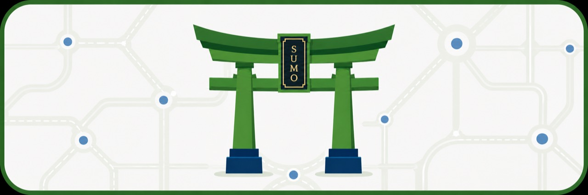
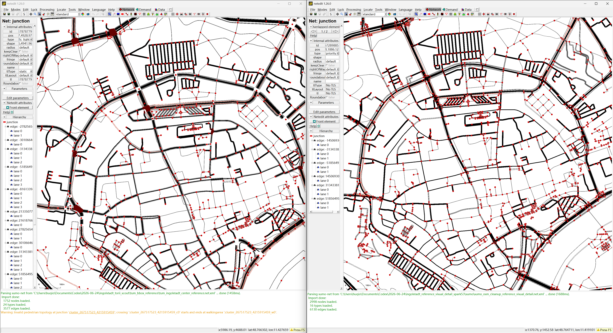

<p align="center">
  
</p>

#  Torii

<div align="center">

**Task-Oriented Road Infrastructure Intelligence**

**Agent plugin for SUMO**

<p><strong>Codex / Claude agent plugin</strong> · SUMO/TraCI Workflows · OSM-zu-SUMO Cleanup · lokale MCP Tools</p>

<a href="https://tarard.github.io/Torii-SUMO/"><strong>Webseite</strong></a> |
<a href="docs/codex-plugin-install.md"><strong>Installation</strong></a> |
<a href="examples/01_signal_control_audit/task.md"><strong>Signal-Control Audit</strong></a> |
<a href="examples/02_one_prompt_osm_network/README.md"><strong>One-Prompt Demo</strong></a> |
<a href="LICENSE"><strong>Lizenz</strong></a>

[English](README.md) | [简体中文](README.zh-CN.md) | [Deutsch](README.de.md)

</div>

## One Prompt to a SUMO Network, Across Models

Torii ist fuer SUMO-Arbeit gedacht: Eine kurze natuerliche Anfrage kann zu einem begrenzten OSM-zu-SUMO-Netzworkflow werden, mit Konstruktionsnachweisen, Erreichbarkeitschecks und klarer Aussagegrenze.

Das Plugin startet jetzt mit einem Workflow Router: `torii_auto_workflow` klassifiziert die Anfrage, waehlt Skills, erstellt Plaene und fuehrt sichere MCP-Schritte aus, um das SUMO-Netz zu erzeugen oder zu aendern.

Torii hat zwei Schichten:

| Schicht | Rolle |
|---|---|
| Reasoning layer | SUMO Expert Skills stellen die richtigen Fragen, waehlen einen Workflow und begrenzen Aussagen. |
| Execution layer | Lokale sichere stdio MCP Tools fuehren begrenzte SUMO-Checks aus und liefern strukturierte Beobachtungen. |

Aktuelle MCP Tools decken den `torii_auto_workflow` Router, Umgebungstests, Konfigurations-Preflight, Smoke Runs, Evidenzpakete, OSM-Netzaufbau, TLS-Kandidaten, mehrquellige TLS-Prueftabellen, Konnektivitaetschecks, Connected-Core-Extraktion, Erreichbarkeitsproben, completion-aware Routeability Audits und Netedit-Startnachweise ab.

## Example

Mit diesem Prompt kann Torii getestet werden:

```text
Use Torii to clean the Ingolstadt city-center network from OSM, compare it with the TUM-VT/sumo_ingolstadt cleaned network for the same bbox, and open the cleaned network in Netedit.
```

Dieses Demo nutzt jetzt die Ingolstaedter Innenstadt, um zu pruefen, ob ein von Torii aus OSM bereinigtes Netz in Richtung eines manuell bereinigten Referenznetzes konvergiert, statt OSM-Import-Erfolg als ausreichend zu behandeln.



| Evidenz | Ergebnis |
|---|---:|
| Torii vehicle core | 2,497 Kanten, 3,051 Spuren, 1,221 Knoten im Vergleichs-bbox |
| Torii reference visual-detail | 6,130 Kanten, 6,701 Spuren, 2,998 Knoten im Vergleichs-bbox |
| TUM bereinigter Referenzausschnitt | 3,577 Kanten, 4,955 Spuren, 1,752 Knoten im selben bbox |
| Ampel-Knoten | Torii visual-detail 217 vs TUM 29 |
| Verbleibendes Bereinigungsziel | wiederverwendbare physische Kreuzungs-/TLS-Aggregation mit Google Maps Kartenpruefung |
| Claim status | `diagnostic-demo` |

Siehe [`examples/02_one_prompt_osm_network`](examples/02_one_prompt_osm_network/README.md). Die erzeugten `.osm.xml`, `.net.xml`, Routen- und Logdateien werden absichtlich nicht committed; das Repository behaelt nur den Prompt und eine leichte Validierungszusammenfassung.

## Quick Start

Installation von GitHub:

```powershell
codex plugin marketplace add Tarard/Torii-SUMO --ref main
codex plugin add torii-sumo@torii-sumo
```

Nach der Installation einen neuen Codex- oder Claude-Code-Thread starten, damit Skills und MCP Tools erkannt werden.

Vollstaendige Anleitung: [Codex Plugin Installation](docs/codex-plugin-install.md).

## What You Can Ask Me

| Prompt | Was Torii tut |
|---|---|
| "Use Torii to clean the Ingolstadt city-center network from OSM and compare it with TUM-VT/sumo_ingolstadt." | Baut aus OSM, prueft Konnektivitaet und Routeability, vergleicht Topologie/TLS-Evidenz mit der Referenz und oeffnet Netedit. |
| "Audit this TraCI signal controller before I compare it with fixed-time or max-pressure." | Prueft Controller-Identitaet, gepaarte demand/seeds/horizon, TLS-Mapping, Ausgaben und Fertigstellung vor jeder Performance-Aussage. |
| "This SUMO run finishes, but tripinfo and summary disagree." | Diagnostiziert Ausgabe-Konsistenz, unfertige Fahrzeuge, Teleports, Routenfehler und Aussagegrenze. |

## Boundaries

Torii baut und auditiert SUMO-Artefakte, zertifiziert ein Modell aber nicht als korrekt.

- OSM-Importe bleiben diagnostisch, bis Strassenumfang, Konnektivitaet, Routeability, TLS-Realitaet und Kartenbaseline-Evidenz geprueft sind.
- `connected-core` Netze sind fuer Smoke Tests nuetzlich, aber verworfene Fragmente und Topologie-Warnungen bleiben Teil der Aussagegrenze.
- Es beweist keine Ampel-Timings, Phasen, demand realism, controller correctness oder vollstaendige Experimentgueltigkeit.

## License and Notices

Quelltext ist unter MIT lizenziert. Skill-Dateien, Dokumentation, Checklisten, Beispiele und Protokolltexte sind unter CC BY 4.0 lizenziert. Beide Bereiche stehen in [`LICENSE`](LICENSE).

Eclipse SUMO ist eine Marke der Eclipse Foundation. Kartendaten im OSM-Demo sind © OpenStreetMap contributors und unter der Open Database License (ODbL) verfuegbar.

Fruehere skill-only Releases sind auf Zenodo archiviert: https://doi.org/10.5281/zenodo.20627976
