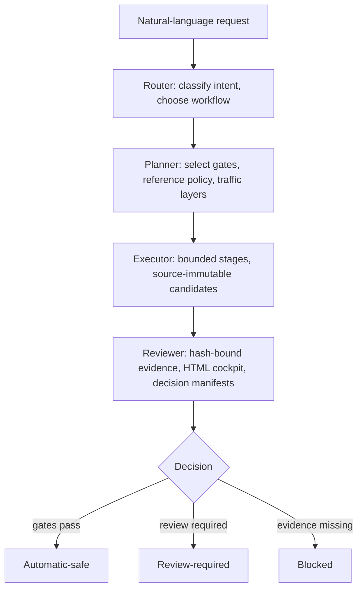

<p align="center">
  
</p>

# Torii

<p align="center">
  <strong>Task-Oriented Road Infrastructure Intelligence for Eclipse SUMO</strong>
</p>

<p align="center">
  An agent plugin that turns natural-language SUMO tasks into bounded,
  evidence-bound workflows — building, auditing, and reviewing networks
  without silently certifying what it cannot prove.
</p>

<p align="center">
  <a href="https://tarard.github.io/Torii-SUMO/">Website</a> ·
  <a href="docs/codex-plugin-install.md">Installation</a> ·
  <a href="docs/README.md">Documentation</a> ·
  <a href="examples/01_signal_control_audit/task.md">Examples</a> ·
  <a href="LICENSE">License</a>
</p>

<p align="center">
  <a href="README.md">English</a> ·
  <a href="README.zh-CN.md">简体中文</a> ·
  <a href="README.de.md">Deutsch</a>
</p>

## How Torii Works



| Layer | Role |
|---|---|
| **Expert skills** | Classify tasks, select checks, state claim boundaries |
| **MCP tools** (74 registered) | Run SUMO, TraCI, NetEdit, OSM conversion, audits, and evidence export |

## Hamburg Corridor Digital Twin

Product target: **Am Sandtorkai 2349 → 2394 → 2403**
(Großer Grasbrook, Am Sandtorpark, Osakaallee).

<p align="center">
  
</p>

| Stage | Status |
|---|---|
| W0 Scope | ✅ |
| W1 Topology | ✅ |
| W2 Signals | 🟡 |
| W3a Counts | ✅ |
| W3b Detectors | 🟡 |
| W4 Replay | 🔴 |

**`detector-constrained-diagnostic-replay`** — blocked by 2403 signal publication gap.
[Evidence summary](docs/hamburg-digital-twin-evidence-summary.json) ·
[Development log](docs/hamburg-digital-twin-development-log.md)

<p align="center">
  
  &nbsp;
  
  <br><em>Left: Hamburg official aerial (2024).  Right: Torii W1 cleaned corridor in SUMO Connection Mode.</em>
</p>

## Design

```
  Candidate
      │
      ▼
  ┌─────────────────────────┐
  │  Protected semantic /   │──Yes──▶  Manual review
  │  TLS delta?             │         (hash-bound decision)
  └─────────────────────────┘
      │ No
      ▼
  ┌─────────────────────────┐
  │  All runtime gates      │──No───▶  BLOCKED
  │  pass?                  │         (recorded in manifest)
  └─────────────────────────┘
      │ Yes
      ▼
  AUTOMATIC-SAFE
```

Source networks are never modified in place — every edit produces a
separate candidate with rollback.  All artifacts are SHA-256 bound.
See [`ARCHITECTURE.md`](ARCHITECTURE.md) for the full design.

## What You Can Do

| You want to... | Torii provides |
|---|---|
| Build and audit a SUMO network from OSM | Full cleanup workflow with Connection Mode, TLS reality, routeability, and review HTML |
| Audit a signal-control experiment | Controller identity, paired demand, teleport/collision check, 4-class claim label |
| Reconstruct a digital-twin corridor | W0–W5 executable plan using official MAP, OCIT, counts, and detector data |
| Audit lane-level connections | Code-native Connection Mode: fromLane→toLane→via, request/foes, lane order, TLS binding |
| Compare two network versions | Exact semantic diff, Connection Mode regression, outside-scope preservation |
| Bind standard NEMA phases | Four-way (1–8) and three-way candidates; never batch-promotes |

[All 74 MCP tools](docs/mcp-tool-catalog.md) —
[Example workflows](examples/01_signal_control_audit/task.md)

## Installation

```powershell
codex plugin marketplace add Tarard/Torii-SUMO --ref main
codex plugin add torii-sumo@torii-sumo
```

Start a new Codex session.  Requires Python 3.11+ and Eclipse SUMO
(`sumo`, `netconvert`, `netedit`).  See the
[installation guide](docs/codex-plugin-install.md).

## Quick Start

```text
Use Torii to build a passenger-road SUMO network from this OSM area.
Check connectivity, audit traffic signals, test routeability, and save a review package.
```

Or start with the router:

```text
torii_auto_workflow
```

## Repository Structure

```text
plugins/torii-sumo/       Codex plugin and MCP server (74 tools)
  src/torii_sumo/
    core/                 Domain logic
    tools/                MCP adapters
    server.py             Tool registration
  skills/                 Expert reasoning and workflow guidance
  scripts/                Reproducible CLI entry points
docs/                     Guides, architecture, protocols, evidence snapshots
examples/                 Small reproducible workflows
benchmarks/               Frozen evaluation assets and adjudication protocols
tests/                    Unit, contract, integration, and regression tests
```

## More

- [Architecture](ARCHITECTURE.md) — router, planner, executor, reviewer, promotion rules
- [MCP Tool Catalog](docs/mcp-tool-catalog.md) — all 74 registered tools
- [Stage 1-M Evidence](docs/stage1-machine-review-ready-plan.md) — 30-corridor blind review, 102,398 atomic witnesses
- [Research Status](docs/torii-corridor-human-modeling-implementation-status.md)
- [Hamburg Evidence & Log](docs/hamburg-digital-twin-evidence-summary.json)

## License

Source code: PolyForm Noncommercial 1.0.0.  Skills, docs, and examples:
CC BY-NC 4.0.  Commercial use requires written permission.  See
[`LICENSE`](LICENSE).

Eclipse SUMO is a trademark of the Eclipse Foundation.  OSM data
© OpenStreetMap contributors (ODbL).  Earlier releases archived at
[Zenodo](https://doi.org/10.5281/zenodo.20627976).
