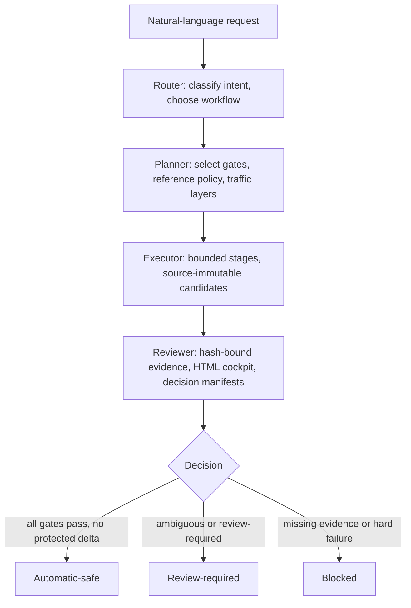
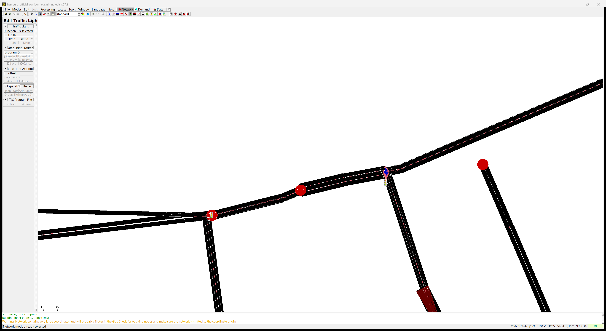

<p align="center">
  
</p>

# Torii

<p align="center">
  <strong>Task-Oriented Road Infrastructure Intelligence for Eclipse SUMO</strong>
</p>

<p align="center">
  An agent plugin that turns natural-language SUMO tasks into bounded,
  evidence-bound workflows — building, auditing, and reviewing networks
  without silently certifying what it cannot prove.
</p>

<p align="center">
  <a href="https://tarard.github.io/Torii-SUMO/">Website</a> ·
  <a href="docs/codex-plugin-install.md">Installation</a> ·
  <a href="docs/README.md">Documentation</a> ·
  <a href="examples/01_signal_control_audit/task.md">Examples</a> ·
  <a href="LICENSE">License</a>
</p>

<p align="center">
  <a href="README.md">English</a> ·
  <a href="README.zh-CN.md">简体中文</a> ·
  <a href="README.de.md">Deutsch</a>
</p>

## How Torii Works



Torii has two parts:

| Layer | Role |
|---|---|
| **Expert skills** | Classify tasks, select checks, state claim boundaries |
| **MCP tools** (74 registered) | Run SUMO, TraCI, NetEdit, OSM conversion, audits, and evidence export |

Every result is hash-bound. Source networks are never modified in place.
Candidates are written separately with rollback plans. Missing evidence
produces `blocked`, not a guess.

## Hamburg Corridor Digital Twin

Product target: **Am Sandtorkai 2349 → 2394 → 2403**
(Großer Grasbrook, Am Sandtorpark, Osakaallee).

<p align="center">
  
</p>

### Stage Dashboard

| Stage | Gate | Key Evidence | Status |
|---|---|---|---|
| **W0** Scope | pass | 3 official LSA nodes, 7 HH-SIB links, identity snapshot frozen | ✅ |
| **W1** Topology | pass | 23/23 movement smoke, 0 teleport, 0 collision; SHA-256 `d87eeac6…` | ✅ |
| **W2** Signals | partial | 2349 & 2394: 8/8 MAP/OCIT bound, 16/16 streams initialized. 2403: no published MAP/OCIT/TLD package | 🟡 |
| **W3a** Counts | pass | 2026-07-18 Saturday window: 19 streams, 190 ten-bin rows, 152 formal comparison bins | ✅ |
| **W3b** Detectors | partial | 17/19 streams bound to exact W1 lanes. 2 blocked on parallel-lane ambiguity < 1 m | 🟡 |
| **W4** Replay | blocked | 15 candidate routes, 0 collision, 0 teleport over 7,200 s. Signal-disabled diagnosis matched all 5,928 official counts across 60 bins | 🔴 |

**Current status:** `detector-constrained-diagnostic-replay`.  Promotion to
"accepted field digital twin" remains blocked by the 2403 signal publication
gap and unresolved shared-lane detector aggregation.  See the
[machine-readable evidence summary](docs/hamburg-digital-twin-evidence-summary.json)
and [development log](docs/hamburg-digital-twin-development-log.md).

### Official Aerial vs. Torii Connection Mode

<p align="center">
  
  &nbsp;
  
  <br><em>Left: Hamburg official aerial (2024).  Right: Torii W1 cleaned corridor in SUMO Connection Mode, three-node road topology frozen.</em>
</p>

### Signal Binding and Junction Detail

<p align="center">
  
  &nbsp;
  
  <br><em>Left: official MAP signal movements bound to SUMO controller at 2394 (8/8 matched).
  Right: 2403 compound junction in Connection Mode — geometry and connections pass, signal control blocked on missing MAP/OCIT.</em>
</p>

## Core Design

### Evidence-bound, not success-claimed

SUMO load success, route completion, or KPI improvement are diagnostics —
**not proof** of correct topology, demand, control, or field equivalence.
Every artifact carries a SHA-256 manifest.  A network that loads in SUMO
can still be geometrically wrong (candidate v26 was rejected despite
passing every runtime gate).

### Source-immutable

Source networks are never overwritten.  Every edit produces a separate
candidate with a rollback plan.  Evidence is bound to exact candidate hashes.
Stale outputs are removed before execution.

### Fail-closed, three-tier

```
  Candidate
      │
      ▼
  ┌─────────────────────────┐
  │  Protected semantic /   │──Yes──▶  Manual review
  │  TLS delta?             │         (hash-bound decision)
  └─────────────────────────┘
      │ No
      ▼
  ┌─────────────────────────┐
  │  All runtime gates      │──No───▶  BLOCKED
  │  pass?                  │         (recorded in manifest)
  └─────────────────────────┘
      │ Yes
      ▼
  AUTOMATIC-SAFE
```

| Tier | Criteria |
|---|---|
| **Automatic-safe** | No protected semantic/TLS delta, all runtime gates pass |
| **Review-required** | Structured findings, candidate-hash-bound decision with reviewer / timestamp / rationale / rollback |
| **Blocked** | Missing evidence, unreviewed protected delta, stale outputs, failed gate — recorded in manifest, not hidden |

## What You Can Do

| You want to... | Torii provides | Entry point |
|---|---|---|
| Build and audit a SUMO network from OSM | Full cleanup workflow with Connection Mode audit, TLS reality check, routeability, and review HTML | `torii_auto_workflow` → `sumo_osm_cleanup_workflow` |
| Audit a signal-control experiment | Controller identity, paired demand/seeds/horizon, teleport/collision check, 4-class claim label | [Example 01](examples/01_signal_control_audit/task.md) |
| Reconstruct a digital-twin corridor | W0–W5 executable plan consuming official MAP, OCIT, counts, and detector data | `sumo_hamburg_sandtorkai_execution_plan` |
| Audit lane-level connections without NetEdit | Code-native Connection Mode: fromLane→toLane→via, request/foes, lane order, TLS binding | `sumo_network_connection_mode_audit` |
| Compare two network versions exactly | Exact semantic diff, Connection Mode regression audit, outside-scope preservation check | `sumo_network_connection_mode_regression_audit` |
| Bind standard NEMA phases to a junction | Four-way (1-8 phases) and three-way (missing-phase placeholders); candidate-only, never batch-promotes | `sumo_network_standard_nema_phase_binding` |
| Make a controlled NetEdit edit with evidence | Hash-bound session: open→observe→act→finalize, source immutable, automatic promotion blocked | `sumo_netedit_session` |
| Reconstruct detector-constrained demand | Route-sensor matrix, count constraints, routeSampler with same-location E1/E2 | `sumo_detector_route_support` |
| Reproduce research results | 30-corridor held-out blind-review package with 384 review units, 102,398 atomic witnesses | [Stage 1-M evidence](docs/stage1-machine-review-ready-plan.md) |

## Typical Outputs

`sumo_osm_cleanup_workflow` produces a complete review package:

```
  Source .net.xml  ────▶  Candidate .net.xml
  (immutable)              (SHA-256 bound)
                                 │
                    ┌────────────┼────────────┐
                    ▼            ▼            ▼
              review.html   review.json   add.xml
              (cockpit)     (decisions)   (overlay)
                    │            │            │
                    └────────────┼────────────┘
                                 ▼
                          manifest.json
                          (artifact DAG,
                           all hashes closed)
```

| Artifact | Contents |
|---|---|
| `*.net.xml` | Candidate network (source never modified) |
| `*.review.html` | Single-page cockpit: gate status, network preview, finding overlay, reference comparison |
| `*.review.json` | Structured machine decisions: pass / review_required / blocked |
| `*.accepted.review.add.xml` | Display-only overlay (poi, poly, param only) |
| `*.map-review.json` | Map evidence with promotion authority flag |
| `*.manifest.json` | Artifact DAG: hashes, dependencies, toolchain identity |
| `rollback.json` | Exact undo plan |

## Installation

### From GitHub

```powershell
codex plugin marketplace add Tarard/Torii-SUMO --ref main
codex plugin add torii-sumo@torii-sumo
```

Start a new Codex session after installation.

### Local development

```powershell
git clone https://github.com/Tarard/Torii-SUMO.git
cd Torii-SUMO
python -m pip install -e ".[dev]"
```

Requirements: Python 3.11+, Eclipse SUMO (`sumo`, `netconvert`, `netedit`), Codex with plugin and local MCP support.

See the [installation guide](docs/codex-plugin-install.md).

## Quick Start

```text
Use Torii to build a passenger-road SUMO network from this OSM area.
Check connectivity, audit traffic signals, test routeability, and save a review package.
```

Or start with the router:

```text
torii_auto_workflow
```

The workflow returns its plan, executed checks, generated files, blocked gates, and supported claim level.

## Example Workflows

| Workflow | Example |
|---|---|
| Signal-control audit | [`01_signal_control_audit`](examples/01_signal_control_audit/task.md) |
| One-prompt OSM network | [`02_one_prompt_osm_network`](examples/02_one_prompt_osm_network/README.md) |
| Four-way TLS review | [`03_xs1_four_way_tls`](examples/03_xs1_four_way_tls/README.md) |
| Three-way TLS review | [`04_xs2_three_way_tls`](examples/04_xs2_three_way_tls/README.md) |

## Repository Structure

```text
plugins/torii-sumo/       Codex plugin and MCP server (74 tools)
  src/torii_sumo/
    core/                 Domain logic: parsing, audit, candidate construction
    tools/                MCP adapters: validate, resolve, serialize
    server.py             Tool registration
  skills/                 Expert reasoning and workflow guidance
  scripts/                Reproducible CLI entry points
docs/                     Guides, architecture, protocols, evidence snapshots
examples/                 Small reproducible workflows
benchmarks/               Frozen evaluation assets and adjudication protocols
tests/                    Unit, contract, integration, and regression tests
```

See [`ARCHITECTURE.md`](ARCHITECTURE.md) for the router, planner, executor, and reviewer design.

## Research Status

**Stage 1-M: Machine REVIEW_READY** (2026-07-14).

- 30 blinded held-out corridor packages frozen across 6 cities (Berlin,
  Amsterdam, Paris, London, Melbourne, Sydney), left- and right-hand traffic.
- 384 review units: 240 conflict sites, 120 negative pairs,
  21 hard controlled-binding assessments, 3 coverage-gap census items.
- 102,398 atomic witnesses (39,725 confirmed, 62,673 potential) in a
  lossless cluster ledger.
- Deterministic sampling, exact schema, hash-bound provenance.
- All automatic promotion gates remain `blocked`.

**Stage 1-H (human validation) not yet started.**  Two independent reviewers,
a third adjudicator, and a pre-registered statistical gate are required
before Stage 1 can exit.  No micro-repair, NEMA, pedestrian, or multi-city
transfer has been certified.

See [Stage 1-M plan](docs/stage1-machine-review-ready-plan.md) and
[implementation status](docs/torii-corridor-human-modeling-implementation-status.md).

## Limitations

Torii audits what it can and abstains on what it cannot:

- OSM imports remain diagnostic until road scope, connectivity, routeability,
  and TLS reality are checked.
- SUMO load and route completion are **not** proof of topology, demand,
  or signal control correctness.
- The route-sensor matrix solves for feasible demand — not a unique OD matrix.
- Torii does not infer signal timing from OSM or guess missing official data.
- Human review or official sources remain required for claims about real signal
  operation, exact lane identity, and field timing.

## License

Torii source code is licensed under PolyForm Noncommercial 1.0.0.  Skill files,
documentation, checklists, examples, and protocol text are licensed under
CC BY-NC 4.0.  Commercial use requires separate written permission.
Both scopes are detailed in [`LICENSE`](LICENSE).

Eclipse SUMO is a trademark of the Eclipse Foundation.  OpenStreetMap data
is © OpenStreetMap contributors and available under the Open Database License.

Earlier skill-only releases are archived on Zenodo:
`https://doi.org/10.5281/zenodo.20627976`
