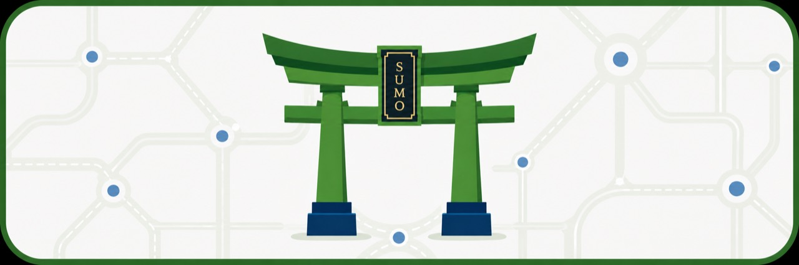
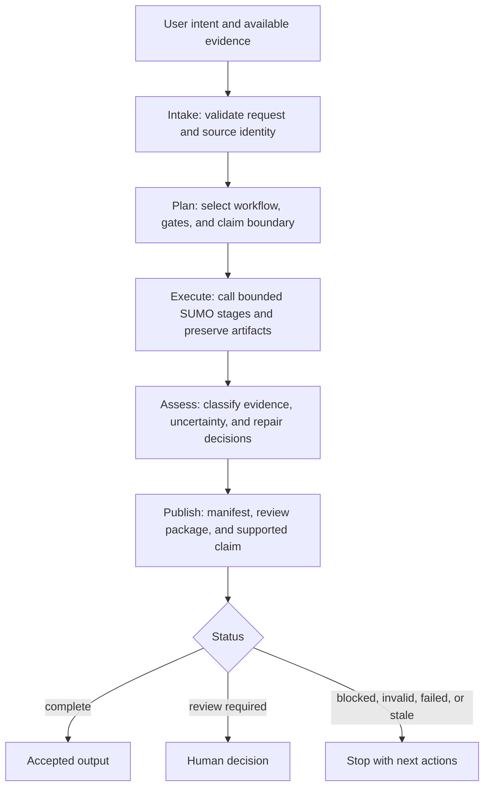
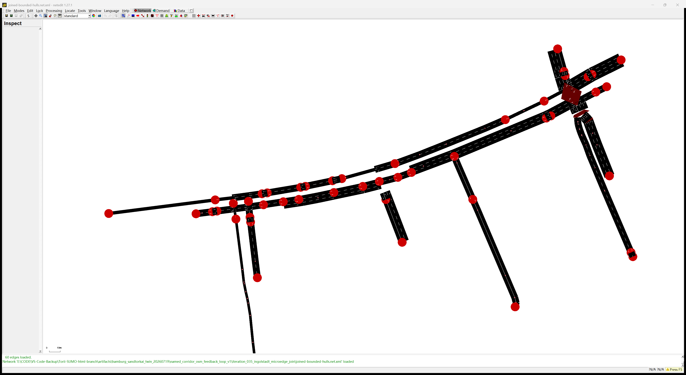
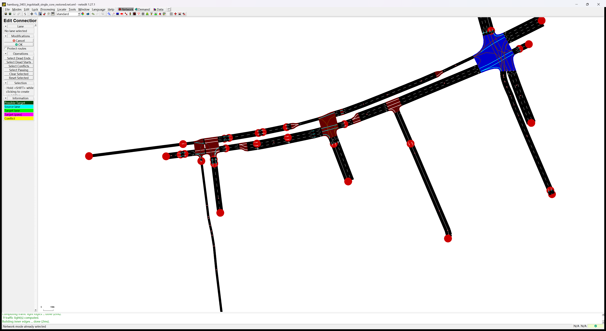

<p align="center">
  
</p>

# Torii

<p align="center">
  <strong>Task-Oriented Road Infrastructure Intelligence for Eclipse SUMO</strong>
</p>

<p align="center">
  An evidence-aware agent plugin that turns natural-language SUMO tasks into bounded,
  evidence-bound, reference-comparable workflows for building, auditing, repairing, and reviewing
  networks without silently certifying what it cannot prove.
</p>

<p align="center">
  <a href="https://tarard.github.io/Torii-SUMO/">Website</a> ·
  <a href="docs/codex-plugin-install.md">Installation</a> ·
  <a href="docs/README.md">Documentation</a> ·
  <a href="docs/workflow.md">Workflow</a> ·
  <a href="examples/01_signal_control_audit/task.md">Examples</a> ·
  <a href="LICENSE">License</a>
</p>

<p align="center">
  <a href="README.md">English</a> ·
  <a href="README.zh-CN.md">简体中文</a> ·
  <a href="README.de.md">Deutsch</a>
</p>

## How Torii Works



The managed workflow joins expert skills and MCP tools with resumable state and evidence contracts around the
existing router, planner, domain tools, and reviewers. It preserves working SUMO
algorithms while preventing false success when required evidence is missing or stale.

| Layer | Role |
|---|---|
| **Expert skills** | Classify tasks, select checks, and state claim boundaries |
| **MCP tools** (76 registered) | Run managed workflows, SUMO, TraCI, NetEdit, OSM conversion, audits, and evidence export |
| **Workflow manifest** | Record stage state, artifact hashes, evidence classes, blockers, review items, and supported claims |

## Hamburg Corridor Digital Twin

Product target: **Am Sandtorkai 2349 → 2394 → 2403**
(Großer Grasbrook, Am Sandtorpark, Osakaallee).

<p align="center">
  
</p>

| Stage | Status |
|---|---|
| W0 Scope | ✅ |
| W1 Topology | ✅ |
| W2 Signals | 🟡 |
| W3a Counts | ✅ |
| W3b Detectors | 🟡 |
| W4 Replay | 🔴 |

**`detector-constrained-diagnostic-replay`** — blocked by the missing signal publication for node 2403.
[Evidence summary](docs/hamburg-digital-twin-evidence-summary.json) ·
[Development log](docs/hamburg-digital-twin-development-log.md)

<p align="center">
  
  &nbsp;
  
  <br><em>Left: Hamburg official aerial (2024). Right: Torii W1 cleaned corridor in SUMO Connection Mode.</em>
</p>

## Design

```text
source evidence
→ parsed observation
→ interpretation
→ repair candidate
→ check
→ decision
→ applied change
→ validation
→ supported claim
```

Source networks are never modified in place. Each edit creates a separate
candidate with a rollback path. Required evidence and generated artifacts are
bound to exact content hashes. Simulation success remains a diagnostic, not
proof of network correctness.

The shared status model distinguishes `complete`, `incomplete`, `blocked`,
`invalid`, `review_required`, `unsupported`, `failed`, and `stale`. A later
success cannot erase an earlier unresolved issue.

See the [canonical workflow](docs/workflow.md) and
[architecture](ARCHITECTURE.md) for the full contracts.

## What You Can Do

| You want to... | Torii provides |
|---|---|
| Build and audit a SUMO network from OSM | Cleanup workflow with Connection Mode, TLS reality, routeability, and review HTML |
| Resume or inspect a workflow | Persistent manifest, artifact identity checks, blockers, and ordered next actions |
| Audit a signal-control experiment | Controller identity, paired demand, teleport and collision checks, and claim labels |
| Reconstruct a digital-twin corridor | W0–W5 executable plan using official MAP, OCIT, counts, and detector data |
| Audit lane-level connections | Code-native Connection Mode checks for lanes, internal paths, requests, foes, and TLS bindings |
| Compare two network versions | Exact semantic diff, Connection Mode regression, and outside-scope preservation |
| Bind standard NEMA phases | Four-way and three-way review candidates that never batch-promote |

[All 76 MCP tools](docs/mcp-tool-catalog.md) ·
[Example workflows](examples/01_signal_control_audit/task.md)

## Installation

```powershell
codex plugin marketplace add Tarard/Torii-SUMO --ref main
codex plugin add torii-sumo@torii-sumo
```

Start a new Codex session. Torii requires Python 3.11 or later and Eclipse SUMO
with `sumo`, `netconvert`, and `netedit`. See the
[installation guide](docs/codex-plugin-install.md).

## Quick Start

The main entry point is `torii_workflow_run`. Ask the agent to run the canonical managed workflow:

```text
Use torii_workflow_run to build a passenger-road SUMO network from this OSM area.
Check connectivity, audit traffic signals, test routeability, and save a review package.
```

Use `torii_workflow_status` to inspect, resume, or explain an interrupted run.
`torii_auto_workflow` remains as a compatibility entry point and now reports the
managed status when legacy output would otherwise imply false success.

The run directory contains a manifest, the raw domain result, evidence-bound
artifacts, blockers, review items, and the supported claim level.

## Repository Structure

```text
plugins/torii-sumo/       Codex plugin and MCP server (76 tools)
  src/torii_sumo/
    core/                 Domain logic and workflow contracts
    tools/                MCP adapters and compatibility facade
    server.py             Tool registration
  skills/                 Expert reasoning and workflow guidance
  scripts/                Reproducible CLI entry points
docs/                     Guides, architecture, protocols, and evidence snapshots
schemas/                  Machine-readable workflow and evidence contracts
examples/                 Small reproducible workflows
benchmarks/               Frozen evaluation assets and adjudication protocols
tests/                    Unit, contract, workflow, and regression tests
```

## More

- [Codex Plugin Installation](docs/codex-plugin-install.md)
- [Canonical Workflow](docs/workflow.md) — user path, evidence model, states, recovery, and compatibility
- [Workflow Redesign Audit](docs/workflow-redesign-audit.md) — diagnosis, alternatives, selected design, and migration boundary
- [Architecture](ARCHITECTURE.md) — router, planner, executor, reviewer, and promotion rules
- [MCP Tool Catalog](docs/mcp-tool-catalog.md) — all 76 registered tools
- [Repository Guide](docs/repository-guide.md) — code ownership and extension boundaries
- [Stage 1-M Evidence](docs/stage1-machine-review-ready-plan.md) — held-out review evidence
- [Research Status](docs/torii-corridor-human-modeling-implementation-status.md)
- [Hamburg Evidence and Log](docs/hamburg-digital-twin-evidence-summary.json)

## License

Torii is released under the [Apache License 2.0](LICENSE).

Eclipse SUMO is a trademark of the Eclipse Foundation. OpenStreetMap data is
© OpenStreetMap contributors and is available under the Open Database License.
Earlier releases are archived on [Zenodo](https://doi.org/10.5281/zenodo.20627976).
