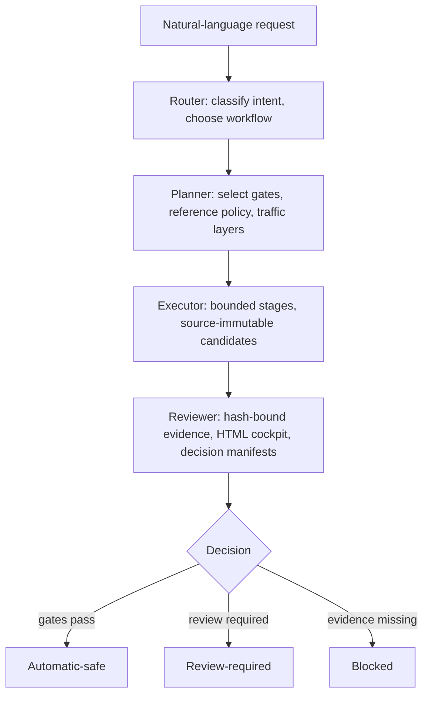

<p align="center">
  
</p>

# Torii

<p align="center">
  <strong>Task-Oriented Road Infrastructure Intelligence for Eclipse SUMO</strong>
</p>

<p align="center">
  An agent plugin that turns natural-language SUMO tasks into bounded,
  evidence-bound workflows — building, auditing, and reviewing networks
  without silently certifying what it cannot prove.
</p>

<p align="center">
  <a href="https://tarard.github.io/Torii-SUMO/">Website</a> ·
  <a href="docs/codex-plugin-install.md">Installation</a> ·
  <a href="docs/README.md">Documentation</a> ·
  <a href="examples/01_signal_control_audit/task.md">Examples</a> ·
  <a href="LICENSE">License</a>
</p>

<p align="center">
  <a href="README.md">English</a> ·
  <a href="README.zh-CN.md">简体中文</a> ·
  <a href="README.de.md">Deutsch</a>
</p>

## How Torii Works



| Layer | Role |
|---|---|
| **Expert skills** | Classify tasks, select checks, state claim boundaries |
| **MCP tools** | The default profile exposes 10 focused tools for checks, classification, comparison, and review |
| **CLI** | Run routeability, long workflows, batch work, and specialized legacy capabilities |

The host model reads `torii workflows --json` to choose a registered scenario from your goal and sources; see [scenario selection](docs/workflow-selection.md).

## Hamburg Corridor Digital Twin

Build road geometry and lane connections from a reviewed construction drawing,
with OSM and supplied Google Maps references as supporting sources. The existing
official MAP/XML/KML and aerial-image mode uses the same command:

```powershell
torii hamburg build-network <request.json> <new-output-dir> --json
```

With `construction_plan`, a manually reviewed `topology.json` records the
drawing's roads, lane uses, widths, and connections. Torii builds a fresh SUMO
network and checks it. This does not automatically interpret an arbitrary PDF.
Drawing-based lane counts, uses, and movements take precedence over maps.
OSM may supply missing coordinates, names, or speeds. Coordinates from another
year require an explicit statement that they apply to the target year.

The user and the dated drawing define the scenario year. A 2013 scenario does
not become a current-road scenario because a newer map is available. Google Maps
is optional; missing references are reported as not supplied. See the
[construction-drawing guide](examples/05_hamburg_topology/construction-plan.md)
and its [illustrative request](examples/05_hamburg_topology/construction-plan.request.example.json).

The MAP/aerial mode creates a fresh source network, official movement plan,
candidate, and construction checks. It does not reuse an earlier candidate or
movement plan. Detector counts and historical signal states are not required
in either mode. In MAP/aerial mode, optional
`construction.junction_contours: "guarded"` tightens empty parts of
junction outlines, then verifies the compiled lane, connection and signal
data. Unproved changes retain the previous boundary and a review record.
See the [construction example](examples/05_hamburg_topology/README.md) and its
[raw-input request](examples/05_hamburg_topology/request.example.json).

Validation uses five fixed Hamburg corridors. The counts below describe the
official input records, not a claim that every reconstruction has passed.

| Corridor | Official intersection IDs | Official movement records |
|---|---|---:|
| Ring 1 | 104, 118, 119, 200, 535 | 114 |
| Am Sandtorkai | 2349, 2394 | 16 |
| Stresemannstraße | 296, 431, 2506 | 43 |
| Barmbeker Straße | 89, 65 | 36 |
| Bremer Straße | 1859, 1862 | 21 |

OSM side roads remain part of each selected area. Roads without official
MAP coverage are recorded separately. A large junction polygon is not a
connectivity failure: its internal lane paths must preserve the intended
movements. Official stop sections may lie within a source road or its SUMO
internal lanes, rather than at an existing road endpoint.

Read connection structure, geometry review, and vehicle passage as separate
results. Checks cover official lane transitions, both corridor directions,
surrounding roads, and paired source/candidate trips. A fixed junction shape
must also survive a netconvert reload. Successful trips alone do not establish
complete topology or field accuracy.

**Release validation is still in progress.** Ring 1 has unresolved lane and
boundary cases. Source dates also matter: a historical open road is not proof
that the same road is open today. These topology tests do not establish a
calibrated digital twin or replay historical signal timing. After the road
network has been checked and frozen, start the separate
[count-calibration workflow](plugins/torii-sumo/skills/simulation-helper-skill-for-eclipse-sumo/references/hamburg-count-calibration-workflow.md)
only when traffic reconstruction is requested.

Earlier detector-replay work is documented in the
[historical evidence summary](docs/hamburg-digital-twin-evidence-summary.json)
and [development log](docs/hamburg-digital-twin-development-log.md).

## Design

```
  Candidate
      │
      ▼
  ┌─────────────────────────┐
  │  Protected semantic /   │──Yes──▶  Manual review
  │  TLS delta?             │         (hash-bound decision)
  └─────────────────────────┘
      │ No
      ▼
  ┌─────────────────────────┐
  │  All runtime gates      │──No───▶  BLOCKED
  │  pass?                  │         (recorded in manifest)
  └─────────────────────────┘
      │ Yes
      ▼
  AUTOMATIC-SAFE
```

Source networks are never modified in place — every edit produces a
separate candidate with rollback.  All artifacts are SHA-256 bound.
See [`ARCHITECTURE.md`](ARCHITECTURE.md) for the full design.

## What You Can Do

| You want to... | Torii provides |
|---|---|
| Build and audit a SUMO network from OSM | CLI cleanup with fixed standard or reference-matched audit profiles |
| Reconstruct Hamburg road topology | Reviewed construction drawings with supporting maps, or official MAP geometry with aerial review |
| Audit a signal-control experiment | Controller identity, paired demand, teleport/collision check, 4-class claim label |
| Reconstruct a digital-twin corridor | W0–W5 executable plan using official MAP, OCIT, counts, and detector data |
| Audit lane-level connections | Code-native Connection Mode: fromLane→toLane→via, request/foes, lane order, TLS binding |
| Compare two network versions | Exact semantic diff, Connection Mode regression, outside-scope preservation |
| Bind standard NEMA phases | Four-way (1–8) and three-way candidates; never batch-promotes |

[MCP profiles and legacy tool catalog](docs/mcp-tool-catalog.md) —
[Example workflows](examples/01_signal_control_audit/task.md)

## Installation

```powershell
codex plugin marketplace add Tarard/Torii-SUMO --ref main
codex plugin add torii-sumo@torii-sumo
```

Start a new Codex session.  Requires Python 3.11+ and Eclipse SUMO
(`sumo`, `netconvert`, `netedit`).  See the
[installation guide](docs/codex-plugin-install.md).

The installed plugin also provides the CLI through its locked runner:

```powershell
uv run --isolated --frozen --script <plugin-root>/scripts/run_torii_sumo.py --cli workflows --json
```

Use the same runner for the `torii ...` commands below. A separate global CLI
installation is not required.

The corridor checks use SUMO 1.27.1. The Python dependency requires
`sumolib>=1.27.1` for the tested connection-permission-aware route checks.
Use the recorded SUMO version when reproducing a result.

## Interfaces

The MCP server starts with the 10-tool `default` profile. Use `legacy` only
when an older integration requires one of the 73 historical tool names.

The default network audit has two profiles:

- `quick`: topology only.
- `standard`: topology, Connection Mode, and overlapping-junction checks.

Neither profile runs SUMO routeability. Run that longer check through the CLI:

```powershell
torii network routeability <network.net.xml> <output-dir> --json
```

Run an allowlisted long, batch, or specialized legacy capability from a JSON
request file:

```powershell
torii workflow <tool> <request.json> --json
```

NetEdit `observe` writes a screenshot and report. Close a session with
`--mode abort`, or use `--mode finalize` with the latest screenshot SHA-256.

## Quick Start

```text
Use Torii to build a passenger-road SUMO network from this OSM area.
Check connectivity, audit traffic signals, test routeability, and save a review package.
```

For a long workflow, prepare its JSON arguments and run:

```powershell
torii workflow sumo_osm_cleanup_workflow request.json --json
```

OSM cleanup is CLI-only and is not an MCP tool. Resolve a place to a bbox
first. The request has seven fields: `output_dir`, `bbox`, `profile`,
`source_osm_path`, `traffic_layers`, `reference_net_file`, and
`timeout_seconds`. Use `traffic_layers` with `profile=standard`. Use a
`reference_net_file` with `profile=reference_matched`; this profile audits
differences and does not apply repairs.

## Repository Structure

```text
plugins/torii-sumo/       Codex plugin, 10-tool default MCP, and legacy profile
  src/torii_sumo/
    core/                 Domain logic
    tools/                MCP adapters
    server.py             Default/NetEdit registration and profile switch
    legacy_tools.py       Opt-in legacy MCP and CLI workflow bundle
  skills/                 Expert reasoning and workflow guidance
  scripts/                Reproducible CLI entry points
docs/                     Guides, architecture, protocols, evidence snapshots
examples/                 Small reproducible workflows
benchmarks/               Frozen evaluation assets and adjudication protocols
tests/                    Unit, contract, integration, and regression tests
```

## More

- [Architecture](ARCHITECTURE.md) — router, planner, executor, reviewer, promotion rules
- [Repository Guide](docs/repository-guide.md) — code, documentation, and evidence boundaries
- [MCP Tool Catalog](docs/mcp-tool-catalog.md) — default, NetEdit, and legacy profiles
- [Stage 1-M Evidence](docs/stage1-machine-review-ready-plan.md) — 30-corridor blind review, 102,398 atomic witnesses
- [Research Status](docs/torii-corridor-human-modeling-implementation-status.md)
- [Hamburg Evidence & Log](docs/hamburg-digital-twin-evidence-summary.json)

## License

Source code uses [PolyForm Noncommercial 1.0.0](LICENSE-CODE).
Repository-authored skills, documentation, checklists, examples, manifests,
schemas, protocol text, prompts, and visual assets use
[CC BY-NC 4.0](LICENSE-DOCS). Commercial use is not licensed by these terms.
See the [scope notice](LICENSE).

Eclipse SUMO is a trademark of the Eclipse Foundation.  OSM data
© OpenStreetMap contributors (ODbL).  Earlier releases archived at
[Zenodo](https://doi.org/10.5281/zenodo.20627976).
