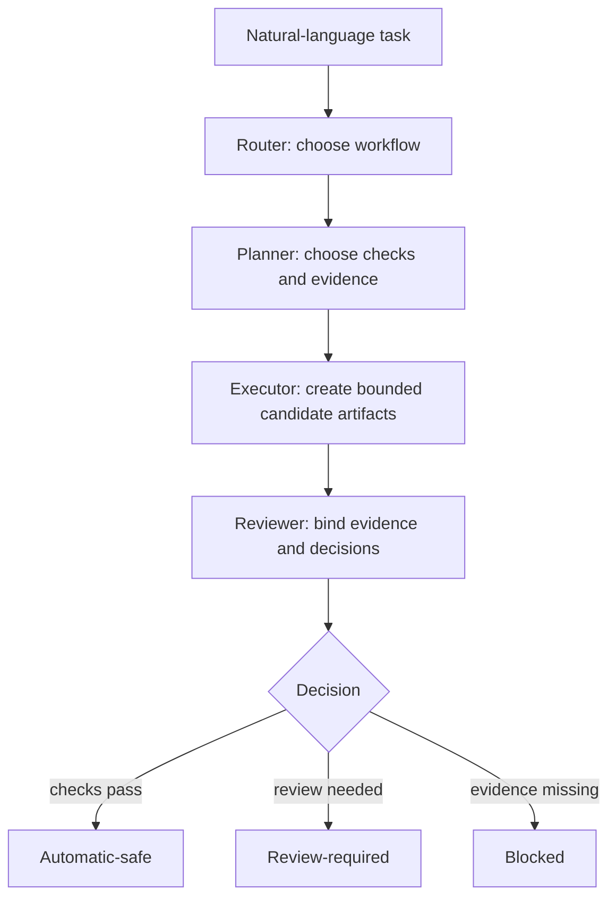

<p align="center">
  
</p>

# Torii

<p align="center">
  <strong>Task-Oriented Road Infrastructure Intelligence for Eclipse SUMO</strong>
</p>

<p align="center">
  Torii is an agent plugin for building, checking, comparing, and reviewing
  Eclipse SUMO networks from natural-language tasks.
</p>

<p align="center">
  <a href="https://tarard.github.io/Torii-SUMO/">Website</a> ·
  <a href="docs/codex-plugin-install.md">Installation</a> ·
  <a href="docs/README.md">Documentation</a> ·
  <a href="examples/01_signal_control_audit/task.md">Examples</a> ·
  <a href="LICENSE">MIT License</a>
</p>

<p align="center">
  <a href="README.md">English</a> ·
  <a href="README.zh-CN.md">简体中文</a> ·
  <a href="README.de.md">Deutsch</a>
</p>

## What Torii Does

Torii turns a task into a bounded SUMO workflow. It separates source data,
candidate changes, checks, evidence, and review decisions.

| Task | Torii provides |
|---|---|
| Build a SUMO network from OSM | Network creation, cleanup, and audit workflows |
| Audit signal-control experiments | Controller identity, paired demand, teleport and collision checks, and claim labels |
| Check lane-level connections | Lane transitions, internal lanes, request/foes, lane order, and TLS bindings |
| Compare network versions | Semantic diffs, regression checks, and outside-scope preservation |
| Reconstruct road topology | Construction-drawing and official-map workflows |
| Reconstruct a digital-twin corridor | Structured workflows for geometry, counts, detector data, and review |
| Bind NEMA phases | Four-way and three-way phase candidates with review gates |

Torii does not treat a successful simulation as proof that the complete network is correct.

## Quick Start

Install the plugin:

```powershell
codex plugin marketplace add Tarard/Torii-SUMO --ref main
codex plugin add torii-sumo@torii-sumo
```

Start a new Codex session. Then ask for a SUMO task, for example:

```text
Use Torii to build a passenger-road SUMO network from this OSM area.
Check connectivity, audit traffic signals, test routeability, and save a review package.
```

Torii supports 64-bit Windows. It requires Python 3.11+ and Eclipse SUMO
with `sumo`, `netconvert`, and `netedit` available.

See the [installation guide](docs/codex-plugin-install.md) for setup details.

## How It Works



Torii uses three main interfaces:

| Interface | Purpose |
|---|---|
| **Expert skills** | Interpret the task and define what can be claimed |
| **MCP tools** | Run focused checks, comparisons, classification, and review |
| **CLI** | Run routeability, long workflows, batch work, and legacy capabilities |

The host model can read `torii workflows --json` to choose a registered workflow.
See [workflow selection](docs/workflow-selection.md).

## Core Safety Model

Torii never edits a source network in place. Each change creates a separate candidate.
Artifacts used for review are SHA-256 bound.

```text
Candidate
   │
   ▼
Protected semantic or TLS change?
   │
   ├─ Yes → Manual review
   │
   └─ No
        │
        ▼
All required checks pass?
   │
   ├─ No  → Blocked
   │
   └─ Yes → Automatic-safe
```

See [ARCHITECTURE.md](ARCHITECTURE.md) for the full design.

## Common Commands

The installed plugin provides the CLI through its locked runner:

```powershell
uv run --isolated --frozen --script <plugin-root>/scripts/run_torii_sumo.py --cli workflows --json
```

A separate global CLI installation is not required.

### Check routeability

```powershell
torii network routeability <network.net.xml> <output-dir> --json
```

### Run a registered workflow

```powershell
torii workflow <tool> <request.json> --json
```

### Run OSM cleanup

```powershell
torii workflow sumo_osm_cleanup_workflow request.json --json
```

OSM cleanup is CLI-only. Resolve a place to a bounding box first.

The request supports these main fields:

- `output_dir`
- `bbox`
- `profile`
- `source_osm_path`
- `traffic_layers`
- `reference_net_file`
- `timeout_seconds`

Use `traffic_layers` with `profile=standard`.
Use `reference_net_file` with `profile=reference_matched`.
The reference-matched profile audits differences and does not apply repairs.

## MCP Profiles

The MCP server starts with the 10-tool `default` profile.
Use `legacy` only when an older integration needs one of the historical tool names.

The default network audit provides two profiles:

- `quick`: topology checks only.
- `standard`: topology, Connection Mode, and overlapping-junction checks.

Neither profile runs SUMO routeability. Run routeability through the CLI.

NetEdit `observe` writes a screenshot and report.
Close a session with `--mode abort`.
Use `--mode finalize` with the latest screenshot SHA-256 when review is complete.

## Tested Environment

The corridor checks use SUMO 1.27.1.
The Python dependency requires `sumolib>=1.27.1` for the tested connection-permission-aware route checks.

Use the recorded SUMO version when reproducing a result.

## Hamburg Corridor Digital Twin

Torii includes a research workflow for reconstructing Hamburg road corridors.
This workflow supports two source modes.

### Construction-drawing mode

A manually reviewed `topology.json` records roads, lane uses, widths, and connections.
Torii then builds a fresh SUMO network and checks it.

```powershell
torii hamburg build-network <request.json> <new-output-dir> --json
```

This mode does not automatically interpret an arbitrary PDF.
Drawing-based lane counts, lane uses, and movements take precedence over maps.
OSM may provide missing coordinates, road names, or speeds.

See the [construction-drawing guide](examples/05_hamburg_topology/construction-plan.md)
and the [example request](examples/05_hamburg_topology/construction-plan.request.example.json).

### MAP and aerial mode

The MAP and aerial workflow creates a fresh source network, movement plan,
candidate, and construction checks. It does not reuse an older candidate.

Optional `construction.junction_contours: "guarded"` can tighten empty parts of junction outlines.
Torii then checks the compiled lane, connection, and signal data.

See the [Hamburg construction example](examples/05_hamburg_topology/README.md)
and its [request example](examples/05_hamburg_topology/request.example.json).

### Validation scope

Validation uses five fixed Hamburg corridors:

| Corridor | Official intersection IDs | Official movement records |
|---|---|---:|
| Ring 1 | 104, 118, 119, 200, 535 | 114 |
| Am Sandtorkai | 2349, 2394 | 16 |
| Stresemannstraße | 296, 431, 2506 | 43 |
| Barmbeker Straße | 89, 65 | 36 |
| Bremer Straße | 1859, 1862 | 21 |

These counts describe the official input records.
They do not mean every reconstruction has passed validation.

Release validation is still in progress.
Ring 1 still has unresolved lane and boundary cases.
A historical open road also does not prove that the road is open today.

The topology tests do not establish a calibrated digital twin or replay historical signal timing.
Start the separate [count-calibration workflow](plugins/torii-sumo/skills/simulation-helper-skill-for-eclipse-sumo/references/hamburg-count-calibration-workflow.md)
only after the road network is checked and frozen.

See the [historical evidence summary](docs/hamburg-digital-twin-evidence-summary.json)
and [development log](docs/hamburg-digital-twin-development-log.md).

## Repository Structure

```text
plugins/torii-sumo/       Codex plugin, MCP server, CLI, and skills
  src/torii_sumo/
    core/                 Domain logic
    tools/                MCP adapters
    server.py             MCP registration and profile switch
    legacy_tools.py       Legacy MCP and CLI workflow bundle
  skills/                 Expert reasoning and workflow guidance
  scripts/                Reproducible CLI entry points

docs/                     Guides, architecture, protocols, and evidence
examples/                 Reproducible example workflows
benchmarks/               Frozen evaluation assets and protocols
tests/                    Unit, contract, integration, and regression tests
```

## Documentation

- [Architecture](ARCHITECTURE.md)
- [Repository guide](docs/repository-guide.md)
- [MCP tool catalog](docs/mcp-tool-catalog.md)
- [Workflow selection](docs/workflow-selection.md)
- [Example workflows](examples/01_signal_control_audit/task.md)
- [Stage 1-M evidence](docs/stage1-machine-review-ready-plan.md)
- [Research status](docs/torii-corridor-human-modeling-implementation-status.md)
- [Hamburg evidence](docs/hamburg-digital-twin-evidence-summary.json)

## License

Torii-SUMO is licensed under the [MIT License](LICENSE).

Third-party material keeps its original license and copyright notice.
See [NOTICE.md](NOTICE.md) for third-party notices.

Eclipse SUMO is a trademark of the Eclipse Foundation.
OpenStreetMap data is © OpenStreetMap contributors and uses the ODbL.
Earlier releases are archived on [Zenodo](https://doi.org/10.5281/zenodo.20627976).
