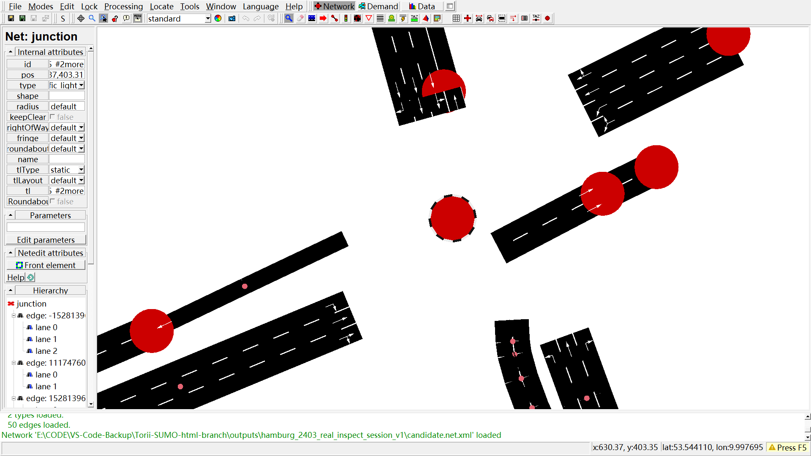

<p align="center">
  
</p>

# Torii

<p align="center">
  <strong>Task-Oriented Road Infrastructure Intelligence for Eclipse SUMO</strong>
</p>

<p align="center">
  Torii turns real-world traffic data and natural-language tasks into SUMO simulations.
</p>

<p align="center">
  <a href="https://tarard.github.io/Torii-SUMO/">Website</a> ·
  <a href="docs/codex-plugin-install.md">Installation</a> ·
  <a href="docs/README.md">Documentation</a> ·
  <a href="examples/01_signal_control_audit/task.md">Examples</a> ·
  <a href="LICENSE">MIT License</a>
</p>

<p align="center">
  <a href="README.md">English</a> ·
  <a href="README.zh-CN.md">简体中文</a> ·
  <a href="README.de.md">Deutsch</a>
</p>

## What Torii Does

<table>
<tr>
<td width="33%" valign="top">
<h3>Build</h3>
Build SUMO networks from OpenStreetMap, vehicle trajectory data, and road construction maps.
</td>
<td width="33%" valign="top">
<h3>Calibrate</h3>
Reconstruct traffic demand and calibrate simulations using real sensor measurements.
</td>
<td width="33%" valign="top">
<h3>Simulate</h3>
Run further SUMO experiments from natural-language instructions.
</td>
</tr>
</table>

## Quick Start

```powershell
codex plugin marketplace add Tarard/Torii-SUMO --ref main
codex plugin add torii-sumo@torii-sumo
```

Then ask Codex, for example:

```text
Use Torii to build a SUMO network from this OSM area.
Check connectivity, traffic signals, and routeability.
```

Torii requires Python 3.11+ and Eclipse SUMO.

## Hamburg Digital Twin

Torii is being used to reconstruct and validate a real traffic corridor in central Hamburg.

<p align="center">
  
</p>

<p align="center"><sub>From Hamburg public data to a reconstructed SUMO corridor.</sub></p>

Torii combines official traffic data, aerial imagery, and SUMO network reconstruction in one workflow.

<p align="center">
  
  
</p>

The current Hamburg calibration matches the aggregate detector count exactly, with **0.15 vehicles MAE per 15-minute bin**.

## Documentation

[Architecture](ARCHITECTURE.md) ·
[Installation](docs/codex-plugin-install.md) ·
[Documentation](docs/README.md) ·
[Examples](examples/01_signal_control_audit/task.md)

## License

Torii-SUMO is licensed under the [MIT License](LICENSE).

Earlier releases are archived on [Zenodo](https://doi.org/10.5281/zenodo.20627976).
