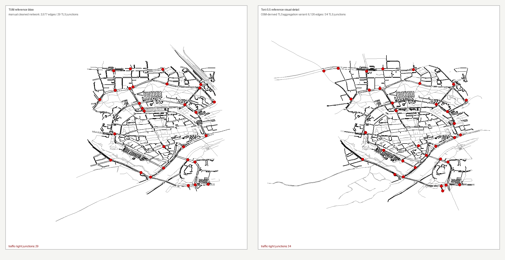

<p align="center">
  
</p>

#  Torii

<div align="center">

**Task-Oriented Road Infrastructure Intelligence**

**Agent plugin for SUMO**

<p><strong>Codex / Claude agent plugin</strong> · SUMO/TraCI 工作流 · OSM-to-SUMO 清洗 · 本地 MCP tools</p>

<a href="https://tarard.github.io/Torii-SUMO/"><strong>项目网站</strong></a> |
<a href="docs/codex-plugin-install.md"><strong>安装</strong></a> |
<a href="examples/01_signal_control_audit/task.md"><strong>信号控制审计</strong></a> |
<a href="examples/02_one_prompt_osm_network/README.md"><strong>One-Prompt Demo</strong></a> |
<a href="LICENSE"><strong>许可证</strong></a>

[English](README.md) | [简体中文](README.zh-CN.md) | [Deutsch](README.de.md)

</div>

## One Prompt to a SUMO Network, Across Models

Torii 面向 SUMO 工作：一句简短的自然语言 prompt 可以变成一个有边界的 OSM-to-SUMO 路网工作流，包含构建证据、路线可达性检查和清晰的结论边界。

插件现在从 workflow router 开始：`torii_auto_workflow` 会分类用户请求、选择 skill、制定计划，并运行安全的 MCP 步骤来为你生成或修改 SUMO 路网。

Torii 有两层：

| 层级 | 作用 |
|---|---|
| 推理层 | SUMO expert skills 负责提出正确问题、选择工作流并限定结论边界。 |
| 执行层 | 本地安全 stdio MCP tools 负责运行有边界的 SUMO 检查，并返回结构化观察。 |

当前 MCP tools 覆盖 `torii_auto_workflow` router、环境检查、配置预检、smoke run、证据包、OSM 路网构建、TLS 候选、多源 TLS 复核表、TLS aggregation review variant、连接性检查、connected-core 提取、路线可达性 probe、completion-aware routeability audit、reference join audit、junction aggregation review variant 和 Netedit 打开证据。

## Example

可以用这个 prompt 测试 Torii：

```text
Use Torii to clean the Ingolstadt city-center network from OSM, compare it with the TUM-VT/sumo_ingolstadt cleaned network for the same bbox, and open the cleaned network in Netedit.
```

这个 demo 现在使用 Ingolstadt 市中心，用来测试 Torii 从 OSM 清洗出的路网是否能向人工清洗参考路网收敛，而不是把 OSM 导入成功当作充分结果。



| 证据 | 结果 |
|---|---:|
| Torii vehicle core | connected-core 提取后，对比 bbox 内 2,493 条 edge、3,045 条 lane、1,220 个 junction |
| Torii reference visual-detail | 对比 bbox 内 6,126 条 edge、6,695 条 lane、2,997 个 junction |
| TUM 人工清洗参考子集 | 同一 bbox 内 3,577 条 edge、4,955 条 lane、1,752 个 junction |
| 信号灯 junction | Torii visual-detail raw 217；TLS aggregation review variant 34 vs TUM 29 |
| 剩余清洗目标 | 对多出的 TLS 候选做 Google Maps 复核，并继续做可复用的物理交叉口聚合 |
| claim status | `diagnostic-demo` |

详见 [`examples/02_one_prompt_osm_network`](examples/02_one_prompt_osm_network/README.md)。这次 5.5 对比用的关键路网和截图已提交到 example；生成的 OSM extract、route 和完整 log 仍然作为可重建产物保留。

## Quick Start

从 GitHub 安装：

```powershell
codex plugin marketplace add Tarard/Torii-SUMO --ref main
codex plugin add torii-sumo@torii-sumo
```

安装后开启一个新的 Codex 或 Claude Code 对话，让插件里的 skills 和 MCP tools 被发现。

完整安装说明见：[Codex Plugin Installation](docs/codex-plugin-install.md)。

## What You Can Ask Me

| Prompt | Torii 会做什么 |
|---|---|
| "Use Torii to clean the Ingolstadt city-center network from OSM and compare it with TUM-VT/sumo_ingolstadt." | 从 OSM 构建路网，检查连接性和路线可达性，将拓扑/TLS 证据与参考路网对比，并打开 Netedit。 |
| "Audit this TraCI signal controller before I compare it with fixed-time or max-pressure." | 在任何性能结论前检查 controller identity、成对 demand/seeds/horizon、TLS 映射、输出和完成度。 |
| "This SUMO run finishes, but tripinfo and summary disagree." | 诊断输出一致性、未完成车辆、teleport、route error 和结论边界。 |

## Boundaries

Torii 可以构建和审计 SUMO artifacts，但不会认证模型一定正确。

- OSM 导入在道路级别、连接性、路线可达性、TLS 现实性和地图基线证据完成前仍然只是诊断结果。
- `connected-core` 路网适合做 smoke test，但被丢弃的碎片和拓扑 warning 仍然属于结论边界。
- 它不能证明信号灯 timing、phasing、demand realism、controller correctness 或完整实验有效性。

## License and Notices

源代码使用 MIT 许可证。Skill 文件、文档、检查清单、示例和协议文本使用 CC BY 4.0。两个授权范围都写在 [`LICENSE`](LICENSE)。

Eclipse SUMO 是 Eclipse Foundation 的商标。OSM demo 中的地图数据 © OpenStreetMap contributors，并基于 Open Database License (ODbL) 提供。

早期 skill-only 版本已归档在 Zenodo：https://doi.org/10.5281/zenodo.20627976
