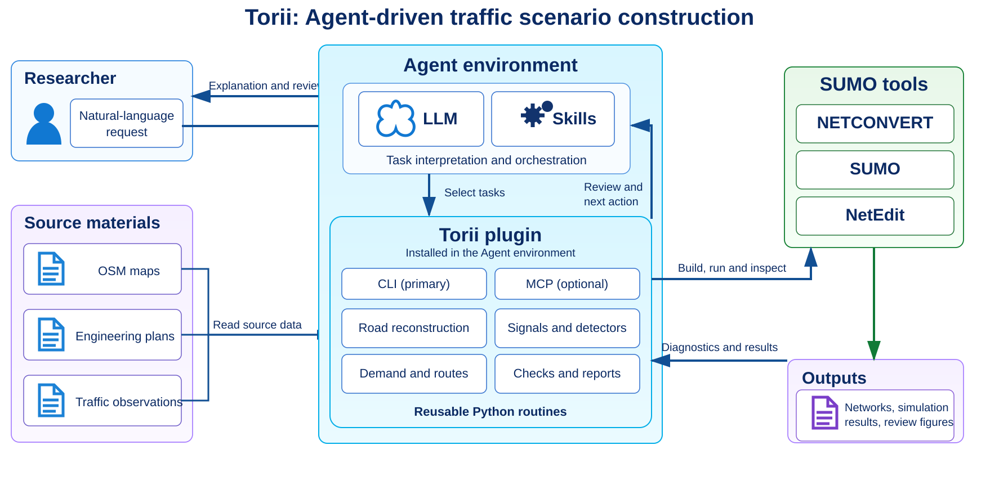
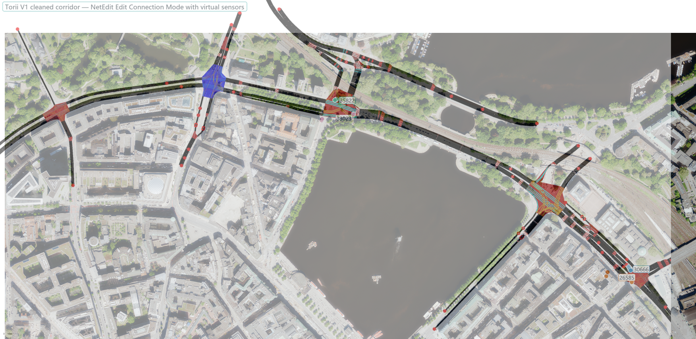
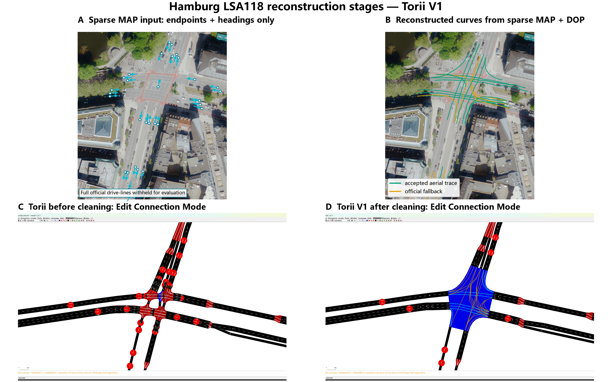

<p align="center">
  
</p>

# Torii

<p align="center">
  <strong>面向 Eclipse SUMO 的任务导向道路基础设施智能</strong>
</p>

<p align="center">
  Torii 将真实交通数据和自然语言任务转换为 SUMO 仿真。
</p>

<p align="center">
  <a href="https://tarard.github.io/Torii-SUMO/">网站</a> ·
  <a href="docs/codex-plugin-install.md">安装</a> ·
  <a href="docs/README.md">文档</a> ·
  <a href="examples/01_signal_control_audit/task.md">示例</a> ·
  <a href="LICENSE">MIT 许可证</a>
</p>

<p align="center">
  <a href="README.md">English</a> ·
  <a href="README.zh-CN.md">简体中文</a> ·
  <a href="README.de.md">Deutsch</a>
</p>

<p align="center">
  
</p>

## Torii 能做什么

<table>
<tr>
<td width="33%" valign="top">
<h3>构建</h3>
从 OpenStreetMap、车辆轨迹数据和道路施工图构建 SUMO 路网。
</td>
<td width="33%" valign="top">
<h3>校准</h3>
使用真实传感器观测重建交通需求并校准仿真。
</td>
<td width="33%" valign="top">
<h3>仿真</h3>
根据自然语言指令继续运行 SUMO 实验。
</td>
</tr>
</table>

## 快速开始

```powershell
codex plugin marketplace add Tarard/Torii-SUMO --ref main
codex plugin add torii-sumo@torii-sumo
```

然后可以向 Codex 这样提问：

```text
Use Torii to build a SUMO network from this OSM area.
Check connectivity, traffic signals, and routeability.
```

Torii 需要 Python 3.11+ 和 Eclipse SUMO。

## 汉堡数字孪生

Torii 正被用于重建和验证汉堡市中心的一段真实交通走廊。

<p align="center">
  
</p>

<p align="center"><sub>Torii V1 走廊叠加在航拍影像上，包含车道连接和虚拟传感器。</sub></p>

Torii 在同一工作流中结合官方交通数据、航拍影像和 SUMO 路网重建。

<p align="center">
  
</p>

<p align="center"><sub>LSA118 重建：官方 MAP 端点与朝向、重建曲线，以及清洗前后的车道连接。</sub></p>

当前汉堡校准能够精确匹配总检测器计数，**每个 15 分钟时间段的 MAE 为 0.15 辆车**。

## 文档

[架构](ARCHITECTURE.md) ·
[安装](docs/codex-plugin-install.md) ·
[文档](docs/README.md) ·
[示例](examples/01_signal_control_audit/task.md)

## 许可证

Torii-SUMO 使用 [MIT License](LICENSE) 许可。

早期版本已归档至 [Zenodo](https://doi.org/10.5281/zenodo.20627976)。
