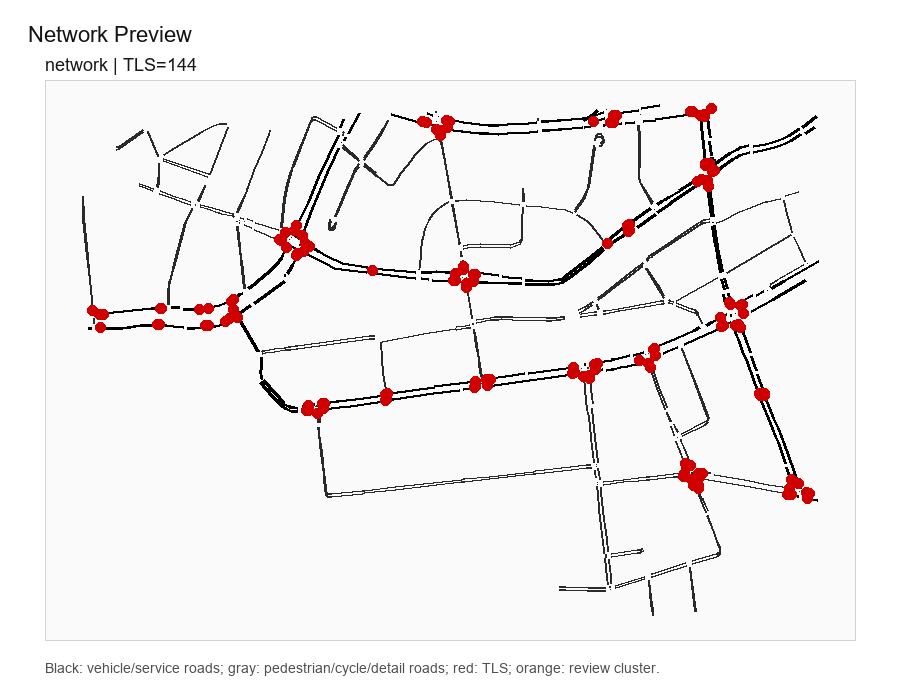
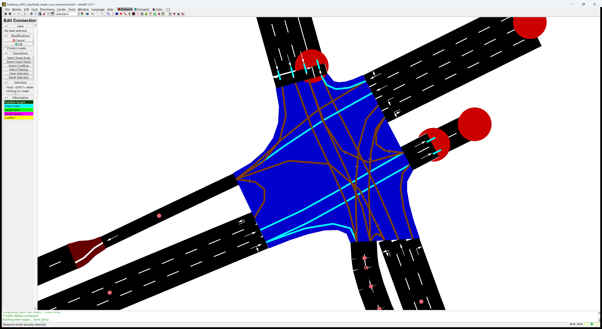
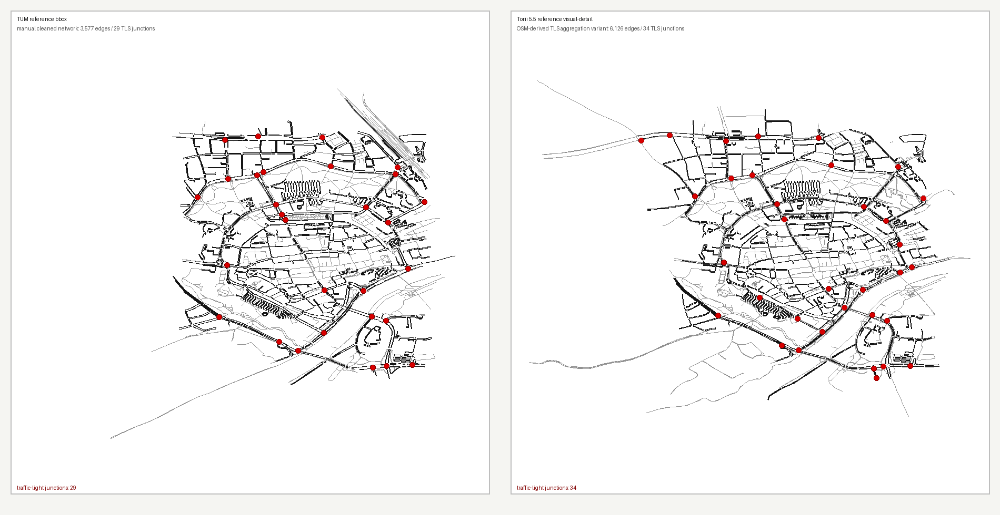

<p align="center">
  
</p>

#  Torii

<div align="center">

**Task-Oriented Road Infrastructure Intelligence**

**Agent plugin for SUMO**

<p><strong>Codex / Claude agent plugin</strong> · SUMO/TraCI 工作流 · OSM-to-SUMO 清洗 · 本地 MCP tools</p>

<a href="https://tarard.github.io/Torii-SUMO/"><strong>项目网站</strong></a> |
<a href="docs/codex-plugin-install.md"><strong>安装</strong></a> |
<a href="examples/01_signal_control_audit/task.md"><strong>信号控制审计</strong></a> |
<a href="examples/02_one_prompt_osm_network/README.md"><strong>One-Prompt Demo</strong></a> |
<a href="LICENSE"><strong>许可证</strong></a>

[English](README.md) | [简体中文](README.zh-CN.md) | [Deutsch](README.de.md)

</div>

## Evidence-Aware OSM-to-SUMO Construction

Torii 面向 SUMO 路网构建工作：一句简短的自然语言 prompt 可以变成一个有边界、证据驱动、可与参考路网对比的 OSM-to-SUMO 工作流，包含构建证据、路线可达性检查、审查 artifacts 和清晰的结论边界。

插件现在从 workflow router 开始：`torii_auto_workflow` 会分类用户请求、选择 skill、制定计划，并运行安全的 MCP 步骤来为你生成或修改 SUMO 路网。

Torii 有两层：

| 层级 | 作用 |
|---|---|
| 推理层 | SUMO expert skills 负责提出正确问题、选择工作流并限定结论边界。 |
| 执行层 | 本地安全 stdio MCP tools 负责运行有边界的 SUMO 检查，并返回结构化观察。 |

架构说明见 [`ARCHITECTURE.md`](ARCHITECTURE.md)：router、planner、executor 和 reviewer。

当前 MCP tools 覆盖 `torii_auto_workflow` router、环境检查、配置预检、smoke run、证据包、OSM 路网构建、TLS 候选、多源 TLS 复核表、TLS aggregation review variant、代码原生的全网及原网到候选 Connection Mode 差分审计、严格的标准三/四叉口 NEMA 相位绑定候选、连接性检查、connected-core 提取、路线可达性 probe、completion-aware routeability audit、overlapping top-level junction audit、reference join audit、junction aggregation review variant 和可选的 NetEdit 打开证据。

### 当前走廊级验收边界

研究状态（2026-07-14）：Stage 1-M 已达到 **Machine REVIEW_READY**。30 个盲化 held-out 走廊包、完整机器 witness census、确定性抽样和 provenance 已冻结，可以进入真实人工验证。这不等于 Stage 1 退出、自动修复获得认证，也不证明任意 OSM 路网已经达到专家 NetEdit 质量。详见 [Stage 1-M 机器证据](docs/stage1-machine-review-ready-plan.md)。

## 汉堡走廊数字孪生：证据报告

产品目标是 **Am Sandtorkai 2349 → 2394 → 2403** 三节点带支路走廊。OSM 负责连续道路骨架，Torii 只在有证据的范围内清洗；Hamburg MAP/OCIT-C/TLD 和官方道路数据决定 movement、信号与传感器身份；SUMO 在同一断面放置 E1/E2，并求解一种能解释官方观测的可行 route 组合。该 route 是非唯一逆问题的一种解，不是唯一 OD 或车辆轨迹真值。

<table>
<tr>
<td width="50%"><strong>汉堡官方 2024 航拍</strong><br></td>
<td width="50%"><strong>LSBG 2022 官方施工图</strong><br></td>
</tr>
<tr>
<td><strong>OSM 导入拓扑</strong><br></td>
<td><strong>Torii 清洗走廊——完整 Connection Mode</strong><br></td>
</tr>
</table>

右下图是刚重新生成的**完整修正版路网 Connection Mode**，不是局部截图，绑定网络 SHA-256 `2da03214…f5c559`。另外的 `NeteditTargetSession` 已真实点击 2403 网络对象并确认左侧显示 `Net: junction`、不是 polygon；该局部证明保留为仓库证据，但不作为报告主图。该 2403 单核心探针保留 18/18 条边界 movement，表面重叠为 0，可被 SUMO 加载，18/18 条 movement smoke 全部到达，碰撞和 teleport 均为 0；但由于官方尚未发布可绑定的 2403 MAP/OCIT，它仍是审核候选，不是最终官方信号模型。

### 信号灯、传感器和 route 复原

<p></p>

| 层 | 已实现证据 | 当前边界 |
|---|---|---|
| 信号灯 | 2349、2394 的 TLD 主信号流已绑定到官方 MAP movement 和实际 SUMO controller `linkIndex`。 | 2403 只有官方 LSA 身份，没有公开 MAP/OCIT 包；Torii 不猜控制器。 |
| 传感器 | 方向站点已通过 composition 绑定到物理 field；E1 用于计数，E2 只用于排队/占有率诊断。 | 19 条映射流中 11 条车道身份为低置信度，因此自动晋级继续阻断。 |
| 路线逆问题 | 使用非负整数约束 `H x_t = y_t`；诊断矩阵为 6×58、rank 6、nullity 52。 | 多条 route 对传感器不可区分，只能得到一个可行解。 |
| 精确矩阵诊断 | 关闭 TLS 时，60/60 个站点时间桶、5,928 辆计数完全一致。 | 只证明需求反演器，不证明现场信号回放。 |
| 官方历史严格窗口 | 15 条候选路线、7 条受测道路、8 个 15 分钟片；route 约束匹配 100%，7,200 秒内零碰撞、零 teleport。 | E1 MAE 仍为 26.47，且 2403/车道证据门禁未过；状态为 `detector-constrained-diagnostic-replay`。 |

### 展示内容与仓库内容分层

| 适合在 README/项目页展示 | 直接放入仓库、用于复现 |
|---|---|
| 精选航拍、施工图、OSM 输入、Connection Mode 清洗结果、TLS 截图和核心指标。 | W0–W5 编排代码、官方数据 adapter、测试、简要开发日志、schema、来源与 SHA-256 证据摘要。 |
| 人能读懂的结论和明确限制。 | 完整生成网络、API 缓存、E1/E2 XML、route ensemble 和 NetEdit 会话仍放在可重建的 `artifacts/`/`outputs/`，不把数 GB/上百 GB 运行缓存塞进 Git。 |

图片来源与许可见[图片证据说明](docs/assets/hamburg-digital-twin/README.md)，核心机器证据见 [`docs/hamburg-digital-twin-evidence-summary.json`](docs/hamburg-digital-twin-evidence-summary.json)，每轮做过什么见[持续开发日志](docs/hamburg-digital-twin-development-log.md)。官方来源包括 [Hamburg LGV DOP](https://metaver.de/trefferanzeige?docuuid=cc0eaed8-cb36-44a0-9bda-153f28d9e7ba) 和 [LSBG 施工图](https://lsbg.hamburg.de/resource/blob/784084/6a06328b36b0de140d75baac9165f8f7/am-sandtorkai-brooktorkai-pop-up-bikelane-verstetigung-abgestimmte-planung-plan-data.pdf)。

### 可复用 W0–W5 工作流

```text
W0 冻结范围/证据
 ↓
W1 OSM 骨架 → estimator/controller/feedback → 审计后的 SUMO 候选
 ├───────────────┐
 ↓               ↓
W2 MAP/OCIT/TLD  W3 传感器 + route incidence/整数需求
 └───────┬───────┘
         ↓
W4 SUMO 回放 + 现实/虚拟 E1 对比
         ↓
W5 哈希绑定报告、下游失效传播与产品包
```

Torii 复用现有模块，不另造第二套路网算法。复制[配置模板](docs/hamburg-digital-twin-workflow.example.json)，把 `<run>` 替换为真实 stage manifest 路径，然后运行：

```powershell
python plugins/torii-sumo/scripts/run_hamburg_execution_plan.py --config hamburg-workflow.json
```

配置内路径相对配置文件解析；任一上游 manifest/feedback 哈希变化会自动使依赖阶段失效。源路网不被覆盖，缺失官方资产只会形成 blocked gate，不会被模型猜测补齐。

### 无 teacher 的小路网自动发现

新的 v2 小路网路径不再要求 teacher、人工 reviewed scope、预填 topology 或 movement 数量。它会直接扫描冻结 OSM bbox 的信号锚点，保守去重 physical-cell 候选，机器选择图 medoid，生成 boundary ports、movement variants 和 split/merge/partial-repair 候选 DAG，之后才允许把 materialized SUMO 网络作为后验验证输入。XS1 自动恢复 4 个 approach 和 12 条 movement；XS2 自动选择了不同于旧手工 seed 的 canonical node，但仍正确绑定 materialized 网络，并保留 6/7 movement 歧义而不自动选择。完整设计、正反 pedestrian crossing 和可复现实验见 [teacher-free discovery v2](docs/teacher-free-osm-signal-discovery-v2.md)。

```powershell
python plugins/torii-sumo/scripts/run_teacher_free_discovery.py --osm <bbox.osm.xml> --output-dir <review-output>
```

输出为 hash-bound JSON、GeoJSON、HTML 和 manifest；源 OSM 保持不可变，所有自动晋级继续阻断。

已经实现的晋级契约以走廊为尺度：接受的修改会物化为独立候选网络；审核位置写入 SUMO `additional.xml`；受保护的语义或 TLS 变化必须有绑定候选 SHA-256 的精确审核决定；身份、netconvert、XML、SUMO load、routeability、topology 和 modal connectivity 证据全部通过前不会晋级。

每个物化修改现在都会生成一套审核包：`*.net.xml`、`*.map-review.json`、`*.accepted.review.add.xml`、`*.review.html`、`*.review.json` 和带哈希的 manifests。`additional.xml` 只负责展示，并且只允许 `poi`、`poly`、`param`；人工决定保存在结构化 JSON 中。Google Maps、卫星图、Mapillary、KartaView 或区域地图只是辅助证据；只有修改显式声明 `map_review_required: true`，并给出 current 或 historical 时间范围时，地图审核才成为硬门。

真实 SUMO 可复现回归覆盖四向 OSM sidewalk、SUMO 官方 pedestrian crossing/TLS 审核、五向 bicycle 和五向 ramp：

```powershell
python plugins/torii-sumo/scripts/run_corridor_contract_regression.py
```

脚本会现场重建源网络，不依赖旧的生成输出。当前架构结论和剩余债务见 [`docs/architecture-audit-2026-07-13.md`](docs/architecture-audit-2026-07-13.md)。

### 代码原生 Connection Mode 硬门

`sumo_network_connection_mode_audit` 会直接从 `.net.xml` 重建 NetEdit Connection Mode；OSM 清洗流程默认执行这项审计，而面向用户的 NetEdit 自动打开默认关闭。它逐路口核对直接 `fromLane -> toLane -> via`、完整 internal-lane continuation、车道与权限、request 顺序和 bitstring、转向车道顺序、lane-rank/交叉映射、机动车入口/出口车道覆盖、TLS `linkIndex` 边界、controller state-string 长度、互为 foe 却共享 signal group，以及同相位同时得到保护 `G` 的 foe movement。SUMO 运行时管理的 `rail_signal` 会被单独分类，不再误报成缺少道路 `tlLogic`。

结果分三档：XML/path/request/linkIndex 确定损坏为 `fail`；合法但存在歧义的 merge、fanout、lane drop、lane addition 或信号冲突为 `review_required`；完全无发现才是 `pass`。前两档都会阻断候选自动晋级。工具输出 JSON、仅用于显示的审核 `additional.xml` 和绑定源 SHA-256 的 manifest。这样 NetEdit 只用于被标记疑难点的可视化复核，routeability 不能再代替车道绑定证明。

`sumo_network_connection_mode_regression_audit` 是“原网 → 候选网”的差分硬门。它分别审计两个 `.net.xml`，把声明的修改范围闭包到被触及 TLS controller 的成员，再按逐路口 finding category 比较，不依赖容易变化的 internal connection 序号。目标范围内新增结构错误或审核项、范围外任何回归、以及无法解释的范围外 junction 身份变化都会阻断晋级。teacher-guided repair queue 已默认执行这道门，并在每个全网候选旁写出 JSON、仅显示的 `additional.xml` 和 SHA-256 manifest；只要候选文件存在，即使前面的 semantic/parity 已失败，也仍可执行这项诊断。

当前 Ingolstadt 同 bbox effective network 的全网审计覆盖 2,274 个路口和 13,169 条直接 movement，13,169/13,169 条 internal path 均被代码证明连续；结构失败为 0，2,164 个路口通过，110 个进入证据审核。队列包括 27 条“入口机动车车道无 junction connection”、19 条“出口机动车车道无来源 connection”、合法 merge/fanout，以及 junction `267517559` 的 1 组当前 TLS 保护绿 foe。12 个铁路隐式 controller 被正确记录为 SUMO runtime rail signal。没有 OSM、地图或车道标线证据时，系统不会从这些发现直接推断修复。

当前 Südliche Ringstraße 重建候选被明确禁止晋级。差分门先发现 plain-XML round trip 会重复应用 type 里的 `sidewalkWidth`/`bikeLaneWidth`，使 lane index 整体错位并产生 1,828 个范围外新增审核项；round-trip type 清洗已经消除这类全网污染。最新安全默认候选的范围外结构错误、审核回归和 junction 身份变化均为 0，但因为目前只映射了更复杂信号单元中的 3 个节点，目标范围内仍新增 13 个结构错误和 27 个审核项，所以继续保持阻断。完整 controller 合并的实验候选也被代码否决。对这些被阻断候选没有 routeability 成功宣称，也没有修改源网络。

### 标准三/四叉口 NEMA 相位绑定

`sumo_network_standard_nema_phase_binding` 已接入 OSM 清洗边界。不传 `junction_id` 时，它只扫描最终有效网络，输出资格队列、独立的 Connection Mode JSON 报告、仅用于显示的 review `additional.xml`、HTML、decision contract 和带哈希 manifest，不会批量修改路网。传入一个 eligible `junction_id` 后，它才会生成独立、可回滚候选，把受保护左转映射到 NEMA 奇数相位，把直行/右转映射到偶数相位，只重写目标 controller 的 `linkIndex` 信号组和 `tlLogic`，然后强制通过 netconvert、SUMO load 和 routeability 三道门。

标准四叉口采用跨环归属：主路一侧左转/直行右转为 5/2，对向为 1/6；支路两侧为 7/4 与 3/8，因此支持官方定义的 1+5、1+6、2+5、2+6 及支路对应组合。三叉口按 SUMO NEMA 规则使用缺相 `0` 占位，并在第二道 barrier 的空侧重复 phase 4。在写出任何候选前，Connection Mode 硬门会沿完整 internal-lane 链追踪每个 `fromLane -> toLane -> via`，检查右侧通行的转向车道顺序和 lane-rank 跳变，验证 request/foes 矩阵，并阻断任何“canonical NEMA 可能并发、但 SUMO 标为 foes”的 movement 对。joined controller、人行/internal 或铁路 link、纯自行车 movement、掉头、`linkIndex2`、几何歧义、arm-to-arm movement 不完整、左转车道不专用也都会 fail-closed。即使所有运行门通过，候选仍保持 `review_required`，因为默认 90 秒方案不是现场标定配时。

phase/ring 契约遵循 SUMO 官方 [NEMA controller 文档](https://sumo.dlr.de/docs/Simulation/NEMA.html)，signal group 遵循官方 [`linkIndex` state-string 语义](https://sumo.dlr.de/docs/Simulation/Traffic_Lights.html)，request/foe 索引遵循官方 [SUMO 路网格式](https://sumo.dlr.de/docs/Networks/SUMO_Road_Networks.html)。routeability 运行已开启 SUMO junction collision 检查；单纯图可达不再被视为 Connection Mode 证据。

本机 SUMO 1.27.1 已重新验收标准四叉和 T 型三叉：两者的 Connection Mode、candidate validation、netconvert round trip、SUMO load 和 12/12 routeability 全部通过，并开启 junction collision 检查，collision/teleport 均为 0。四叉验证 12 条内部 movement path 并绑定到 phases 1–8；三叉验证 6 条 path，使用 phases 1/2/4/6，以及 rings `1,2,0,4`、`0,6,0,4`。当前 Ingolstadt 同 bbox 扫描绑定到可被 SUMO 加载的 effective TLS-cleaned network，共生成 249 条 TLS-junction 审核记录，其中几何上有 24 个三叉和 4 个四叉，但严格自动资格为 0。1,617 条 request-bound movement path 全部结构有效：221 个 TLS 路口通过 Connection Mode 证明，28 个为 `review_required`，结构失败为 0；28 个标准几何路口中为 15 个通过、13 个需要证据审核。审核发现表示机器还不能自动证明安全，不等于被标记 link 必然错误。统一 display-only 审核层把 28 个 connection-review 位置与 221 个仅因其他 NEMA 范围条件被阻断的位置分开，并且没有修改 effective network。

### Ingolstadt 教师走廊切片

第一个同 bbox 教师切片已经可以端到端执行：

```powershell
python plugins/torii-sumo/scripts/run_ingolstadt_corridor_teacher.py
```

默认行为仍是单路口的边界切片。若要对同 bbox 原始 OSM 与完整人工清洗参考网执行
reference-cluster 匹配、聚合候选估计和差分门禁，可继续使用同一个 runner：

```powershell
python plugins/torii-sumo/scripts/run_ingolstadt_corridor_teacher.py --workflow-mode reference-matched
```

该模式直接委托 Torii 已有的 `reference_matched` OSM 清洗工作流，不另造第二套聚类
算法；原始 OSM、聚合候选、teacher replay 候选和人工参考网会分别保存并绑定哈希。
默认只运行 estimator；teacher replay 和昂贵的候选物化必须显式传入
`--materialize-teacher-candidates`。该 estimator 路径会关闭全网 TLS 聚合，避免在单个
冲突核通过保真与几何门禁前污染 OSM 比较基线。

它会下载当前 OSM bbox，构建 raw visual-detail 路网，只应用边界严格、证据充分的结构修复，然后运行 SUMO load、completion-aware routeability，并把 junction `267517510` 与 TUM 人工清洗单元对照。结构修复始终写入独立候选：本次只从一条已经是无控制状态的人行内部连接删除了 1 个陈旧 TLS identity，58 个内嵌 `tlLogic` 和 12 个铁路隐式控制器保持不变，源文件哈希确认未变，同时生成逐项回滚计划和仅用于显示的 review `additional.xml`。

最新本机 SUMO 1.27.1 验收中，候选成功加载，随机生成的 10/10 行程全部完成，collision 和 teleport 均为 0。教师迁移仍是 `review_required`：当前 OSM 已支持信号灯控制，并明确包含 3 个信号控制 crossing 节点；候选剩余差异是人行内部结构和 movement signatures。因此 Torii 不会机械重放旧教师 TLS。生成的 run manifest 和 HTML 用 SHA-256 绑定精确 OSM、source、candidate、地图证据和审核产物。

在线获取完成后，可以同时传入 `--candidate-net` 和 `--source-osm` 做确定性离线重放；runner 会跳过 Overpass，但仍把精确 OSM 证据写入教师对照和 manifest。下载失败会保留为 blocked run，不会静默复用缓存冒充在线成功。

## Example

可以用这个 prompt 测试 Torii：

```text
Use Torii to clean the Ingolstadt city-center network from OSM, compare it with the TUM-VT/sumo_ingolstadt cleaned network for the same bbox, run the code-native Connection Mode audit, and open only flagged junctions in NetEdit if visual review is needed.
```

这个 demo 使用 Ingolstadt 市中心，用来测试 Torii 的 OSM-derived workflow 是否比单纯导入更可审计，并且是否更接近人工清洗参考路网。目前已经证明的验收结论是上面的单走廊切片；下面较早的全 bbox 表格仍是诊断证据，不代表城市级自动等价已经完成。



| 证据 | 结果 |
|---|---:|
| Torii vehicle core | connected-core 提取后，对比 bbox 内 2,493 条 edge、3,045 条 lane、1,220 个 junction |
| Torii reference visual-detail | 对比 bbox 内 6,126 条 edge、6,695 条 lane、2,997 个 junction |
| TUM 人工清洗参考子集 | 同一 bbox 内 3,577 条 edge、4,955 条 lane、1,752 个 junction |
| 信号灯 junction | Torii visual-detail raw 217；TLS aggregation review variant 34 vs TUM 29 |
| 剩余清洗目标 | 对多出的 TLS 候选做 Google Maps 复核，并继续做可复用的物理交叉口聚合 |
| claim status | `diagnostic-demo` |

详见 [`examples/02_one_prompt_osm_network`](examples/02_one_prompt_osm_network/README.md)。这次 5.5 对比用的关键路网和截图已提交到 example；生成的 OSM extract、route 和完整 log 仍然作为可重建产物保留。

## Quick Start

从 GitHub 安装：

```powershell
codex plugin marketplace add Tarard/Torii-SUMO --ref main
codex plugin add torii-sumo@torii-sumo
```

安装后开启一个新的 Codex 或 Claude Code 对话，让插件里的 skills 和 MCP tools 被发现。

完整安装说明见：[Codex Plugin Installation](docs/codex-plugin-install.md)。

## What You Can Ask Me

| Prompt | Torii 会做什么 |
|---|---|
| "Use Torii to clean the Ingolstadt city-center network from OSM and compare it with TUM-VT/sumo_ingolstadt." | 从 OSM 构建路网，检查连接性、路线可达性和代码原生车道绑定，将拓扑/TLS 证据与参考路网对比并生成审核队列；NetEdit 只在疑难点需要时打开。 |
| "Audit this TraCI signal controller before I compare it with fixed-time or max-pressure." | 在任何性能结论前检查 controller identity、成对 demand/seeds/horizon、TLS 映射、输出和完成度。 |
| "This SUMO run finishes, but tripinfo and summary disagree." | 诊断输出一致性、未完成车辆、teleport、route error 和结论边界。 |

## Boundaries

Torii 可以构建和审计 SUMO artifacts，但不会认证模型一定正确。

- OSM 导入在道路级别、连接性、路线可达性、TLS 现实性和地图基线证据完成前仍然只是诊断结果。
- `connected-core` 路网适合做 smoke test，但被丢弃的碎片和拓扑 warning 仍然属于结论边界。
- 它不能证明信号灯 timing、phasing、demand realism、controller correctness 或完整实验有效性。

## License and Notices

源代码使用 PolyForm Noncommercial 1.0.0。Skill 文件、文档、检查清单、示例和协议文本使用 CC BY-NC 4.0。商业使用需要另行取得书面许可。两个授权范围都写在 [`LICENSE`](LICENSE)。

Eclipse SUMO 是 Eclipse Foundation 的商标。OSM demo 中的地图数据 © OpenStreetMap contributors，并基于 Open Database License (ODbL) 提供。

早期 skill-only 版本已归档在 Zenodo：https://doi.org/10.5281/zenodo.20627976
