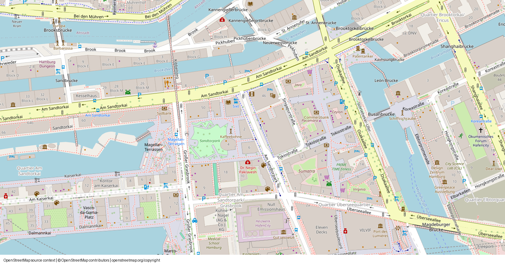
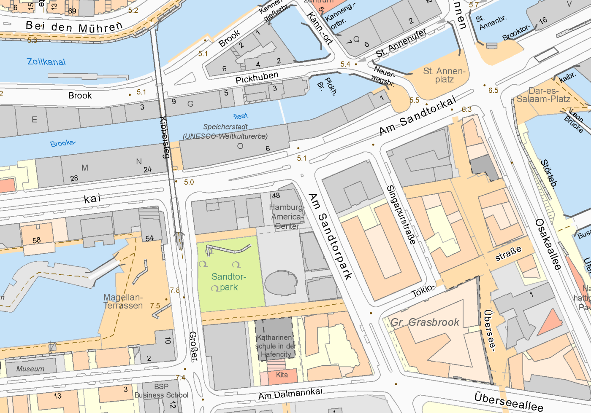
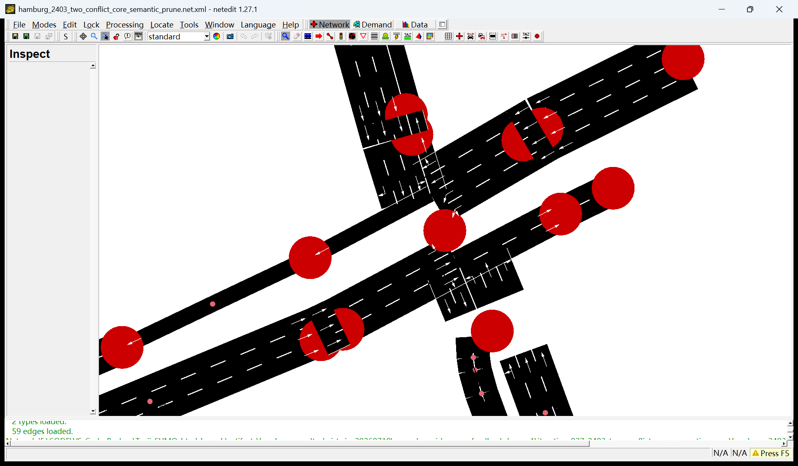
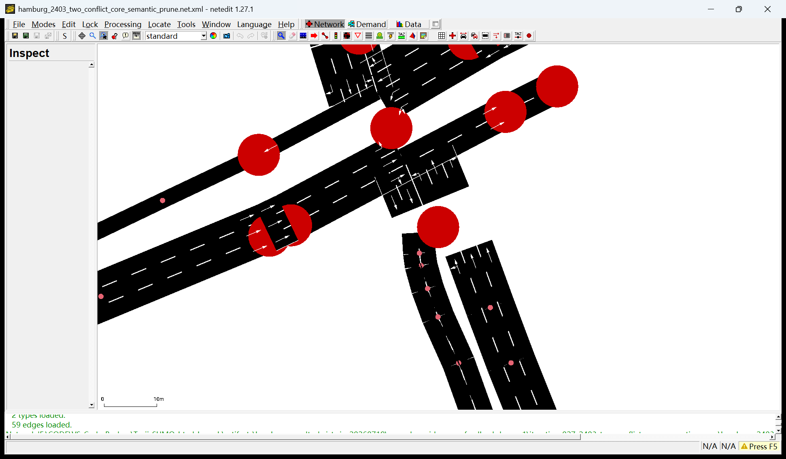

# Hamburg Am Sandtorkai W1/W2 evidence bundle

This frozen bundle accompanies the Hamburg `2349 -> 2394 -> 2403` corridor work.
It is intentionally small: it contains the immutable OSM acquisition, the reviewed
W1 SUMO network, visual review material, and compact W2 signal evidence. Generated
intermediate runs remain outside version control.

## Current stage status

| Stage | Status | Claim boundary |
|---|---|---|
| W1 road topology | `review_ready`; execution gate `pass` | The exact network preserves all 23 source-authorized boundary movements, has zero recorded surface/Connection Mode failures, loads in SUMO, and passes 23/23 movement smoke routes with zero teleport/collision. This does not prove 2403 signal control. |
| W2 signal binding/history | 2349 and 2394 `pass`; corridor promotion `blocked` | 16/16 published primary-signal streams bind to 22 physical SUMO controlled connections. The frozen two-hour weekday history contains 3,671 exported link events. Node 2403 has no current machine-bindable MAP/OCIT/TLD control asset. |
| W3 station cross-sections | `in_progress`; automatic promotion `blocked` | The official 15-minute station layer provides nine streams in the selected Saturday window: six directional cross-sections are constraints and three direction-0 totals are QA only. Four directional sections are ready for hash-bound E1/E2 materialization; two 2403 arm-2 sections remain semantic reviews, and 2349 has no published station stream. The earlier 19 field-to-lane hypotheses remain diagnostics only. |

The W1 candidate SHA-256 is
`aa1676df2182026a87d261e633d2cf8bd100c9b2a8c3ee6ac9d9d3dd22d49a33`.

## Included files

- `hamburg_sandtorkai_source_bbox.osm.xml.gz`: immutable raw OSM bbox acquisition.
- `hamburg_osm_original_map.png`: rendered OpenStreetMap context for the same
  bbox, including the required contributor attribution.
- `osm-source-overpass-query.ql` and `osm-source-commands.txt`: acquisition and
  import provenance.
- `hamburg_sandtorkai_w1.net.xml`: reviewed SUMO/NetEdit W1 network.
- `w1-handoff.manifest.json`: hash-bound W1 machine-gate summary.
- `netedit_w1_north_core.png` and `netedit_w1_south_core.png`: final hash-bound
  NetEdit overview captures for the two physical 2403 conflict cores.
- `hamburg_official_geobasemap.png`: official Hamburg real-world basemap for the
  same corridor extent.
- `w2-signal-binding.manifest.json`, `w2-signal-bindings.json`,
  `w2-signal-observations.manifest.json`, and `w2-tls-link-events.csv`: compact
  W2 binding and historical-event evidence for 2349/2394.
- `bundle.manifest.json`: portable file hashes and source/claim metadata.

## Visual cross-checks

OpenStreetMap source context:

Official Hamburg geobasemap:

Final NetEdit north conflict core:

Final NetEdit south conflict core:

## Sources and licensing

The OSM snapshot covers `9.9880,53.5405,10.0030,53.5450` and was acquired with
the included Overpass query. OpenStreetMap data is available under the ODbL;
attribution: (c) OpenStreetMap contributors. The rendered context uses the
standard OpenStreetMap tile layer at zoom 17 and carries attribution in-image.

The official map image was fetched from Hamburg's
`HH_WMS_Geobasiskarten` service using layer `geobasiskarten_farbig`, EPSG:25832,
and bbox `565650,5932950,566220,5933350`. It is licensed under Datenlizenz
Deutschland - Namensnennung - Version 2.0. Attribution: Freie und Hansestadt
Hamburg, Landesbetrieb Geoinformation und Vermessung.

- OSM copyright: https://www.openstreetmap.org/copyright
- Hamburg WMS metadata: https://metaver.de/trefferanzeige?docuuid=3CFD37D9-C920-4DD5-81B3-B3FE1671D7B9
- Hamburg WMS capabilities: https://geodienste.hamburg.de/HH_WMS_Geobasiskarten?SERVICE=WMS&REQUEST=GetCapabilities

Screenshots are review evidence only. They cannot authorize movement, lane,
controller, signal-timing, or detector-aggregation promotion.
