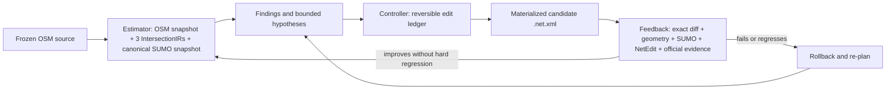

# Hamburg corridor digital-twin development log

This is the concise, continuously maintained engineering log for the Hamburg
three-intersection corridor digital-twin work. It records decisions and evidence
boundaries that may later become reusable Torii product design. It is not a
substitute for machine-readable manifests.

## Fixed objective

Build a branched corridor of about three intersections in SUMO, place virtual
detectors at the official detector locations, replay official signal control when
the same-window history is available, and reproduce the observed traffic counts.

## Reusable feedback loop



NetEdit loads only the exact candidate `.net.xml`. Its companion state is a
bundle of Torii's existing contracts: one `IntersectionIR` per target junction,
a corridor `CanonicalNetworkSnapshot`, a `WorkflowState` control summary, and a
hash-closed `ArtifactManifestV1` containing the edit ledger, rollback, audits,
parent candidate, and promotion trace.

### Estimator state bundle

```text
iteration_N/
  candidate.net.xml                    # exact SUMO/NetEdit payload
  estimator/
    source-osm.snapshot.json           # immutable downloaded OSM facts
    osm-derivation.json                # source -> filtered OSM provenance
    sumo.snapshot.json                 # exact imported SUMO facts
    osm-sumo-lineage.json              # source IDs and confidence
    canonical-network.snapshot.json    # corridor-level semantic state
    intersections/<node>/intersection_ir.json
  controller/
    workflow-state.json                # concise control-console summary only
    promotion-trace.json
  feedback/
    exact-semantic-regression/         # source/candidate diff and safety gates
  edit-ledger.json                     # reversible proposed edits
  rollback.json
  artifact-manifest.json               # authoritative paths, hashes, and DAG
```

No single JSON file replaces the network. The `.net.xml` remains the executable
payload; the estimator bundle makes its source, semantics, uncertainty, and
change history explicit. Only hash-bound artifacts produced by known Torii
adapters may influence promotion. `WorkflowState` is never promotion authority.
When two files contain the same canonical snapshot bytes, the authoritative
artifact DAG keeps one identity instead of treating the copy as new evidence.

## Evidence and authority order

1. Hamburg MAP/OCIT-C/TLD: movement, signal-group, and signal-state authority.
2. Current Hamburg HH-SIB/HVS and official road objects: road-axis, direction,
   stationing, carriageway, and lane-inventory authority.
3. Hamburg cross-sections and detailed mapping: independent structured topology
   corroboration; their survey/validity date remains a mandatory gate.
4. OSM: acquisition and candidate-topology input only.
5. Google Maps/Street View, Hamburg DOP, and NetEdit screenshots: visual review
   only; they cannot authorize automatic promotion.
6. Torii/SUMO load, routeability, smoke traffic, and detector fit: diagnostics
   and runtime validation only; they do not prove real-world topology.

If structured official sources conflict, the candidate remains blocked. Missing
evidence is never replaced with a guessed connection or signal program.

## Progress log

| Date | Step | What changed or was checked | Result | Reusable Torii design |
|---|---|---|---|---|
| 2026-07-11 to 2026-07-19 | Initial Am Sandtorkai corridor | Reused Torii OSM cleanup, compact-corridor extraction, MAP/KML/OCIT parsing, detector mapping, routeSampler, SUMO E1/E2, signal replay, NetEdit review, and geometry audits. | Flow reconstruction worked, but incomplete 2403 signal assets and several topology/geometry defects blocked a complete twin. | Keep source snapshots immutable; candidate networks are versioned; every stage fails closed and records hashes. |
| 2026-07-19 | Compound-junction handling | Classified complex junctions separately from their signal controller. In particular, one controller no longer implies one merged SUMO junction. | Removed the unsafe whole-junction merge assumption and large overlapping junction shapes. | Represent skeleton, channelization, physical owners, and controller domain as separate dimensions. |
| 2026-07-19 | Alternative corridor screen | Selected `1923 -> 2363 -> 2150` because all three nodes have official MAP/KML/OCIT assets and a complete Saturday detector window. | Suitable as a topology and replay validation corridor; it does not replace the named Am Sandtorkai product target. | Add an automatic corridor-selection gate over signal assets, counts, distance, and official road continuity. |
| 2026-07-19 | Official road/MAP splice | Reused Torii lane-axis stitch, splice planner/materializer, PlainXML, netconvert, surface-overlap audit, Connection Mode audit, and SUMO load checks. | Candidate v26 loads, has zero structural connection failures and zero surface overlap, but generic Connection Mode still reports 27 semantic findings. | PlainXML is the editable representation; final `.net.xml` is always regenerated by netconvert. |
| 2026-07-19 | Exact movement and TLS binding | Bound official MAP movements to physical SUMO connections and TLD streams using exact lane keys and signal groups. | 19/19 movements are routeable; 19/19 signal bindings are available, including two explicitly audited same-signal-group projections. | Signal-group projection is opt-in, same-node/same-group only, and retains provenance. |
| 2026-07-19 | Detector-constrained replay | Reused routeSampler and detector writers. Added an explicit detector-boundary diagnostic mode and lane-positioned departures. | Validation corridor achieved a near-exact detector replay, but this is a local detector-section twin rather than full OD proof. | Distinguish boundary detectors from internal detectors; never convert internal lane counts into departure-lane facts. |
| 2026-07-20 | Topology-first reset | Reviewed the remaining topology findings before any further traffic calibration. Split 27 generic findings into official MAP core findings, expected splice findings, and 16 unresolved HH-SIB axis semantics. | Runtime success is no longer accepted as topology proof. The network remains diagnostic until official facts cover each required transition. | Add an independent official-topology promotion gate after generic Torii/SUMO gates. |
| 2026-07-20 | Official cross-section refresh | Re-downloaded the corridor cross-sections from Hamburg OGC API Features with complete pagination and EPSG:25832. Snapshot: 3,504/3,504 features, SHA-256 `1cea3b2ec6f4c2357a90d2ecce34a1d764017542621835e8db51fb9a02b7a341`. | Acquisition is complete, but the dataset describes generalized surfaces from the 2016 survey and cannot alone prove the 2026 layout. | A source adapter must separate acquisition validity from claim-time validity and preserve raw strip types/widths. |
| 2026-07-20 | Google Maps cross-check | Reviewed 1923 and 2363 Street View and 2150 satellite imagery. | Gross channelization and compound layouts are visually corroborated; exact lane-to-lane transitions remain unproved. The artifact is explicitly `review_only`. | Image sources must be a separate evidence class with `promotion_authority=false`. |
| 2026-07-20 | Gate design safety review | Prototyped an official-topology promotion gate, then audited whether its claims were derived from the candidate and from trusted source adapters. | The first prototype was rejected: it could compare caller-reported `candidate_value` and source metadata without independently deriving either fact. It is not a production gate and cannot promote a network. | Promotion facts must be extracted from the exact candidate by a known fact extractor and from schema-specific official adapters; hashes and allow-listed labels alone are insufficient. |
| 2026-07-20 | Real cross-section adapter run | Ran the new adapter against the frozen OAF response. | Acquisition passed with 3,504 features and 287 station profiles; claim status is `review_required` because no official 2026 validity interval is declared; promotion stays blocked. | Keep acquisition completeness, temporal validity, classification, and topology authorization as separate gates. |
| 2026-07-20 | Topology fact ledger | Bound all 27 v26 Connection Mode findings to the candidate SHA and separated MAP-core, official-merge, and HH-SIB-axis findings. | The ledger contains 6 MAP-core, 5 merge-splice, and 16 axis facts. None is currently independently promotable; 4 axis facts have historical support, 4 conflict with that inventory, and 8 lack exact lane-transition evidence. | Promotion should operate on explicit fact IDs rather than a network-level `pass` flag. Runtime and visual checks remain downstream diagnostics. |
| 2026-07-20 | Current official geometry search | Queried the current Hamburg OAF services for `Kreuzungsskizzen` and `Feinkartierung Straße` over the complete validation corridor, froze six paginated snapshots, and recorded hashes and per-object dates. | The live sketch service covers all three nodes, but its node drawings are dated 2011, 2011, and 2021. Fine-mapping contains newer 2023/2025 road-space objects, but mixed dates and no legal lane-transition semantics. Both remain `review_required`. | Reuse official OAF snapshots as independent geometry evidence, while evaluating validity per feature and keeping physical surfaces separate from legal movements. |
| 2026-07-20 | Focused regression after topology work | Ran the topology, signal-binding, splice, and source-adapter regression set plus Ruff and whitespace checks. | 72 focused tests passed; the safety review still blocks topology promotion because passing tests included a now-rejected self-reported evidence path. | Test success validates implementation behavior, not the truth of field topology; promotion tests need adversarial candidate/source fixtures. |
| 2026-07-20 | v26 background NetEdit review attempt | Reused Torii's existing no-focus NetEdit screenshot workflow against the exact v26 candidate. | The workflow failed closed before capture because the foreground Windows keyboard layout was Chinese (`0x0804`). No old-candidate screenshots were reused and no system setting was changed. | GUI review must be candidate-hash-bound and environment-safe; a blocked GUI review remains a blocked review, not an excuse to reuse stale images. |
| 2026-07-20 | v26 English-layout NetEdit review and rejection | Re-ran the hash-bound background review after the keyboard was switched to English. All 12 views were captured without changing the candidate, but the images show bent approach bundles, abrupt joins, and oversized/overlapping junction surfaces. | v26 is rejected as a topology/geometry candidate. Earlier automated “zero overlap” and load checks were insufficient and must not promote it. | Add source-geometry parity and visual-shape gates; a SUMO-loadable network can still be geometrically wrong. |
| 2026-07-20 | OSM-baseline architecture reset | Traced the bad geometry to using local Hamburg MAP cells and HH-SIB axes as a replacement road skeleton. | Stop repairing v26. Rebuild from a cleaned, tightly cropped OSM corridor; use Hamburg official sources as authoritative semantic/correction overlays rather than as the whole-road geometry generator. | Preserve OSM road curvature and continuity outside bounded junction cells; official MAP/OCIT controls lane count, movement, TLS, and detector identity. |
| 2026-07-20 | Estimator/state-contract reuse | Audited Torii's existing state models before adding another format. Reused `IntersectionIR` for each raw OSM junction, `CanonicalNetworkSnapshot` for the exact SUMO/NetEdit network, `WorkflowState` for the control summary, and `ArtifactManifestV1` plus the edit ledger for hashes, dependencies, rollback, and promotion. | Removed the duplicate experimental `osm_feedback_state` contract because arbitrary JSON could have influenced its quality result without schema/candidate-hash validation. | A network iteration is a bundle of existing contracts, not a new monolithic network language; `.net.xml` remains the NetEdit payload and the canonical snapshot is its stable semantic companion. |
| 2026-07-20 | OSM feedback iteration 000 | Ran the existing OSM cleanup workflow on a frozen bbox source with all automatic topology repair disabled, then ran connectivity, topology, routeability, Connection Mode, surface, rendered-edge, and background NetEdit audits. | Baseline is construction-invalid: 30 suspicious topology clusters, 43/50 vehicles arrived, 6 teleports, 108 lane-to-non-owner-junction overlaps, 56 junction-to-junction overlaps, and 5 rendered-edge overlap warnings. | The estimator observes an immutable candidate first; no controller action is allowed before a complete baseline quality vector exists. |
| 2026-07-20 | OSM feedback iteration 001 | The provenance estimator found that bbox filtering changed 40 retained OSM ways. Rebuilt from the same frozen source with complete source ways, using the existing `clip_source_ways_to_bbox=False` switch. | Retained ways increased 471→499 and changed retained ways fell 40→0. Overall quality did not improve consistently: topology clusters 30→34, arrivals 43→36, teleports 6→3, rendered overlaps stayed 5. Exact canonical regression remains blocked. | A controller may accept an action for one layer (source fidelity) while rejecting candidate promotion. A/B decisions require per-dimension before/after deltas, not one weighted score. |
| 2026-07-20 | Raw OSM intersection observation | Generated Torii-native, non-materializing `IntersectionIR` artifacts for OSM nodes 1923, 2363, and 2150. | OSM reports 3, 3, and 4 passenger approaches respectively, while support paths inflate total approaches to 8, 4, and 12; 1923/2150 retain 4/8 internal fragments. These are estimator findings, not edit authorization. | Keep motor-vehicle skeleton, support modes, physical fragments, and signal controller evidence as separate state dimensions before proposing joins. |
| 2026-07-20 | OSM feedback iteration 002 | Reused Torii's compact-corridor extractor on the complete-way import, then compared the parent and compact candidates with one frozen route file. | External edges fell 636→105 while all 50 frozen routes completed in both networks with zero teleports/collisions. The compact network remains construction-invalid: 14 Connection Mode reviews, 21 lane-to-non-owner overlaps, 7 junction overlaps, and 2 rendered overlaps. | Scope extraction is a new hash-bound baseline, not a topology promotion. Later edits compare against this compact baseline. |
| 2026-07-20 | Control-anchor estimator correction | Ran Torii's existing composable archetype estimator separately on the 1923 signal anchor and its adjacent road junction, then checked Hamburg's official LSA type. | Signal anchor `343634175` is an A2 crossing candidate, adjacent junction `312938329` is A3, and official node 1923 is `F-LSA`. They must not be merged. | Model physical conflict nodes, stop-line/signal anchors, and controller domains as separate identities. One controller or official point is not one SUMO junction. |
| 2026-07-20 | Corridor type gate | Re-ran corridor screening with the product policy `required_signal_types=[K-LSA]`. | Candidate `1923→2363→2150` is automatically blocked because its official sequence is `F-LSA→K-LSA→F-LSA`. | Candidate screening must verify official control type before topology reconstruction starts. Validation corridors may use other types only when declared explicitly. |
| 2026-07-20 | Safe 1923 controller action | Wrote a Torii edit ledger with one `review_marker` and a no-change rollback; no network mutation was materialized. | Current evidence only supports preserving the F-LSA anchors and the real side-road junction. A future shape-only probe must keep coordinates, edges, connections, TLS/linkIndex, and route semantics unchanged. | The controller may output a deliberate no-op when the estimator cannot authorize an edit; no-op is a valid feedback action, not a stalled workflow. |
| 2026-07-20 | Hash-closed iteration bundle | Reused `ArtifactManifestV1` and added a public file-to-artifact identity constructor. Bound the OSM source, SUMO source/candidate, IntersectionIRs, archetype profiles, official node type, controller state, route A/B, geometry audits, edit ledger, rollback, and overlay. | Iteration 002 now validates as 35 artifacts and 36 closed dependencies; source mutation is false. Hard gates still fail/stop promotion. | The reusable state format is an artifact DAG around the exact `.net.xml`, not a second executable network format. |
| 2026-07-20 | Three-K-LSA rescreen | Reused the official LSA, MAP/KML/OCIT, count, and road-axis screen and selected `5 → 61 → 148` (Lübecker Straße/Lübeckertordamm/Steindamm). | All three are official `K-LSA`; current static signal assets bind at all three nodes and 52/52 count streams cover the selected Saturday window. | Corridor selection is an evidence gate before OSM topology work, not a late manual choice. |
| 2026-07-20 | New OSM estimator baseline | Downloaded one immutable OSM bbox, kept complete selected ways, disabled all automatic topology edits, and generated an exact SUMO/NetEdit candidate plus canonical and per-junction observations. | Baseline is correctly blocked: 18 suspicious clusters, 36 Connection Mode reviews, 47 junction overlaps, 78 lane/junction overlaps, 5 rendered-edge warnings, 23 teleports, and 2 collisions. | The estimator must describe defects before the controller proposes an edit; SUMO loadability alone is not a pass. |
| 2026-07-20 | Control-domain/physical-cell observation | Compared each official LSA point with nearby OSM branch nodes and ran the existing composable archetype estimator. | Nodes 5 and 148 expose four-arm compound candidates; node 61 exposes a five-approach/slip-link candidate. All remain review-only and no official point is treated as a physical OSM node. | Control identity, signal anchors, physical conflict cells, and SUMO junction owners stay separate in state. |
| 2026-07-20 | Manifest byte re-verification | Added a general `ArtifactManifestV1.assert_artifact_files_unchanged()` guard and tamper/missing-file tests. | The controller can no longer rely on stale manifest hashes when reading a prior iteration. | Every feedback iteration rehashes the full artifact DAG before using it as promotion evidence. |
| 2026-07-20 | Model-directed NetEdit merge decisions | Used the exact OSM candidate, official intersection classifications, and Torii's hash-bound background NetEdit Inspect/TLS/Connection views to decide the three physical cells directly. Materialized only the two evidence-backed join hypotheses with the existing junction aggregation code. | Node 5: the complete four-node core is logically one junction, but the Torii materializer introduces 18 target-surface findings and a Connection Mode regression. Node 61: preserve the channelized multi-node layout. Node 148: the two-node join passes geometry and connection gates, but remains topology-only because the repaired route diagnostic increased collisions from 4 to 6 before official K-LSA restoration. | Keep model/visual intent separate from execution quality. Background NetEdit review is valid for screenshots, not editing: the controller needs real input plus post-edit machine evidence before accepting any GUI candidate. |
| 2026-07-20 | NetEdit session MCP design | Compared common Blender, FreeCAD, and Unity MCP interaction patterns: bind one scene/document, observe object and viewport state, perform one atomic edit, then save or undo. Mapped that pattern to one focused `sumo_netedit_session(open\|observe\|act\|finalize\|abort)` tool rather than a general desktop-control API. Official NetEdit operations remain the vocabulary: `I/C/T/M/S/D/E` modes, `F5` recompute, `F7` join, `Enter` accept, `Esc` abort, `Ctrl+S` save, and `Ctrl+Z/Y` undo/redo. | Each action is window-targeted and bound to the caller's exact last recorded screenshot SHA plus a fresh live capture. `open` copies the immutable source to a separate candidate; `observe` records the client-coordinate viewport; `act` permits one allow-listed mouse/shortcut edit; `finalize` saves, rehashes, and runs SUMO/geometry/connection gates; `abort` closes without promoting. | Reuse Torii's launcher, screenshot, hashing, SUMO-load, surface, and Connection Mode audits. Preserve an action ledger and before/after screenshots; GUI success can never promote a network automatically. |
| 2026-07-20 | Real NetEdit input transport probe | Tested background Win32 `SendMessage` delivery and real foreground mouse/keyboard input against the same four selected node-5 nodes. `SendMessage` reported success but did not execute `F7` or change the file. Real target-window input did execute `F7` and save a changed candidate. | The genuine four-node join produced an oversized central junction polygon, so the candidate was rejected rather than promoted. This also proves that transport acknowledgement is not edit evidence; file hash, screenshot, and machine audits are required. | The MCP must use real target-window input, restrict control to the launched NetEdit process, and bind every action to observable state. It exposes no arbitrary OS-wide input operation to callers and accepts no message-only success criterion. |
| 2026-07-20 | Human-cleaned Ingolstadt comparison | Inspected the TUM `sumo_ingolstadt` network as a methodology and geometry benchmark. Its human-edited network keeps the OSM-derived road skeleton, applies selective local NetEdit edits, uses explicit custom junction shapes and lane-to-lane connections, and often lets one TLS cover a compound cluster instead of collapsing every physical node. | Representative clusters retain several physical source nodes, bounded junction polygons, explicit `via/tl/linkIndex` connections, and ordinary road curvature without gross external lane-length drift. The project is not treated as Hamburg topology truth and retains its own documented limitations. | Judge Hamburg candidates against the same construction qualities: preserve road continuity, edit only bounded cells, keep channelized owners where needed, explicitly audit connections, and reject oversized junction surfaces even when SUMO loads them. |
| 2026-07-20 | Public MCP real-input and audit proof | Hardened the grouped tool with client-coordinate screenshots, queried Per-Monitor-V2 DPI evidence, a fresh screenshot check immediately before every input/save, exact PID/HWND focus checks, and partial-input cleanup after transport failure. Ran `open → observe → click → observe → abort` through the registered FastMCP server; separately ran `open → observe → F7 → observe → F5 → observe → finalize` through the public Python adapter. | The mouse smoke used a 1400×1000 client image at 144 DPI and preserved the source. Normal NetEdit animation changed 0.295% of global pixels, while the protected 49×49 click region stayed identical. The F7/F5 edit changed only the candidate and loaded in SUMO, but the reused surface audit found 18 introduced/focus overlaps and Connection Mode reported `new_target_scope_review_findings`; promotion remained blocked. | Adopt the 3D-editor MCP loop, not its arbitrary-code surface: observed viewport plus persisted object state, one atomic edit, undo/abort, explicit save, then independent machine feedback. A successfully delivered GUI action is never equivalent to a valid road network. |
| 2026-07-20 | NetEdit MCP safety closure | Froze GUI settings and selections into hash-bound session snapshots; required F7 to be the first edit with selection junctions exactly equal to the declared source scope; rejected injection while any physical key or mouse button is held; constrained the MCP schema with literal operation/action/object enums; and made wrong-session errors non-destructive. Semantic shortcuts/save require exact live viewport equality. Finalize binds source/candidate hashes around SUMO-load, surface, Connection Mode, junction-identity, outside-scope preservation, and audit-integrity checks. | Even when every machine gate passes, a GUI candidate remains `review_required`; a failed geometry/connection/scope gate propagates as top-level `fail`. Validation mistakes remain observable/retryable, while uncertain delivery/focus/evidence failures abort the target session. | This is the reusable control-system boundary: immutable inputs, one atomic controller action, explicit state observation, independent machine feedback, and no automatic promotion. The local screenshot artifact is viewable by Codex, but generic MCP `ImageContent` remains a later interoperability enhancement. |
| 2026-07-20 | Hardened FastMCP F7 feedback run | Re-ran `open → observe → F7 → observe → F5 → observe → finalize` through the registered FastMCP server with the frozen four-junction selection and declared replacement ID. The session used a fresh evidence directory and preserved both the source and frozen preload hashes. | F7 selection lock, junction identity, SUMO load, and audit-integrity gates passed. Surface comparison and Connection Mode failed, so the top-level result was `fail`; the screenshot still shows the oversized central polygon. Candidate SHA-256 is `fe151ba844defdb380e31219c2ded4786a4886175b97ab21202c6c37bf570454`, audit-summary SHA-256 is `9cf71b273ade0523fe847a27cccd4481de36280c725344eb8ccc25cbf2c2dd0a`. | The larger MCP can execute and observe a real NetEdit hypothesis, but the feedback controller—not input delivery—decides acceptance. This four-node merge remains rejected and cannot be reused as cleaned topology. |
| 2026-07-20 | Full physical-key safety probe | Re-ran the final FastMCP path after expanding the input preflight from modifiers to every Windows virtual key. The first F7 attempt was blocked by an exact-viewport change; subsequent attempts were blocked because Windows continuously reported `VK_SUBTRACT (0x6D)` as physically down. | No F7 was delivered, the candidate SHA remained equal to the frozen source, and only the NetEdit process created for this test was stopped. Torii did not synthesize a key-up or bypass the user's input state. | Validation/preflight failures are retryable, but physical input ownership remains fail-closed. A GUI controller must never mix an unledgered human key with an MCP action merely to complete a smoke test. |
| 2026-07-20 | Outside-scope preservation re-audit | Re-audited the previously saved F7 candidate with the new exact outside-scope XML gate. It compares non-target junctions, non-incident external edges and lanes, out-of-scope connections, unaffected TLS programs, and remaining top-level network state. | The scope gate passed with 244 outside junctions, 320 outside edges, 1,438 outside connections, and 62 unaffected TLS programs unchanged. The overall candidate still failed because the bounded surface and Connection Mode gates failed. | The rejected merge was locally bounded but geometrically wrong. Scope preservation and local geometry correctness are independent feedback dimensions and both are required. |

## Current topology state

- v26 is a rejected diagnostic artifact; it is loadable but not geometrically acceptable.
- The active line now starts from an immutable OSM geometry/topology baseline.
- Iteration 001 is accepted only as the source-preserving ingest layer; it is not
  promoted as the better SUMO candidate because its quality vector is mixed.
- Iteration 002 is accepted only as the compact SUMO-layer comparison baseline;
  its route semantics are preserved for the frozen test, but its geometry is not
  acceptable for NetEdit review or digital-twin promotion.
- The authoritative iteration state is the hash-closed artifact DAG and exact
  semantic diff. `WorkflowState` is only the controller summary.
- `1923→2363→2150` is rejected as the product's three-intersection corridor:
  official node types are `F-LSA→K-LSA→F-LSA`.
- `5→61→148` is the active three-`K-LSA` product candidate. Its immutable
  complete-way OSM baseline and hash-closed estimator bundle exist, but the raw
  SUMO import is intentionally not promoted because topology, geometry, and
  runtime gates fail.
- Direct model review now gives three explicit physical-cell decisions: join the
  complete node-5 core in principle, preserve node 61 as multiple channelized
  physical nodes, and retain the node-148 join as a topology-only candidate.
  Node 5 was rolled back because Torii materialized the correct intent badly;
  node 148 awaits official TLS reconstruction and a non-regressing safety run.
- At 1923, the A2 F-LSA control anchor and the adjacent A3 road junction are
  distinct physical roles. The current controller action is a reversible no-op.
- Official MAP core movements remain useful evidence, but their local geometry is
  no longer allowed to replace the corridor road skeleton.
- Four axis findings have useful structured cross-section evidence, but the
  source date still requires current corroboration.
- Four findings conflict with the historical cross-section inventory and require
  newer official detail or current imagery review.
- Eight exact source-lane to target-lane transitions remain unsupported by the
  available structured sources.
- Therefore the topology promotion gate remains **blocked**.

## Next steps

1. Keep complete OSM ways at ingest, then crop at the SUMO/canonical layer so
   source ways are never geometrically truncated.
2. Compare candidates with the same frozen route set and target-cell scope;
   random trips over differently sized networks are not a valid A/B test.
3. On `5→61→148`, bind official control domains to the estimator's physical
   OSM-cell hypotheses without assuming that an LSA point is a junction node.
4. For 1923, run a strictly isolated junction-shape reset probe only after its
   before/after contract proves zero changes to node coordinates, ordinary
   edges, connections, TLS/linkIndex, and frozen routes.
5. Rerun exact semantic diff, overlap, curvature, Connection Mode, SUMO,
   NetEdit, TLS, route, detector, teleport, and collision gates; promote only
   when no hard quality dimension regresses.
6. Fix the existing junction materializer rather than adding a second GUI/MCP
   editing stack: preserve the selected core roads as explicit internal
   lane-to-lane connections, then rerun the same hash-bound NetEdit feedback.
