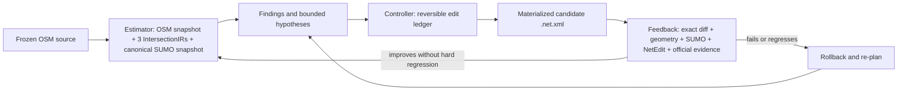

# Hamburg corridor digital-twin development log

This is the concise, continuously maintained engineering log for the Hamburg
three-intersection corridor digital-twin work. It records decisions and evidence
boundaries that may later become reusable Torii product design. It is not a
substitute for machine-readable manifests.

## Fixed objective

Build a branched corridor of about three intersections in SUMO, place virtual
detectors at the official detector locations, replay official signal control when
the same-window history is available, and reproduce the observed traffic counts.

### Product target and supporting benchmarks

- The only product corridor is Am Sandtorkai `2349 -> 2394 -> 2403`:
  Großer Grasbrook, Am Sandtorpark, and Osakaallee.
- The first deliverable is its reviewed OSM-derived topology. Signal control,
  detectors, demand reconstruction, and replay remain downstream stages.
- OSM supplies the continuous road skeleton. Hamburg MAP/OCIT-C/TLD, HH-SIB/HVS,
  and current official road objects correct or constrain bounded facts; they do
  not replace the complete road geometry with disconnected local cells.
- Ingolstadt is a human-cleaned teacher/regression benchmark for learning cleanup
  operations. `5 -> 61 -> 148` and `1923 -> 2363 -> 2150` are validation fixtures.
  None of these may be promoted as the Hamburg product corridor.
- MCP/NetEdit automation and the estimator-controller-feedback loop are control
  instruments. A successful tool run is not a topology acceptance result.

### Canonical work hierarchy (2026-07-21 reset)

There is one product line, not several parallel experiments:

1. **Product target:** the Hamburg `2349 -> 2394 -> 2403` corridor digital twin.
2. **First product stage -- topology:** keep OSM as the continuous skeleton;
   estimate its defects; use Hamburg official evidence as authority and the
   same-bbox Ingolstadt human-cleaned network only as a cleanup-action prior;
   execute bounded edits through Torii/MCP; feed machine and NetEdit audit results
   back to the next estimator iteration.
3. **Second product stage -- observation/control:** bind official signal movements,
   signal history, and colocated real/SUMO detectors to the frozen topology.
4. **Third product stage -- traffic state:** reconstruct a Saturday two-hour demand,
   run SUMO, and calibrate against detector counts without hiding missing evidence.
5. **Productization:** retain only the general estimator/controller/feedback
   contracts that succeeded on Hamburg and add them to Torii.

Ingolstadt, MCP, NetEdit automation, and the feedback loop are subordinate tools
inside the topology stage. They are never alternative deliverables or reasons to leave the
Hamburg corridor unfinished.

The accepted road-topology scope now covers 2349, 2394 and 2403. At 2403, the
preserve-split physical layout, scoped junction polygons and official-plan lane
permissions pass the geometry, connection and runtime gates in iteration 024.
Controller ownership and timing remain unresolved because no current MAP/OCIT/TLD
package is published. Signal replay and demand validation stay downstream of
that separate evidence gate.

## Reusable feedback loop



NetEdit loads only the exact candidate `.net.xml`. Its companion state is a
bundle of Torii's existing contracts: one `IntersectionIR` per target junction,
a corridor `CanonicalNetworkSnapshot`, a `WorkflowState` control summary, and a
hash-closed `ArtifactManifestV1` containing the edit ledger, rollback, audits,
parent candidate, and promotion trace.

### Estimator state bundle

```text
iteration_N/
  candidate.net.xml                    # exact SUMO/NetEdit payload
  estimator/
    source-osm.snapshot.json           # immutable downloaded OSM facts
    osm-derivation.json                # source -> filtered OSM provenance
    sumo.snapshot.json                 # exact imported SUMO facts
    osm-sumo-lineage.json              # source IDs and confidence
    canonical-network.snapshot.json    # corridor-level semantic state
    intersections/<node>/intersection_ir.json
  controller/
    workflow-state.json                # concise control-console summary only
    promotion-trace.json
  feedback/
    exact-semantic-regression/         # source/candidate diff and safety gates
  edit-ledger.json                     # reversible proposed edits
  rollback.json
  artifact-manifest.json               # authoritative paths, hashes, and DAG
```

No single JSON file replaces the network. The `.net.xml` remains the executable
payload; the estimator bundle makes its source, semantics, uncertainty, and
change history explicit. Only hash-bound artifacts produced by known Torii
adapters may influence promotion. `WorkflowState` is never promotion authority.
When two files contain the same canonical snapshot bytes, the authoritative
artifact DAG keeps one identity instead of treating the copy as new evidence.

## Evidence and authority order

1. Hamburg MAP/OCIT-C/TLD: movement, signal-group, and signal-state authority.
2. Current Hamburg HH-SIB/HVS and official road objects: road-axis, direction,
   stationing, carriageway, and lane-inventory authority.
3. Hamburg cross-sections and detailed mapping: independent structured topology
   corroboration; their survey/validity date remains a mandatory gate.
4. OSM: acquisition and candidate-topology input only.
5. Google Maps/Street View, Hamburg DOP, and NetEdit screenshots: visual review
   only; they cannot authorize automatic promotion.
6. Torii/SUMO load, routeability, smoke traffic, and detector fit: diagnostics
   and runtime validation only; they do not prove real-world topology.

If structured official sources conflict, the candidate remains blocked. Missing
evidence is never replaced with a guessed connection or signal program.

## Progress log

| Date | Step | What changed or was checked | Result | Reusable Torii design |
|---|---|---|---|---|
| 2026-07-11 to 2026-07-19 | Initial Am Sandtorkai corridor | Reused Torii OSM cleanup, compact-corridor extraction, MAP/KML/OCIT parsing, detector mapping, routeSampler, SUMO E1/E2, signal replay, NetEdit review, and geometry audits. | Flow reconstruction worked, but incomplete 2403 signal assets and several topology/geometry defects blocked a complete twin. | Keep source snapshots immutable; candidate networks are versioned; every stage fails closed and records hashes. |
| 2026-07-19 | Compound-junction handling | Classified complex junctions separately from their signal controller. In particular, one controller no longer implies one merged SUMO junction. | Removed the unsafe whole-junction merge assumption and large overlapping junction shapes. | Represent skeleton, channelization, physical owners, and controller domain as separate dimensions. |
| 2026-07-19 | Alternative corridor screen | Selected `1923 -> 2363 -> 2150` because all three nodes have official MAP/KML/OCIT assets and a complete Saturday detector window. | Suitable as a topology and replay validation corridor; it does not replace the named Am Sandtorkai product target. | Add an automatic corridor-selection gate over signal assets, counts, distance, and official road continuity. |
| 2026-07-19 | Official road/MAP splice | Reused Torii lane-axis stitch, splice planner/materializer, PlainXML, netconvert, surface-overlap audit, Connection Mode audit, and SUMO load checks. | Candidate v26 loads, has zero structural connection failures and zero surface overlap, but generic Connection Mode still reports 27 semantic findings. | PlainXML is the editable representation; final `.net.xml` is always regenerated by netconvert. |
| 2026-07-19 | Exact movement and TLS binding | Bound official MAP movements to physical SUMO connections and TLD streams using exact lane keys and signal groups. | 19/19 movements are routeable; 19/19 signal bindings are available, including two explicitly audited same-signal-group projections. | Signal-group projection is opt-in, same-node/same-group only, and retains provenance. |
| 2026-07-19 | Detector-constrained replay | Reused routeSampler and detector writers. Added an explicit detector-boundary diagnostic mode and lane-positioned departures. | Validation corridor achieved a near-exact detector replay, but this is a local detector-section twin rather than full OD proof. | Distinguish boundary detectors from internal detectors; never convert internal lane counts into departure-lane facts. |
| 2026-07-20 | Topology-first reset | Reviewed the remaining topology findings before any further traffic calibration. Split 27 generic findings into official MAP core findings, expected splice findings, and 16 unresolved HH-SIB axis semantics. | Runtime success is no longer accepted as topology proof. The network remains diagnostic until official facts cover each required transition. | Add an independent official-topology promotion gate after generic Torii/SUMO gates. |
| 2026-07-20 | Official cross-section refresh | Re-downloaded the corridor cross-sections from Hamburg OGC API Features with complete pagination and EPSG:25832. Snapshot: 3,504/3,504 features, SHA-256 `1cea3b2ec6f4c2357a90d2ecce34a1d764017542621835e8db51fb9a02b7a341`. | Acquisition is complete, but the dataset describes generalized surfaces from the 2016 survey and cannot alone prove the 2026 layout. | A source adapter must separate acquisition validity from claim-time validity and preserve raw strip types/widths. |
| 2026-07-20 | Google Maps cross-check | Reviewed 1923 and 2363 Street View and 2150 satellite imagery. | Gross channelization and compound layouts are visually corroborated; exact lane-to-lane transitions remain unproved. The artifact is explicitly `review_only`. | Image sources must be a separate evidence class with `promotion_authority=false`. |
| 2026-07-20 | Gate design safety review | Prototyped an official-topology promotion gate, then audited whether its claims were derived from the candidate and from trusted source adapters. | The first prototype was rejected: it could compare caller-reported `candidate_value` and source metadata without independently deriving either fact. It is not a production gate and cannot promote a network. | Promotion facts must be extracted from the exact candidate by a known fact extractor and from schema-specific official adapters; hashes and allow-listed labels alone are insufficient. |
| 2026-07-20 | Real cross-section adapter run | Ran the new adapter against the frozen OAF response. | Acquisition passed with 3,504 features and 287 station profiles; claim status is `review_required` because no official 2026 validity interval is declared; promotion stays blocked. | Keep acquisition completeness, temporal validity, classification, and topology authorization as separate gates. |
| 2026-07-20 | Topology fact ledger | Bound all 27 v26 Connection Mode findings to the candidate SHA and separated MAP-core, official-merge, and HH-SIB-axis findings. | The ledger contains 6 MAP-core, 5 merge-splice, and 16 axis facts. None is currently independently promotable; 4 axis facts have historical support, 4 conflict with that inventory, and 8 lack exact lane-transition evidence. | Promotion should operate on explicit fact IDs rather than a network-level `pass` flag. Runtime and visual checks remain downstream diagnostics. |
| 2026-07-20 | Current official geometry search | Queried the current Hamburg OAF services for `Kreuzungsskizzen` and `Feinkartierung Straße` over the complete validation corridor, froze six paginated snapshots, and recorded hashes and per-object dates. | The live sketch service covers all three nodes, but its node drawings are dated 2011, 2011, and 2021. Fine-mapping contains newer 2023/2025 road-space objects, but mixed dates and no legal lane-transition semantics. Both remain `review_required`. | Reuse official OAF snapshots as independent geometry evidence, while evaluating validity per feature and keeping physical surfaces separate from legal movements. |
| 2026-07-20 | Focused regression after topology work | Ran the topology, signal-binding, splice, and source-adapter regression set plus Ruff and whitespace checks. | 72 focused tests passed; the safety review still blocks topology promotion because passing tests included a now-rejected self-reported evidence path. | Test success validates implementation behavior, not the truth of field topology; promotion tests need adversarial candidate/source fixtures. |
| 2026-07-20 | v26 background NetEdit review attempt | Reused Torii's existing no-focus NetEdit screenshot workflow against the exact v26 candidate. | The workflow failed closed before capture because the foreground Windows keyboard layout was Chinese (`0x0804`). No old-candidate screenshots were reused and no system setting was changed. | GUI review must be candidate-hash-bound and environment-safe; a blocked GUI review remains a blocked review, not an excuse to reuse stale images. |
| 2026-07-20 | v26 English-layout NetEdit review and rejection | Re-ran the hash-bound background review after the keyboard was switched to English. All 12 views were captured without changing the candidate, but the images show bent approach bundles, abrupt joins, and oversized/overlapping junction surfaces. | v26 is rejected as a topology/geometry candidate. Earlier automated “zero overlap” and load checks were insufficient and must not promote it. | Add source-geometry parity and visual-shape gates; a SUMO-loadable network can still be geometrically wrong. |
| 2026-07-20 | OSM-baseline architecture reset | Traced the bad geometry to using local Hamburg MAP cells and HH-SIB axes as a replacement road skeleton. | Stop repairing v26. Rebuild from a cleaned, tightly cropped OSM corridor; use Hamburg official sources as authoritative semantic/correction overlays rather than as the whole-road geometry generator. | Preserve OSM road curvature and continuity outside bounded junction cells; official MAP/OCIT controls lane count, movement, TLS, and detector identity. |
| 2026-07-20 | Estimator/state-contract reuse | Audited Torii's existing state models before adding another format. Reused `IntersectionIR` for each raw OSM junction, `CanonicalNetworkSnapshot` for the exact SUMO/NetEdit network, `WorkflowState` for the control summary, and `ArtifactManifestV1` plus the edit ledger for hashes, dependencies, rollback, and promotion. | Removed the duplicate experimental `osm_feedback_state` contract because arbitrary JSON could have influenced its quality result without schema/candidate-hash validation. | A network iteration is a bundle of existing contracts, not a new monolithic network language; `.net.xml` remains the NetEdit payload and the canonical snapshot is its stable semantic companion. |
| 2026-07-20 | OSM feedback iteration 000 | Ran the existing OSM cleanup workflow on a frozen bbox source with all automatic topology repair disabled, then ran connectivity, topology, routeability, Connection Mode, surface, rendered-edge, and background NetEdit audits. | Baseline is construction-invalid: 30 suspicious topology clusters, 43/50 vehicles arrived, 6 teleports, 108 lane-to-non-owner-junction overlaps, 56 junction-to-junction overlaps, and 5 rendered-edge overlap warnings. | The estimator observes an immutable candidate first; no controller action is allowed before a complete baseline quality vector exists. |
| 2026-07-20 | OSM feedback iteration 001 | The provenance estimator found that bbox filtering changed 40 retained OSM ways. Rebuilt from the same frozen source with complete source ways, using the existing `clip_source_ways_to_bbox=False` switch. | Retained ways increased 471→499 and changed retained ways fell 40→0. Overall quality did not improve consistently: topology clusters 30→34, arrivals 43→36, teleports 6→3, rendered overlaps stayed 5. Exact canonical regression remains blocked. | A controller may accept an action for one layer (source fidelity) while rejecting candidate promotion. A/B decisions require per-dimension before/after deltas, not one weighted score. |
| 2026-07-20 | Raw OSM intersection observation | Generated Torii-native, non-materializing `IntersectionIR` artifacts for OSM nodes 1923, 2363, and 2150. | OSM reports 3, 3, and 4 passenger approaches respectively, while support paths inflate total approaches to 8, 4, and 12; 1923/2150 retain 4/8 internal fragments. These are estimator findings, not edit authorization. | Keep motor-vehicle skeleton, support modes, physical fragments, and signal controller evidence as separate state dimensions before proposing joins. |
| 2026-07-20 | OSM feedback iteration 002 | Reused Torii's compact-corridor extractor on the complete-way import, then compared the parent and compact candidates with one frozen route file. | External edges fell 636→105 while all 50 frozen routes completed in both networks with zero teleports/collisions. The compact network remains construction-invalid: 14 Connection Mode reviews, 21 lane-to-non-owner overlaps, 7 junction overlaps, and 2 rendered overlaps. | Scope extraction is a new hash-bound baseline, not a topology promotion. Later edits compare against this compact baseline. |
| 2026-07-20 | Control-anchor estimator correction | Ran Torii's existing composable archetype estimator separately on the 1923 signal anchor and its adjacent road junction, then checked Hamburg's official LSA type. | Signal anchor `343634175` is an A2 crossing candidate, adjacent junction `312938329` is A3, and official node 1923 is `F-LSA`. They must not be merged. | Model physical conflict nodes, stop-line/signal anchors, and controller domains as separate identities. One controller or official point is not one SUMO junction. |
| 2026-07-20 | Corridor type gate | Re-ran corridor screening with the product policy `required_signal_types=[K-LSA]`. | Candidate `1923→2363→2150` is automatically blocked because its official sequence is `F-LSA→K-LSA→F-LSA`. | Candidate screening must verify official control type before topology reconstruction starts. Validation corridors may use other types only when declared explicitly. |
| 2026-07-20 | Safe 1923 controller action | Wrote a Torii edit ledger with one `review_marker` and a no-change rollback; no network mutation was materialized. | Current evidence only supports preserving the F-LSA anchors and the real side-road junction. A future shape-only probe must keep coordinates, edges, connections, TLS/linkIndex, and route semantics unchanged. | The controller may output a deliberate no-op when the estimator cannot authorize an edit; no-op is a valid feedback action, not a stalled workflow. |
| 2026-07-20 | Hash-closed iteration bundle | Reused `ArtifactManifestV1` and added a public file-to-artifact identity constructor. Bound the OSM source, SUMO source/candidate, IntersectionIRs, archetype profiles, official node type, controller state, route A/B, geometry audits, edit ledger, rollback, and overlay. | Iteration 002 now validates as 35 artifacts and 36 closed dependencies; source mutation is false. Hard gates still fail/stop promotion. | The reusable state format is an artifact DAG around the exact `.net.xml`, not a second executable network format. |
| 2026-07-20 | Three-K-LSA rescreen | Reused the official LSA, MAP/KML/OCIT, count, and road-axis screen and selected `5 → 61 → 148` (Lübecker Straße/Lübeckertordamm/Steindamm). | All three are official `K-LSA`; current static signal assets bind at all three nodes and 52/52 count streams cover the selected Saturday window. | Corridor selection is an evidence gate before OSM topology work, not a late manual choice. |
| 2026-07-20 | New OSM estimator baseline | Downloaded one immutable OSM bbox, kept complete selected ways, disabled all automatic topology edits, and generated an exact SUMO/NetEdit candidate plus canonical and per-junction observations. | Baseline is correctly blocked: 18 suspicious clusters, 36 Connection Mode reviews, 47 junction overlaps, 78 lane/junction overlaps, 5 rendered-edge warnings, 23 teleports, and 2 collisions. | The estimator must describe defects before the controller proposes an edit; SUMO loadability alone is not a pass. |
| 2026-07-20 | Control-domain/physical-cell observation | Compared each official LSA point with nearby OSM branch nodes and ran the existing composable archetype estimator. | Nodes 5 and 148 expose four-arm compound candidates; node 61 exposes a five-approach/slip-link candidate. All remain review-only and no official point is treated as a physical OSM node. | Control identity, signal anchors, physical conflict cells, and SUMO junction owners stay separate in state. |
| 2026-07-20 | Manifest byte re-verification | Added a general `ArtifactManifestV1.assert_artifact_files_unchanged()` guard and tamper/missing-file tests. | The controller can no longer rely on stale manifest hashes when reading a prior iteration. | Every feedback iteration rehashes the full artifact DAG before using it as promotion evidence. |
| 2026-07-20 | Model-directed NetEdit merge decisions | Used the exact OSM candidate, official intersection classifications, and Torii's hash-bound background NetEdit Inspect/TLS/Connection views to decide the three physical cells directly. Materialized only the two evidence-backed join hypotheses with the existing junction aggregation code. | Node 5: the complete four-node core is logically one junction, but the Torii materializer introduces 18 target-surface findings and a Connection Mode regression. Node 61: preserve the channelized multi-node layout. Node 148: the two-node join passes geometry and connection gates, but remains topology-only because the repaired route diagnostic increased collisions from 4 to 6 before official K-LSA restoration. | Keep model/visual intent separate from execution quality. Background NetEdit review is valid for screenshots, not editing: the controller needs real input plus post-edit machine evidence before accepting any GUI candidate. |
| 2026-07-20 | NetEdit session MCP design | Compared common Blender, FreeCAD, and Unity MCP interaction patterns: bind one scene/document, observe object and viewport state, perform one atomic edit, then save or undo. Mapped that pattern to one focused `sumo_netedit_session(open\|observe\|act\|finalize\|abort)` tool rather than a general desktop-control API. Official NetEdit operations remain the vocabulary: `I/C/T/M/S/D/E` modes, `F5` recompute, `F7` join, `Enter` accept, `Esc` abort, `Ctrl+S` save, and `Ctrl+Z/Y` undo/redo. | Each action is window-targeted and bound to the caller's exact last recorded screenshot SHA plus a fresh live capture. `open` copies the immutable source to a separate candidate; `observe` records the client-coordinate viewport; `act` permits one allow-listed mouse/shortcut edit; `finalize` saves, rehashes, and runs SUMO/geometry/connection gates; `abort` closes without promoting. | Reuse Torii's launcher, screenshot, hashing, SUMO-load, surface, and Connection Mode audits. Preserve an action ledger and before/after screenshots; GUI success can never promote a network automatically. |
| 2026-07-20 | Real NetEdit input transport probe | Tested background Win32 `SendMessage` delivery and real foreground mouse/keyboard input against the same four selected node-5 nodes. `SendMessage` reported success but did not execute `F7` or change the file. Real target-window input did execute `F7` and save a changed candidate. | The genuine four-node join produced an oversized central junction polygon, so the candidate was rejected rather than promoted. This also proves that transport acknowledgement is not edit evidence; file hash, screenshot, and machine audits are required. | The MCP must use real target-window input, restrict control to the launched NetEdit process, and bind every action to observable state. It exposes no arbitrary OS-wide input operation to callers and accepts no message-only success criterion. |
| 2026-07-20 | Human-cleaned Ingolstadt comparison | Parsed the current TUM `sumo_ingolstadt` network as a methodology and geometry benchmark. Its NetEdit-saved network contains 912 `cluster_*` junctions: 619 join two source nodes and 75 join four. A direct ownership audit finds 123 active controllers: 121 control one physical SUMO junction and only two control two separated junctions, about 73 m and 89 m apart. | The dominant human-cleaned pattern is therefore to merge one physical conflict core, retain short channelized approach/storage edges outside that core, and use a shared controller only for genuinely separated conflict areas. The network also contains explicit NetEdit-created nodes/edges and hand-shaped lane/junction geometry, so a raw automatic join is not the method. | Treat node 148's two-node core as an Ingolstadt-style join candidate. Treat node 5's four-node core as one logical conflict core in principle, but reject the current F7 output: Torii must rebuild its bounded junction envelope and explicit lane connections without swallowing nearby approach fragments. Node 61 remains split because its storage/slip geometry describes separated physical cells. |
| 2026-07-21 | Same-location Ingolstadt OSM A/B | Downloaded current OSM at two published Ingolstadt junctions, a 2023-08-02 Overpass snapshot for the four-node case, and OSM API history for the two-node core way. Compared those inputs with the exact human-cleaned SUMO network at commit `e0a95de`. | The two-node OSM core (one internal short segment) becomes one cluster with six retained external edges, 20 internal edges, and 12 controlled `via` connections. The four-node OSM ring (four internal segments and eight outside neighbours) becomes one cluster with nine retained external edges, 41 internal edges, and 19 controlled `via` connections. | The reusable operation is not distance-only joining: identify the complete conflict core, absorb its OSM micro-edges, preserve the external approach skeleton at explicit cuts, then rebuild internal lane movements. Hamburg node 5's prior four-node F7 selection was incomplete; its official a1-a4 cuts enclose 16 OSM/SUMO micro-nodes, which must be tested as a new bounded cluster hypothesis. |
| 2026-07-20 | Public MCP real-input and audit proof | Hardened the grouped tool with client-coordinate screenshots, queried Per-Monitor-V2 DPI evidence, a fresh screenshot check immediately before every input/save, exact PID/HWND focus checks, and partial-input cleanup after transport failure. Ran `open → observe → click → observe → abort` through the registered FastMCP server; separately ran `open → observe → F7 → observe → F5 → observe → finalize` through the public Python adapter. | The mouse smoke used a 1400×1000 client image at 144 DPI and preserved the source. Normal NetEdit animation changed 0.295% of global pixels, while the protected 49×49 click region stayed identical. The F7/F5 edit changed only the candidate and loaded in SUMO, but the reused surface audit found 18 introduced/focus overlaps and Connection Mode reported `new_target_scope_review_findings`; promotion remained blocked. | Adopt the 3D-editor MCP loop, not its arbitrary-code surface: observed viewport plus persisted object state, one atomic edit, undo/abort, explicit save, then independent machine feedback. A successfully delivered GUI action is never equivalent to a valid road network. |
| 2026-07-20 | NetEdit MCP safety closure | Froze GUI settings and selections into hash-bound session snapshots; required F7 to be the first edit with selection junctions exactly equal to the declared source scope; rejected injection while any physical key or mouse button is held; constrained the MCP schema with literal operation/action/object enums; and made wrong-session errors non-destructive. Semantic shortcuts/save require exact live viewport equality. Finalize binds source/candidate hashes around SUMO-load, surface, Connection Mode, junction-identity, outside-scope preservation, and audit-integrity checks. | Even when every machine gate passes, a GUI candidate remains `review_required`; a failed geometry/connection/scope gate propagates as top-level `fail`. Validation mistakes remain observable/retryable, while uncertain delivery/focus/evidence failures abort the target session. | This is the reusable control-system boundary: immutable inputs, one atomic controller action, explicit state observation, independent machine feedback, and no automatic promotion. The local screenshot artifact is viewable by Codex, but generic MCP `ImageContent` remains a later interoperability enhancement. |
| 2026-07-20 | Hardened FastMCP F7 feedback run | Re-ran `open → observe → F7 → observe → F5 → observe → finalize` through the registered FastMCP server with the frozen four-junction selection and declared replacement ID. The session used a fresh evidence directory and preserved both the source and frozen preload hashes. | F7 selection lock, junction identity, SUMO load, and audit-integrity gates passed. Surface comparison and Connection Mode failed, so the top-level result was `fail`; the screenshot still shows the oversized central polygon. Candidate SHA-256 is `fe151ba844defdb380e31219c2ded4786a4886175b97ab21202c6c37bf570454`, audit-summary SHA-256 is `9cf71b273ade0523fe847a27cccd4481de36280c725344eb8ccc25cbf2c2dd0a`. | The larger MCP can execute and observe a real NetEdit hypothesis, but the feedback controller—not input delivery—decides acceptance. This four-node merge remains rejected and cannot be reused as cleaned topology. |
| 2026-07-20 | Full physical-key safety probe | Re-ran the final FastMCP path after expanding the input preflight from modifiers to every Windows virtual key. The first F7 attempt was blocked by an exact-viewport change; subsequent attempts were blocked because Windows continuously reported `VK_SUBTRACT (0x6D)` as physically down. | No F7 was delivered, the candidate SHA remained equal to the frozen source, and only the NetEdit process created for this test was stopped. Torii did not synthesize a key-up or bypass the user's input state. | Validation/preflight failures are retryable, but physical input ownership remains fail-closed. A GUI controller must never mix an unledgered human key with an MCP action merely to complete a smoke test. |
| 2026-07-20 | Outside-scope preservation re-audit | Re-audited the previously saved F7 candidate with the new exact outside-scope XML gate. It compares non-target junctions, non-incident external edges and lanes, out-of-scope connections, unaffected TLS programs, and remaining top-level network state. | The scope gate passed with 244 outside junctions, 320 outside edges, 1,438 outside connections, and 62 unaffected TLS programs unchanged. The overall candidate still failed because the bounded surface and Connection Mode gates failed. | The rejected merge was locally bounded but geometrically wrong. Scope preservation and local geometry correctness are independent feedback dimensions and both are required. |
| 2026-07-20 | Post-review MCP boundary hardening | A final adversarial review found three boundary gaps: candidate-side incidence could expand the declared edit scope, a delivered action followed by screenshot failure could remain unledgered, and the public MCP accepted a caller-supplied NetEdit executable name. Froze external edge/TLS scope from the source network, required exact declared-junction ownership for candidate internal edges, made every post-delivery evidence failure abort the session, removed the executable parameter from the MCP schema, and made unknown audit statuses fail closed. | The focused suite increased to 71 passing tests. New regressions cover candidate reattachment, numeric-ID substring collisions, unrelated/candidate-injected internal-edge mutation, unknown audit states, and post-input/post-save evidence loss. | A GUI feedback controller must freeze authorization before editing, separate pre-input retryability from post-input uncertainty, and never expose an executable-selection surface to MCP callers. |
| 2026-07-21 | Node 5 complete conflict-core estimate | Combined the same-location Ingolstadt OSM/cleaned comparison with Hamburg MAP a1-a4 cuts and the exact OSM graph. | The physical core is exactly 16 OSM/SUMO nodes and 16 internal OSM edge fragments; the eight external OSM approaches remain the immutable road skeleton. | A join proposal is a bounded conflict-cell hypothesis, not a list of short edges. The estimator must output the complete absorbed core and explicit retained cuts before the controller may rebuild it. |
| 2026-07-21 | Teacher replay outside-scope correction | Traced a 10.86 m boundary gap to full-network `netconvert` clipping an ordinary off-scope edge while Torii restored only internal artifacts. Reused the existing off-scope restore path, extended it to ordinary lane geometry and edge centerlines, and limited geometry blending to the local conflict-cell endpoint. | Iteration 034 has zero outside-scope structural regressions, zero introduced surface overlaps, SUMO load pass, and exact 25/25 official TLS movement parity. | OSM owns remote approach endpoints and long-road geometry; the official teacher owns core-side endpoints, lane cardinality, movements, internal/via topology, and TLS/linkIndex. Normalization side effects outside that split authority are restored or rejected. |
| 2026-07-21 | Ingolstadt-style lane-transition boundary repair | Identified downstream node `9799586527` as a real, non-TLS Steinhauerdamm/B75 3→2 lane transition rather than part of the node-5 conflict core. Added an evidence-authorized Torii controller that keeps the node, edges, lanes, and connections unchanged and replaces only its polygon with the convex hull of adjacent lane endpoints. | Iteration 037 resolves the inherited `4.815165 m²` overlap with zero introduced findings. Topology SHA is unchanged; both retained movements (`1→0`, `2→1`) arrive with zero teleport/collision; background NetEdit captures are hash-bound. | Never enable global `--junctions.minimal-shape` as a cleanup shortcut. The estimator classifies a linear lane transition, the controller applies one local shape action, and surface/Connection/SUMO/smoke/NetEdit feedback decides whether to retain it. |
| 2026-07-21 | Existing Ingolstadt runner optimization | Audited `run_ingolstadt_corridor_teacher.py` before adding new code. Kept its original bounded single-junction mode, then added an opt-in `reference-matched` mode that delegates to Torii's existing full OSM cleanup workflow. | The new mode preserves raw OSM, human reference, aggregation candidates, and teacher replay candidates as separate hash-bound layers; it rejects an explicit candidate net because full comparison must rebuild from OSM. The current same-bbox audit locates 132 of 149 human join cases, but still labels them with one coarse action family. Teacher materialization remains separately opt-in, and join confirmation now uses exact status tokens so `unconfirmed` cannot be accepted by substring. | Use this runner as an estimator of human edit patterns, not as a Hamburg generator. Its next output contract must describe absorbed core nodes/edges, retained boundaries and storage segments, applicable conditions, and counterexamples; Hamburg official evidence decides whether an action transfers. |
| 2026-07-21 | Ingolstadt teacher-action contracts | Reused the existing full reference-join report instead of adding another matcher. Projected every human case into an action contract containing absorbed source nodes/internal edges, retained OSM boundaries, applicability evidence, excess/missing scope and rejection reasons. The v6 runner additionally binds the exact bbox and SHA-256 of the source OSM, TUM teacher, comparison net and join report, and verifies source/teacher hashes before and after execution. | The frozen same-bbox rerun succeeds as an estimator: 149 contracts comprise 29 exact bounded conflict-core priors, 61 source-identity reviews, 42 incomplete-source abstentions and 17 unmatched abstentions. The earlier count of 77 was too broad because 48 candidates extended beyond the human teacher core; those cases are now withheld. `execution_status=pass`, `input_parity=pass`, `evidence_status=review_required`, and `promotion_gate_status=blocked`. | Feed only the 29 exact-core cases to the Hamburg estimator as non-authoritative structural priors. Reviews and abstentions are negative controls. A contract may propose one bounded edit, but Hamburg official geometry/movement evidence and the full feedback gates must independently authorize it. |
| 2026-07-21 | Product-scope reset | Re-audited the accumulated Hamburg artifacts after validation corridors had started to dominate the work plan. | Locked the only product target back to Am Sandtorkai `2349→2394→2403`; Ingolstadt and the two alternative corridors remain method fixtures only. | Every iteration and promotion report must carry the product scope ID; a validation fixture cannot become the product target through workflow reuse. |
| 2026-07-21 | Named-corridor teacher-free estimator | Reused the existing bbox signal-cell discovery on the immutable Am Sandtorkai OSM snapshot, without a teacher, materialization, or expected topology. | Found 24 cells from 96 signal anchors. Near the targets, 2394 has one consistent suggestion, while 2349 has three overlapping interpretations and 2403 has five. Legacy fixed-radius `IntersectionIR` views inflate approaches, so they are observations rather than cell-selection authority. | Conflict-cell discovery, fixed-radius IR, official identity, and controller domain are separate estimator channels; disagreement must produce abstention, not a merge. |
| 2026-07-21 | 2403 controller abstention | Wrote a Torii corridor edit ledger containing one hash-traceable review marker and a no-change rollback for the 2403 OSM cell. | The ledger validates and explicitly requires review; no source/candidate network was modified or generated. Five overlapping cell hypotheses, storage-capable connectors, and missing current MAP/OCIT/TLD movement assets block a join or TLS installation. | A no-op is a valid controller action. The feedback loop advances its knowledge state without forcing a topology mutation when the estimator is non-identifiable. |
| 2026-07-21 | Named-corridor OSM lineage and approach restoration | Rebuilt the compact Am Sandtorkai OSM candidate with `--output.original-names`, then compared every 2349/2394 official MAP lane against the retained OSM approaches. | The estimator found that the earlier crop had removed complete OSM approach chains `61649647#0/#1/#2` and `127716467#0/#1`. Restoring only those five source segments changed the official lane binding from three low-confidence lanes to 21/21 active, high-confidence bindings. | Do not redraw the road surface or replace it with MAP geometry. Preserve complete OSM ways and use official MAP evidence to detect missing cuts and authorize the smallest restoration. |
| 2026-07-21 | 2349/2394 official static topology candidate | Applied the existing Hamburg compound topology adapter to the restored OSM skeleton. For 2349, joined only the two 0.20 m opposing micro-cores; for 2394, preserved the compound multi-owner layout. | The first candidate had 16/16 official movements and exact external-lane geometry, but Connection Mode found six OSM routing connections outside the complete official vehicle inventory. The adapter had demoted their signal ownership without removing their routing permission. | Treat every successful materialization as a controller hypothesis. The feedback audit can still reject it when the official movement contract and the remaining OSM lane graph disagree. |
| 2026-07-21 | 2349/2394 feedback-corrected topology | Reused the existing 2394 routing-removal inventory, added the one equivalent 2349 removal, and wrote SUMO's official `<delete>` connection patch form. Added exact official evidence hooks for two lane fan-outs and one destination merge. | Iteration 009 removes exactly six unsupported connections, adds exactly five MAP-supported connections, preserves 21/21 lane bindings and 16/16 official movements, keeps all 133 external lane geometries unchanged, and loads in SUMO. Iteration 010 Connection Mode passes with zero new target or outside-scope findings. Hash-bound background NetEdit Inspect/TLS/Connection captures for 2349 and 2394 preserve the candidate SHA and show no long cross-block links or lane-surface distortion. | Freeze SHA `d87eeac6a0f6c5c082f59917fc40e8ead71d5e97cfcda565301bd7c1b8871913` as the accepted 2349/2394 topology sub-scope. This does not promote the whole corridor or claim historical signal timing. |
| 2026-07-21 | 2403 physical-layout evidence | Compared the OSM core with Google satellite imagery and the same-bbox Ingolstadt teacher cases C046, C058, and counterexample C039. The imagery is review-only; C046/C058 are structural precedents, not Hamburg truth. | All sources support preserving the divided-road approaches, storage/channelization links, and multiple physical owners. They reject the proposal to collapse the complete 2403 compound into one large junction. C039 is rejected because its source/teacher identity is unstable and its join would swallow independent stoplines. | A shared controller never implies one physical SUMO junction. Teacher transfer needs an explicit retained-boundary/stopline contract; otherwise the controller must choose no-op or a geometry-only repair. |
| 2026-07-21 | 2403 scoped junction-shape repair | Rejected the global `netconvert --junctions.minimal-shape` probe because it changed all 133 external lane geometries. Added a reuse-first Torii controller that accepts an explicitly enumerated junction set, reuses the existing external edge/lane and Connection Mode signatures, verifies hash-bound TLS semantics, and copies only junction `shape/customShape` from the same-topology reference. | Iteration 016 changes six authorized 2403 polygons and nothing else: external lane deviation is 0 m, normal/controlled movement deltas are 0, SUMO load and Connection Mode regression pass, and local surface findings fall from 11 lane + 5 junction overlaps to 0 + 0. Iteration 017 background NetEdit review used an English keyboard, no global input, and preserved candidate SHA `9e4ba2580f7f1ff2e0cb5be5d453f88d6075f50d100364139ac8eb275069b11a`. | Treat SUMO minimal-shape output as a geometry reference only, never as the candidate network. Promotion remains `review_required`: official 2403 MAP/OCIT movements and controller ownership are still missing, so this closes polygon geometry but not legal movement or signal topology. |
| 2026-07-21 | 2403 provisional movement inventory | Reused Torii's external-lane graph and bounded BFS on the immutable iteration-016 candidate instead of writing another path finder. Enumerated four ingress edges, four egress edges, seven internal channelization edges, 33 physical lane connections and 17 bounded ingress-to-egress lane paths. Cross-checked the source OSM way tags and restriction relations. | The Am Sandtorkai ingress has three lanes and `turn:lanes=left\|through\|through;right`, which agrees with its current left/through/right lane branching. Brooktorkai is internally inconsistent: OSM declares four lanes but supplies five turn-lane tokens. No core turn-restriction relation resolves that conflict. | Keep geometry frozen. Convert each ingress lane's OSM token/path comparison into estimator evidence; auto-accept only exact lane-count/order matches, retain the Brooktorkai movements as provisional, and never treat the absence of a restriction relation as official permission. |
| 2026-07-21 | 2403 official Brooktorkai lane/movement evidence | Compared the frozen OSM/SUMO approach with the current LSBG March-2024 Brandstwiete/Bei St. Annen plan, the implemented July-2022 Am Sandtorkai/Brooktorkai plan and current satellite imagery. The government plans are authoritative; imagery is only a visual cross-check. | Both plans show one separate cycle lane plus exactly four Kfz lanes at the Brooktorkai stop line. The five-token OSM `turn:lanes` value is stale/malformed and must not create a fifth motor lane. In SUMO right-to-left lane order the supported permissions are lane 0 `through;right`, lane 1 `through`, lanes 2-3 `left`. The frozen candidate already contains every one of these movements except `25444569#2 lane 0 -> 395272650#0 lane 0` (straight). | Preserve all four lane geometries and the compound physical owners. Apply one hash-bound PlainXML connection addition, then require exact outside-scope preservation, zero surface regressions, Connection Mode pass, SUMO load/routeability and background NetEdit review. This can promote legal road topology only; 2403 signal ownership/timing remains blocked without MAP/OCIT/TLD evidence. |
| 2026-07-21 | 2403 feedback-loop movement closure | Rejected iteration 018 because whole-network `netconvert` moved 36 lanes, and rejected iteration 019 because restoring the external OSM geometry left 19 internal path endpoint gaps. Added a reusable scoped Torii primitive that restores existing internal movement geometry from the accepted parent and reanchors only the declared new movement to immutable external-lane endpoints. | Iteration 024 preserves all 133 external lane shapes and lengths exactly, adds exactly one ordinary movement and no controlled movement, introduces no surface finding, passes SUMO load and Connection Mode with the hash-bound engineering-plan merge evidence, and sends 10/10 movement-smoke vehicles through with zero teleport/collision. Fresh background NetEdit Inspect/TLS/Connection captures used the English keyboard layout and preserved candidate SHA `df3c6de1936c9ff1bd16d363c1d2e3cc19af44302cff2b074575f7a0153e7548`; no new cross-block connection or lane-surface distortion is visible relative to the accepted parent. | Freeze iteration 024 as the reviewed three-intersection **road-topology** candidate. This closes movement topology, not signal control: 2403 MAP/OCIT/TLD controller ownership and timing remain a separate blocked stage. |
| 2026-07-21 | Detector binding on frozen topology | Reused the existing MAP-to-SUMO and count-stream binders. Collapsed only one-to-one serial cuts of the same signed OSM way, preserving true parallel-lane ambiguity; for 2394, supplied the frozen official MAP file instead of using nearest-lane geometry. | Binding improves from 5/19 to 17/19 active. All 9 streams at 2394 now use official MAP ingress-lane identity. Only 2403 Z.1/Z.2 remain blocked because its MAP is unpublished and their nearest parallel lanes differ by less than the 1 m ambiguity gate. E1/E2 output remains withheld. | A detector at an OSM edge cut is one physical lane hypothesis, but a different OSM way or parallel lane is never collapsed. Official MAP identity overrides geometry only when the detector point is still within the strict distance gate. |
| 2026-07-21 | Shared-lane detector semantics gate | Re-ran the detector binder on iteration 024 with the 2394 MAP and the 2403 four-lane constellation evidence. The official MAP and LSBG plan retain the existing 2394 motor-lane counts, so duplicate Z fields do not authorize another road lane. | All 19 fields have lane hypotheses, but only 17 `(node, lane)` identities exist: 2394 Z.1/Z.2 share MAP lane 2 and Z.5/Z.6 share MAP lane 7 while their counts differ. The v7 manifest now keeps the mappings active but blocks E1/E2 materialization and automatic promotion instead of silently summing them. | Lane identity and aggregation semantics are separate evidence layers. Multiple official fields on one lane may be serial, redundant, or otherwise non-additive; Torii requires explicit official aggregation evidence before constructing one virtual sensor. |
| 2026-07-21 | 2403 two-conflict-core closure and W1 handoff | Rejected the single-core/hull probes and the first two-core variant because they distorted surfaces or added two SUMO-guessed movements absent from the accepted parent. Iteration 027 keeps separate north/south conflict cores and deletes only those two guessed movements. | Preservation parity is 23/23 boundary movements with no loss/addition; surface, SUMO load and Connection Mode gates pass; 23/23 smoke vehicles arrive with zero teleport/collision; both owners have immutable background NetEdit reviews. The SHA-bound W1 handoff is `review_ready` with execution gate `pass`. | Join authorization is per physical conflict core. W1 promotion consumes one candidate SHA plus preservation, geometry, connection, runtime and NetEdit evidence; it still cannot prove official signal control. |
| 2026-07-21 | Final-OSM signal binding | Reused the existing iteration-009 compound TLS derivation instead of re-running path inference or comparing final OSM edges with `hh-map-*` teacher IDs. The W2 binder now accepts the hash-bound compound plan and checks every selected physical connection against iteration 027. | 2349 binds 8/8 streams to 9/9 controlled OSM connections; 2394 binds 8/8 to 13/13. The two-hour official weekday history has 16/16 initialized streams and 3,671 exported events. W2 remains non-promoting because 2403 has no published MAP/OCIT/TLD control asset. | Preserve official movement-to-OSM evidence as a reusable contract. One movement may own multiple physical SUMO connections; exact set parity replaces edge-name equality. |
| 2026-07-21 | W3 official count-station truth correction | Audited Hamburg's `Anzahl_Kfz_Zaehlstelle_15-Min` SensorThings layer before materializing detectors. Kept the 5-minute `Zählfeld` streams only as lane/location diagnostics and switched the intended demand/validation truth to the processed directional station streams. | The selected Saturday window contains 10/10 bins for all nine station streams. Six direction-1/2 streams represent real directional cross-sections; three direction-0 streams are totals used only for QA, never additional route constraints. Four directional cross-sections can be uniquely materialized on W1; the two 2403 arm-2 sections remain `review_required` because their geometry is unique but their movement semantics cannot be promoted without the missing 2403 MAP/OCIT evidence. Node 2349 has no published station stream. | A detector field is not a traffic-total contract. Bind one official station to one directed SUMO edge cross-section, place E1 on all passenger lanes, compare the lane sum with the single station observation, and keep direction-0 totals and raw fields outside routeSampler constraints. |

## Current topology state

- The only product scope is Am Sandtorkai `2349→2394→2403`; Ingolstadt and the
  alternative Hamburg corridors are method fixtures, not replacement targets.
- The active baseline is the immutable OSM bbox source. OSM owns continuous road
  shapes and remote approaches; official Hamburg data may authorize bounded
  conflict-core movements, lane counts, controller ownership, and signal semantics.
- 2349 and 2394 now have an OSM-derived official static-topology candidate:
  21/21 official lanes and 16/16 vehicle movements are bound, all 133 external
  lane geometries are unchanged, SUMO loads the network, and no local surface
  finding was introduced.
- The 2349/2394 sub-scope is now machine- and NetEdit-reviewed and frozen by
  hash. It is **two-of-three topology accepted**, not a corridor digital twin;
  its all-red programs are structural placeholders and do not claim historical
  signal replay.
- 2403 is no longer an unresolved physical-shape problem. Imagery, the OSM road
  skeleton, and the Ingolstadt preserve-split teacher rule support a compound
  four-arm layout rather than one merged junction. A scoped controller changed
  only six authorized junction polygons; all 133 external lane geometries,
  every connection, and every TLS payload remain unchanged. The 11 lane-surface
  and 5 junction-surface findings are now zero, SUMO loads the candidate, and
  the generic Connection Mode regression has no blocker.
- The July-2022 and March-2024 official engineering plans close the remaining
  Brooktorkai lane-permission gap. Iteration 027 then replaces the unresolved
  micro-node cluster with two bounded physical conflict cores while preserving
  all 23 source-authorized boundary movements. The W1 topology is frozen at SHA
  `aa1676df2182026a87d261e633d2cf8bd100c9b2a8c3ee6ac9d9d3dd22d49a33`;
  2403 controller ownership and historical timing remain unknown because no
  current machine-bindable MAP/OCIT/TLD package is published.
- The earlier 19-field/17-lane result is retained only as diagnostic evidence;
  it is not the W3 traffic truth. The official station audit identifies six real
  directional cross-sections: four are ready for hash-bound E1/E2 materialization,
  while the two 2403 arm-2 sections remain semantic reviews. Node 2349 has no
  published station stream, so corridor-wide promotion remains blocked.

### 2403 topology status split

| Layer | Status | Evidence boundary |
|---|---|---|
| Physical compound layout | `pass` | OSM continuity, current imagery and Ingolstadt preserve-split teacher agree on multiple physical owners. |
| Junction/lane surface geometry | `pass` | Authorized six-polygon repair resolves `16 -> 0` findings with `0 m` external-lane deviation. |
| Generic SUMO connection graph | `pass` | No connection delta, no Connection Mode blocker, and SUMO load passes. |
| Official legal-movement parity | `pass` | Two hash-bound LSBG engineering plans prove the four Kfz lanes and the one missing lane-0 straight movement; iteration 024 adds exactly that movement. |
| Signal controller ownership | `blocked` | Official signal groups and controlled movements are unavailable; existing TLS data cannot be promoted. |

### 2026-07-21 evidence publication

- Published a compact GitHub evidence bundle for W1/W2 containing the frozen
  SUMO network, its raw OSM bbox source, an attributed OSM rendering, the
  official Hamburg geobasemap, two hash-bound NetEdit review captures, W1/W2
  manifests, signal events, and acquisition provenance.
- Kept generated caches and experimental candidates outside version control;
  the bundle does not change the W1 topology or relax the W2/W3 gates.

## Next steps

1. Treat iteration 027 SHA `aa1676df…49a33` as the immutable W1 topology;
   later signal or detector work must prove exact road-topology preservation.
2. Preserve the completed 2349/2394 static and two-hour historical signal
   bindings; keep 2403 signal ownership/timing explicitly blocked until a
   machine-bindable official asset is available.
3. Freeze the official 15-minute station inventory, then place co-located E1/E2
   detectors for the four uniquely proven directional cross-sections. Keep the
   two 2403 arm-2 sections diagnostic until official movement evidence closes
   their semantics, and keep raw detector fields out of demand totals.
4. Rebuild the selected Saturday two-hour demand with warm-up, then compare
   official and SUMO detector bins, teleports, collisions and queues.
5. Productize only the reusable estimator/controller/audit steps; Ingolstadt
   priors remain non-authoritative and no validation corridor replaces Hamburg.
