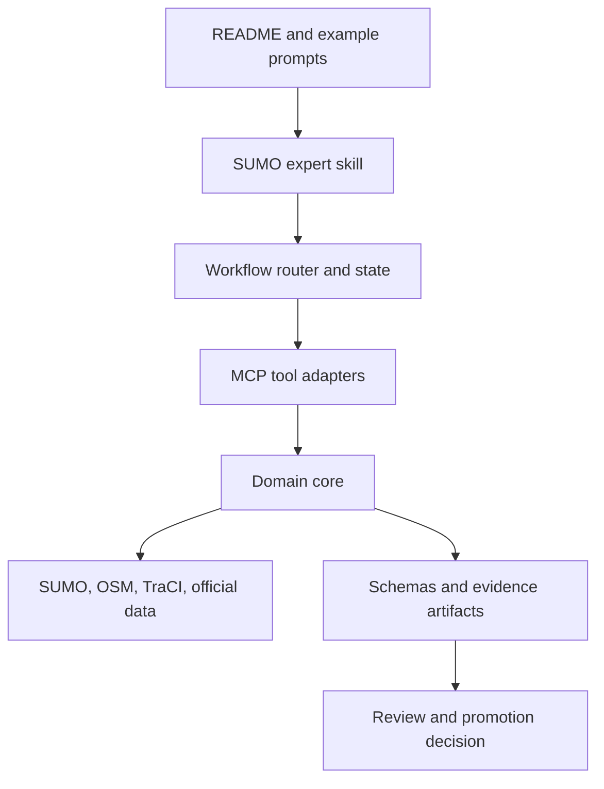

# Torii Repository Guide

This guide defines the public shape of the Torii repository and where new work belongs. The goal is a small, understandable entry surface backed by specialized domain modules, not a flat collection of scripts or MCP tools.

The same placement and verification rules are summarized for coding agents in [`AGENTS.md`](../AGENTS.md).

## System Layers



| Layer | Canonical location | Owns | Must not own |
|---|---|---|---|
| Product entry | `README.md`, `examples/` | user promise, first run, representative outputs | detailed research logs |
| Reasoning | `plugins/torii-sumo/skills/` | task routing, questions, evidence requirements, claim language | SUMO subprocess implementation |
| Orchestration | `core/workflow_*`, `tools/workflow_tools.py` | workflow state and safe next-step selection | low-level XML algorithms |
| MCP boundary | `src/torii_sumo/mcp_contract_tools.py`, `src/torii_sumo/server.py`, `src/torii_sumo/legacy_tools.py`, `src/torii_sumo/tools/` | input validation, path resolution, serialization, profile and tool registration | duplicated domain logic |
| Domain core | `src/torii_sumo/core/` and focused packages | parsing, inference, candidate construction, audit, comparison | UI-specific prose |
| Contracts | `schemas/` and typed models | stable artifact shapes and decision enums | generated run data |
| Reproduction | `plugins/torii-sumo/scripts/`, `examples/`, `benchmarks/` | CLI entry points, curated demonstrations, frozen evaluation | reusable business logic |
| Verification | `tests/` | unit, contract, integration, and regression coverage | one-off exploratory output |
| Documentation | `docs/`, `ARCHITECTURE.md` | navigation, invariants, protocols, status snapshots | executable source of truth |

## Dependency Direction

The intended dependency direction is:

```text
server.py
  -> mcp_contract_tools.py -------------------\
  -> legacy_tools.py (explicit legacy only) ---+-> tools/* -> core/* -> external libraries
```

Core modules must not import the MCP server. Scripts should call reusable core or tool functions rather than reimplementing them. Reduced-profile registration belongs in `server.py`; the opt-in legacy bundle belongs in `legacy_tools.py`. Tool descriptions and argument adaptation belong at the MCP or tool boundary; algorithms and artifact semantics belong below it.

## Public Entry Points

Torii exposes three entry levels:

1. **Default MCP:** ten short, model-facing operations for inspection, comparison, bounded audits, and review artifacts.
2. **CLI workflows:** long OSM, intersection, demand, replay, and digital-twin runs invoked with `torii workflow` and a JSON request.
3. **Legacy MCP:** the historical 74-tool surface, loaded only when an older integration selects the `legacy` profile.

The complete grouping is in [MCP Tool Catalog](mcp-tool-catalog.md).

## Where New Work Goes

| You are adding... | Put it here | Also add/update |
|---|---|---|
| A new user-visible task family | skill routing plus a capability workflow | README capability table, tool catalog, end-to-end test |
| A reusable parser, audit, or materializer | `src/torii_sumo/core/` or a focused package | unit tests and artifact schema if public |
| A reduced-profile MCP operation | `mcp_contract_tools.py` plus the relevant `tools/*_tools.py` adapter | `server.py`, tool catalog, contract test |
| A reproducible experiment command | `plugins/torii-sumo/scripts/` | protocol document and regression test |
| A small teaching/demo scenario | `examples/<number>_<name>/` | local README with exact command and expected boundary |
| A frozen evaluation corpus | `benchmarks/<name>/` | protocol, provenance, hashes, and adjudication boundary |
| A generated run | `outputs/<run>/` or an explicit artifact directory | manifest; do not link it as stable evidence until frozen |
| A public artifact type | `schemas/` plus typed implementation | schema export/validation test |
| A stable architecture invariant | `ARCHITECTURE.md` | affected tests and user-facing boundary if relevant |
| A dated research decision or status snapshot | `docs/<descriptive-date>.md` | documentation index; never silently overwrite history |

## Module Cohesion Rules

- Prefer one module per stable domain concept, not one module per experiment step.
- Keep Hamburg-specific public-data logic in its focused digital-twin modules; move only genuinely reusable primitives into generic core modules.
- Use workflow modules to compose operations; do not create a second orchestration loop inside a CLI script.
- Return structured decisions (`pass`, `review_required`, `blocked`, `not_applicable`) instead of relying on prose parsing.
- Bind evidence to exact inputs and candidates when it can affect promotion.
- Keep source artifacts immutable; write candidate and review artifacts separately.
- Avoid adding a new top-level directory unless none of the ownership categories above fits.

## Documentation Shape

The top-level README follows a deliberate order:

1. one-sentence product claim;
2. one system-flow diagram;
3. grouped capabilities;
4. installation and example prompts;
5. typical outputs;
6. repository map;
7. bounded research status;
8. limitations and license.

Detailed numerical findings belong in versioned evidence documents. This prevents the first-use path from being buried under research chronology while keeping every claim traceable.

## Lessons Adopted from ChatSUMO

The organization borrows several presentation strengths from the ChatSUMO paper and ChatSUMO-Agent repository:

- a single overview figure before implementation detail;
- a compact prompt-to-artifact trace;
- capability-oriented modules with explicit entry points;
- a short repository map and typical-output section;
- experiments organized by user-visible operation.

Torii deliberately does not borrow the assumption that successful execution or KPI improvement establishes model correctness. Evidence gates, abstention, source/candidate separation, and review-bound promotion remain first-class repository concepts.
