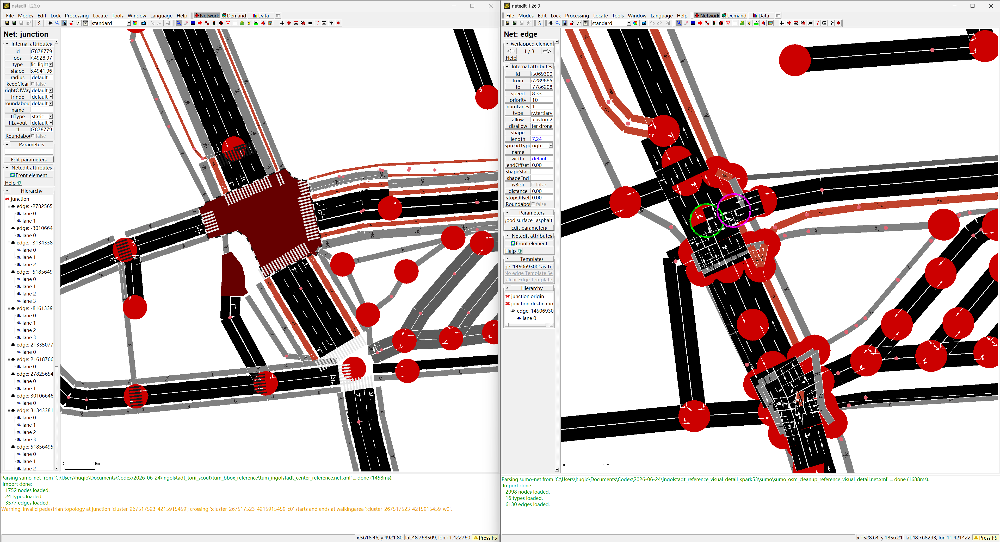

# One-Prompt OSM-to-SUMO Network Demo

This example records an Ingolstadt city-center Torii workflow target: build a bounded SUMO network from OpenStreetMap, clean it, and compare the result with the manually cleaned TUM `sumo_ingolstadt` reference network for the same bbox.

Prompt:

```text
Use Torii to clean the Ingolstadt city-center network around https://www.openstreetmap.org/#map=17/48.765391/11.423800 from OSM, compare it with the TUM-VT/sumo_ingolstadt cleaned network for the same bbox, and open the cleaned network in Netedit.
```

## Area and Reference

| Item | Value |
|---|---|
| Center | `48.765391, 11.423800` |
| OSM view | <https://www.openstreetmap.org/#map=17/48.765391/11.423800> |
| Comparison bbox | `11.413800,48.755391,11.433800,48.775391` |
| Torii source | OSM, `network_profile='reference_matched'` |
| Reference source | TUM-VT [`sumo_ingolstadt`](https://github.com/TUM-VT/sumo_ingolstadt), `simulation/Ingolstadt SUMO 365/ingolstadt_net.net.xml` |

The TUM network is the manually cleaned reference, not an input source for Torii. The correct comparison sequence is:

1. Inspect the TUM network's retained hierarchy and permissions.
2. Cut the same city-center bbox from the TUM network.
3. Build the Torii network from OSM with a reference-matched plan.
4. Keep two Torii scopes separate: `vehicle_core` for routeability and `reference_visual_detail` for full-detail Netedit comparison.
5. Compare the TUM bbox cut with the Torii `reference_visual_detail` product.

TUM's Ingolstadt model is a multimodal simulation network. In the city-center bbox it retains passenger, bicycle, pedestrian, bus, and rail-related edges. Torii therefore generates a passenger `vehicle_core` plus a separate `reference_visual_detail` network so that routeability checks and visual topology comparisons do not get mixed.

## Result Summary


| Evidence | Torii `vehicle_core` | Torii `reference_visual_detail` | TUM city-center bbox cut |
|---|---:|---:|---:|
| All non-internal edges | 2,493 | 6,126 | 3,577 |
| Lanes | 3,045 | 6,695 | 4,955 |
| Junctions | 1,220 | 2,997 | 1,752 |
| Raw traffic-light junctions | 202 raw / 34 after TLS aggregation | 217 raw / 34 after TLS aggregation | 29 |
| `tlLogic` count | 146 raw / 34 after TLS aggregation | 82 raw / 34 after TLS aggregation | 28 |
| Default use | routeability / simulation core | Netedit full-detail comparison | reference comparator |
| Claim status | routeability passed; TLS still needs map review | topology grouping still needs correction | reference comparator only |

TUM passenger-drivable hierarchy in this bbox:

| TUM passenger road type | Edge count |
|---|---:|
| `highway.service` | 945 |
| `highway.residential` | 429 |
| `highway.tertiary` | 256 |
| `highway.unclassified` | 162 |
| `highway.secondary` | 85 |
| `highway.living_street` | 66 |
| `highway.primary` + links | 31 |
| `highway.track` | 26 |
| missing or uncommon type | 28 |

## Interpretation

The reference-matched workflow now avoids the earlier unfair comparison. Torii does not compare a passenger connected-core against TUM's full-detail reference. It builds `reference_visual_detail` separately and opens that network for Netedit comparison.

The key remaining comparison signals are physical-intersection grouping, TLS grouping, lane permissions, and routeability, not only edge count.

- TUM keeps a high-detail city-center bbox with 3,577 edges and 4,955 lanes.
- Torii `reference_visual_detail` keeps the lower-level visible layers too, but it is still over-fragmented: 2,997 junctions.
- The TLS aggregation review variant reduces Torii from 217 raw traffic-light junctions / 82 `tlLogic` definitions to 34 physical TLS representatives. TUM exposes 29 traffic-light junctions / 28 `tlLogic` definitions in the same bbox, so the remaining TLS gap is now a small set of map-review candidates rather than hundreds of raw SUMO nodes.

## Known Gap: Junction Aggregation



The screenshot above shows the current reusable cleanup target. TUM represents the physical intersection as a clean joined junction, while the Torii OSM-derived visual-detail network exposes many small SUMO nodes and short edges around the same physical intersection.

Torii should not automatically join these nodes from geometry alone. The audit step must first generate dense-junction clusters, inspect each cluster's local graph (`internal_edge_ids`, `boundary_edge_ids`, `connected_node_pairs`, overlap hints, and approach count), and provide Google Maps default-map review links. Only source-bounded clusters should be used to build a junction-aggregated variant. Satellite view can still be used when the default map is ambiguous, but it is not the default gate.

## Files in This Example

- [`prompt.md`](prompt.md): the one-prompt request.
- [`manifest.public.json`](manifest.public.json): public, path-sanitized artifact manifest.
- [`networks/tum_ingolstadt_center_reference.net.xml`](networks/tum_ingolstadt_center_reference.net.xml): TUM bbox reference network used for comparison.
- [`networks/torii_5_5_connected_core_tls_aggregated.net.xml`](networks/torii_5_5_connected_core_tls_aggregated.net.xml): Torii 5.5 connected-core simulation network after TLS aggregation.
- [`networks/torii_5_5_reference_visual_detail_tls_aggregated.net.xml`](networks/torii_5_5_reference_visual_detail_tls_aggregated.net.xml): Torii 5.5 visual-detail comparison network after TLS aggregation.
- [`validation/comparison_summary.json`](validation/comparison_summary.json): compact validation record.
- [`validation/tum_vs_torii_bbox_comparison.csv`](validation/tum_vs_torii_bbox_comparison.csv): count, topology, and routeability comparison.
- [`validation/run_2026-06-24_5_5`](validation/run_2026-06-24_5_5): 5.5 run summaries, TLS representative tables, and TUM spatial TLS matching.
- [`assets/tum_vs_torii_5_5_tls_aggregated_overview.png`](assets/tum_vs_torii_5_5_tls_aggregated_overview.png): TUM vs Torii 5.5 TLS-aggregated overview screenshot.
- [`assets/tum_vs_torii_5_5_tls_aggregated_detail.png`](assets/tum_vs_torii_5_5_tls_aggregated_detail.png): TUM vs Torii 5.5 intersection-detail screenshot.
- [`assets/torii_5_5_core_vs_visual_detail.png`](assets/torii_5_5_core_vs_visual_detail.png): Torii connected-core vs visual-detail screenshot.
- [`assets/junction_fragmentation_gap.png`](assets/junction_fragmentation_gap.png): known junction-fragmentation cleanup target.

Generated OSM extracts, route files, and full logs are intentionally not committed. They should be rebuilt into a fresh output directory when the example is rerun.

## Reproduction Notes

1. Inspect the TUM reference network structure and retained edge types.
2. Cut the TUM reference network to the confirmed city-center bbox.
3. Confirm the Torii road-detail target. For this comparison use `network_profile='reference_matched'` and provide the TUM `.net.xml` as the reference artifact.
4. Build the Torii OSM network for the same bbox.
5. Extract a connected passenger core when the raw OSM import has disconnected fragments.
6. Build the separate `reference_visual_detail` network when the reference contains lower-level or modal visible layers.
7. Run passenger connectivity and routeability audits on the vehicle core.
8. Compare edge, lane, road-type, lane-permission, junction, TLS, joined-junction, dense-cluster, and routeability evidence.
9. Open the Torii `reference_visual_detail` network and TUM bbox cut in Netedit for scope-matched topology and TLS review.

## Claim Boundary

This is a diagnostic comparison example. A scope-matched Netedit view does not prove that the Torii network is equivalent to the manually cleaned TUM network. The current comparison shows the next required cleanup target: reusable physical-intersection grouping and Google Maps review for the remaining TLS candidates before any destructive aggregation.

## Data Attribution

Torii input data comes from OpenStreetMap and is available under the Open Database License (ODbL). See <https://www.openstreetmap.org/copyright>.

The reference comparator is the public TUM-VT `sumo_ingolstadt` project. See <https://github.com/TUM-VT/sumo_ingolstadt>.
