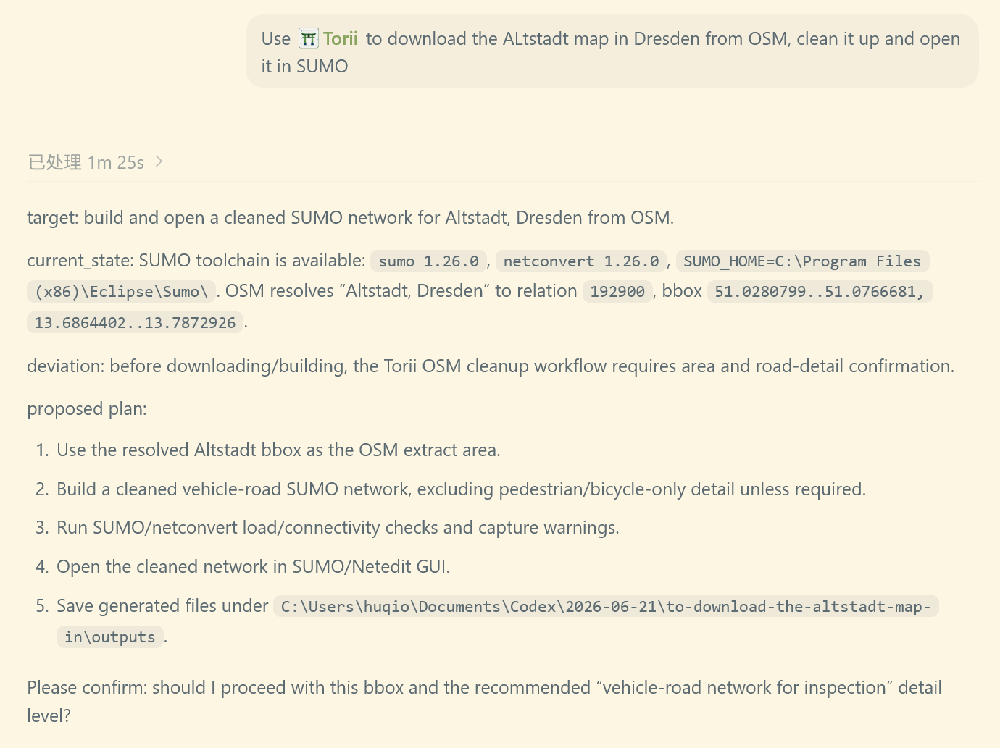
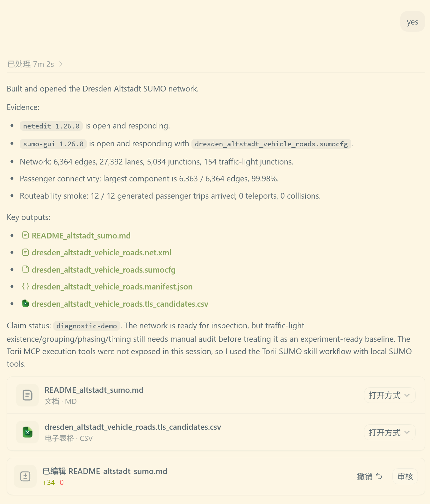
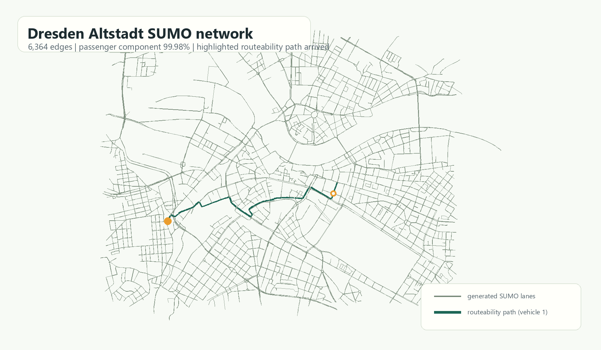
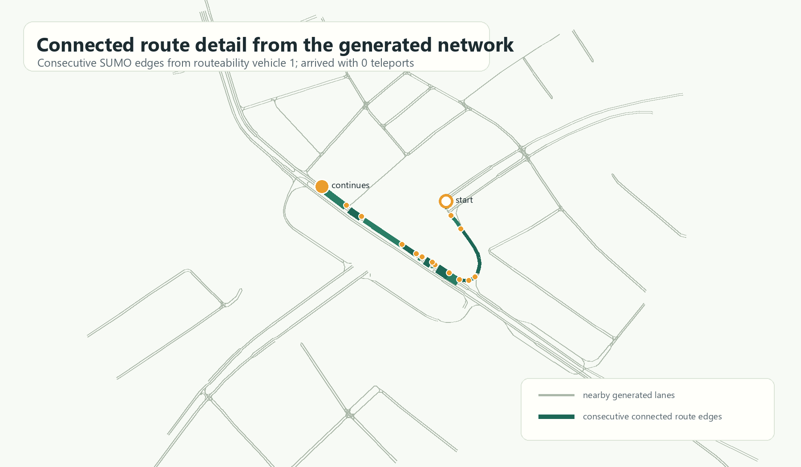

# One-Prompt OSM-to-SUMO Network Demo

This example records a one-prompt Torii workflow that builds a diagnostic SUMO network for Altstadt, Dresden from OpenStreetMap data and opens it for inspection.

Prompt:

```text
Use Torii to download the Altstadt map in Dresden from OSM, clean it up and open it in SUMO
```

Torii resolved the area, asked for confirmation of the bbox and vehicle-road detail level, built the network with SUMO tooling, opened it in SUMO/Netedit, and reported validation evidence.





Generated SUMO network:



Zoomed connected route detail:



## Result Summary

| Item | Value |
|---|---:|
| OSM place | Altstadt, Dresden, Sachsen, Deutschland |
| OSM relation | 192900 |
| Bbox | 51.0280799, 13.6864402 to 51.0766681, 13.7872926 |
| SUMO version | 1.26.0 |
| Edges | 6,364 |
| Lanes | 27,392 |
| Junctions | 5,034 |
| SUMO traffic-light junctions | 154 |
| TLS multi-source review | 154 rows: 147 `osm-only`, 7 `sumo-guess-only`, all `needs_manual_review` |
| Passenger connectivity | connected-core network: 6,363 / 6,363 passenger edges, 100% |
| Routeability smoke | 12 / 12 generated passenger trips arrived |
| Teleports / collisions | 0 / 0 |
| Claim status | `diagnostic-demo` |

## Files in This Example

This repository example keeps only lightweight, reviewable artifacts:

- [`prompt.md`](prompt.md): the one-prompt request.
- [`manifest.public.json`](manifest.public.json): public, path-sanitized artifact manifest.
- [`validation/netcheck.txt`](validation/netcheck.txt): passenger connectivity summary.
- [`validation/components.txt`](validation/components.txt): component output.
- [`validation/routeability.summary.xml`](validation/routeability.summary.xml): routeability smoke summary.
- [`validation/routeability.tripinfo.xml`](validation/routeability.tripinfo.xml): routeability smoke tripinfo.
- [`validation/summary.xml`](validation/summary.xml): one-step network load summary.
- [`validation/tls_candidates.csv`](validation/tls_candidates.csv): SUMO traffic-light candidate table for manual review.
- [`validation/altstadt_tls_multisource_review.csv`](validation/altstadt_tls_multisource_review.csv): Google Maps baseline review table with OSM, Mapillary, KartaView, inventory, signal-plan, and field-evidence columns.
- [`assets/`](assets/): screenshots of the intake and build evidence.

The full generated network is intentionally distributed as a GitHub release asset rather than committed into git history:

- `dresden_altstadt_vehicle_roads.osm.xml`
- `dresden_altstadt_vehicle_roads.net.xml`
- `dresden_altstadt_vehicle_roads.sumocfg`
- routeability trips/routes/summary/tripinfo
- build log, connectivity output, TLS candidate table, and public manifest

Release asset: `torii-one-prompt-altstadt-osm-sumo-demo-v1.0.2.zip`

## Reproduction Notes

The workflow used the Torii OSM cleanup hard gate:

1. Resolve the place name to an OSM area and bbox.
2. Ask the user to confirm the area and recommended vehicle-road detail level.
3. Download OSM `highway=*` ways and turn-restriction relations for the confirmed bbox.
4. Run SUMO `netconvert` with passenger-vehicle filtering.
5. Run a headless SUMO load check.
6. Run a passenger connectivity check.
7. Run a routeability smoke test with generated passenger trips.
8. Emit TLS candidate and multi-source review tables. Google Maps remains the required current-network baseline gate; OSM, Mapillary, KartaView, official inventory, signal-plan, and field-evidence columns support the review.
9. Open the generated network in SUMO/Netedit for inspection.

## Data Attribution

The map extract is derived from OpenStreetMap data downloaded through Overpass.

Map data: © OpenStreetMap contributors. OpenStreetMap data is available under the Open Database License (ODbL). See <https://www.openstreetmap.org/copyright>.

## Claim Boundary

This is a diagnostic construction artifact. It demonstrates that Torii can turn a short natural-language request into a bounded OSM-to-SUMO construction workflow with evidence.

It does not certify the network as a formal experiment-ready baseline. Traffic-light existence, grouping, phasing, timing, demand realism, and controller readiness still require a manual Google Maps baseline audit plus experiment-specific validation.
